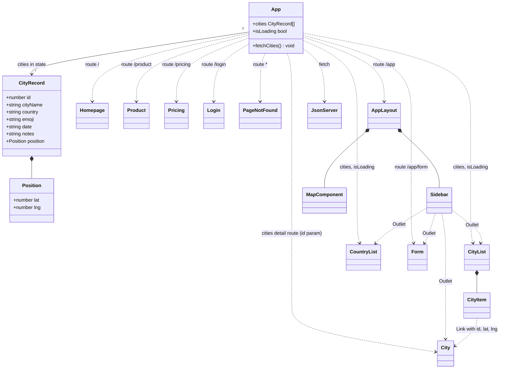
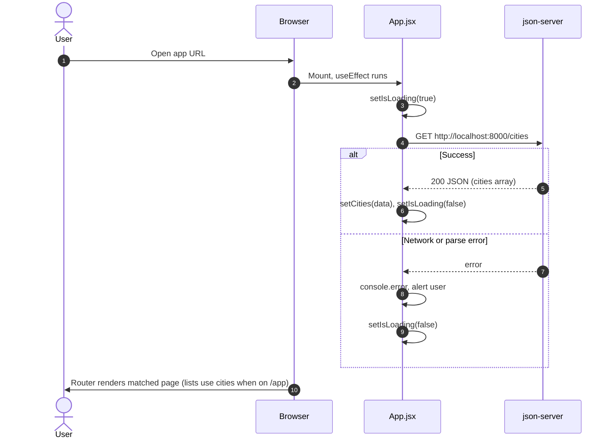
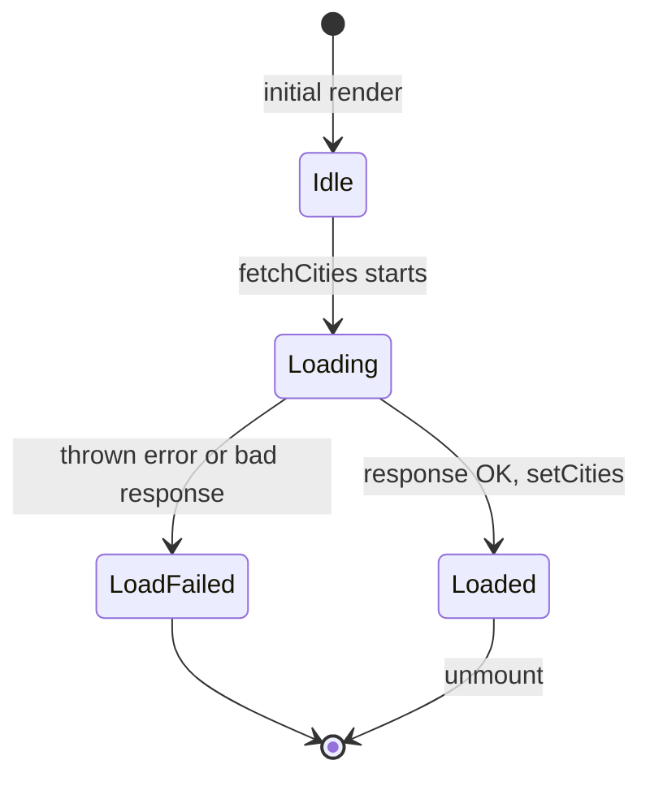

# WorldWise

WorldWise is a single-page application for tracking cities you have visited. It lists trips with notes and dates, groups places by country, and uses a lightweight REST API backed by static JSON so you can run the app locally without a real database. The project demonstrates client-side routing, shared application state, and integration between a React front end and a mock API.

## Features

- Marketing-style pages (home, product, pricing) and a login route separate from the main app shell.
- Protected-style app area at `/app` with nested routes for cities, city detail, countries, and a trip form.
- City list and detail views fed from a REST resource (`/cities`).
- Country aggregation derived from loaded city data.
- Map area with URL search parameters for latitude and longitude (placeholder map UI).
- Loading state while cities are fetched.
- CSS Modules for component-scoped styling.

## Architecture

- **Routing**: `react-router-dom` with `BrowserRouter`, nested routes under `/app`, and a catch-all 404 route.
- **Data**: Cities are loaded once in `App` via `fetch` and passed as props to list components. The API is served by **json-server** reading `data/cities.json`.
- **State**: Local React state in `App` for the city collection and loading flag; form and map use local state or URL search params where appropriate.

### UML diagrams

The following [Mermaid](https://mermaid.js.org/) diagrams summarize structure and behavior. They match the implementation in `src/` (routing shell in `App.jsx`, nested layout under `/app`, and the mock API).

#### Class diagram (components and data flow)

High-level view of main React components, shared city records, and how `App` wires routes to children. `CityRecord` mirrors the shape of objects in `data/cities.json`. `MapComponent` is the `Map` component from `src/components/Map.jsx`; `JsonServer` represents the mock API (`GET /cities` on port 8000).



#### Sequence diagram (initial city load)

What happens when the SPA boots: `App` requests the city list once; child routes under `/app` receive the result via props.



#### State diagram (`App` city data lifecycle)

The loading flag and fetch outcome for the shared `cities` state. Route-level navigation is handled by the router; this diagram focuses on asynchronous data loading inside `App`.



## Tech Stack

| Category | Technologies |
|----------|----------------|
| Runtime / build | Node.js, Vite |
| UI | React 19, React DOM |
| Routing | React Router DOM 7 |
| API (development) | json-server |
| Tooling | ESLint 9 (flat config), `concurrently` |
| Styling | CSS Modules (`.module.css`) |

## Prerequisites

- **Node.js** (current LTS recommended)
- **npm** (comes with Node)

## Installation

```bash
git clone <repository-url>
cd 18-worldwise
npm install
```

## Usage

Development expects the mock API and the Vite dev server to run together.

**Recommended (API + front end):**

```bash
npm run dev
```

This starts:

- JSON Server on `http://localhost:8000` (watching `data/cities.json`)
- Vite on the default dev port (typically `http://localhost:5173`)

Open the Vite URL in the browser. The app fetches cities from `http://localhost:8000/cities`; if the server is not running, loading will fail and an error may be shown.

**Run processes separately:**

```bash
npm run server   # json-server only, port 8000
npm run vite     # Vite only
```

**Production build:**

```bash
npm run build
npm run preview   # optional: serve the production build locally
```

## Project Structure

```
18-worldwise/
├── data/
│   └── cities.json          # Seed data for json-server (/cities)
├── docs/
│   └── LECTURE_STEPS.md     # Course / lecture notes (if present)
├── public/                  # Static assets
├── src/
│   ├── components/          # Reusable UI (lists, map, form, nav, etc.)
│   ├── pages/               # Route-level pages and app layout
│   ├── App.jsx              # Routes, city fetch, shared city state
│   ├── main.jsx             # Entry, StrictMode
│   └── index.css            # Global styles
├── index.html
├── eslint.config.js
├── package.json
└── vite.config.js
```

## Configuration

- **API base URL**: Hardcoded in `src/App.jsx` as `http://localhost:8000`. For a different host or port, change that constant (or refactor to an environment variable) and align `json-server` / proxy settings accordingly.
- **JSON Server**: Port `8000` and watch file are defined in the `server` script in `package.json`.
- **Vite**: Default configuration in `vite.config.js` (React plugin only).

## Scripts

| Command | Description |
|---------|-------------|
| `npm run dev` | Runs `json-server` and `vite` concurrently |
| `npm run vite` | Vite dev server only |
| `npm run server` | json-server watching `data/cities.json` on port 8000 |
| `npm run build` | Production build to `dist/` |
| `npm run preview` | Preview production build locally |
| `npm run lint` | ESLint on the project |

## Testing and Quality

- **Linting**: `npm run lint` uses ESLint with recommended JavaScript rules, React Hooks rules, and Vite-friendly React Refresh settings.
- **Tests**: No automated test runner is configured in this repository. Add a framework (for example Vitest) if you extend the project with unit or integration tests.

## Contributing

1. Fork the repository and create a branch for your change.
2. Keep commits focused and messages clear.
3. Run `npm run lint` before opening a pull request.
4. Describe what changed and how to verify it in the PR description.

If this repo follows a specific branching model (for example `main` / `develop`), align with that workflow documented by the maintainers.

## Roadmap / Future Improvements

- Externalize API base URL via environment variables for deployment.
- Replace the map placeholder with a real map library and geocoding if needed.
- Persist new or edited trips through `json-server` (POST/PATCH) or a backend.
- Add automated tests for routing and data loading.

## License

No license file is present in this repository. Specify a license (for example MIT) and add a `LICENSE` file before distributing or reusing the code.

## Acknowledgments

Educational context: project naming and structure align with common React curriculum material (for example Jonas Schmedtmann’s React course). Adjust this section if you use different sources or instructors.
