## 🧳 Section 17: *React Route: Building Single-Page Applications (SPA)*

### 📑 Table of Contents


<br>

## 🔧 205. Lesson 205 — *Routing and Single-Page Application (SPAs)*

[🧳 Section 17: *React Route: Building Single-Page Applications (SPA)*](#-section-17-react-route-building-single-page-applications-spa)

### 📑 Table of Contents:
- [205. Lesson 205 — *Routing and Single-Page Application (SPAs)*](#-205-lesson-205--routing-and-single-page-application-spas)
- [205.1 Context](#-2051-context)
- [205.2 Updating code according the context](#-2052-updating-codetheory-according-the-context)
  - [205.2.1 What is Routing?](#20521-what-is-routing)
  - [205.2.2 Single-Page Applications (SPA)](#20522-single-page-applications-spa)
- [205.3 Issues](#-2053-issues)
- [205.4 Pending Fixes (TODO)](#-2054-pending-fixes-todo)

### 🧠 205.1 Context:

**Routing** is the mechanism that determines which UI component or view to display based on the current URL. In traditional multi-page applications (MPAs), the server returns different HTML documents for each route (e.g. `/about`, `/contact`). In React and other modern frontend frameworks, **client-side routing** lets the app update the visible content without requesting a new HTML page from the server; only a single HTML shell is loaded and subsequent updates happen in the browser via JavaScript.

A **Single-Page Application (SPA)** is an application that loads a single HTML document and then dynamically updates its content as the user navigates, without full page reloads. React is often used to build SPAs, and the URL can change (e.g. via the History API) without triggering a server round-trip.

**Key Concepts:**

1. **Client-side routing** — Routing logic runs in the browser. The URL changes and the framework swaps components in and out based on the current path.
2. **History API** — Browsers expose `history.pushState`, `history.replaceState`, and the `popstate` event to change the URL and respond to back/forward without full reloads.
3. **Virtual navigation** — The server does not send new HTML for each route; the React app renders the appropriate component for the current URL.
4. **Route matching** — A routing library (e.g. React Router) maps URL paths to component trees (e.g. `/cities` → `<CitiesList />`, `/cities/42` → `<CityDetail />`).
5. **Nested routes** — Routes can be hierarchical (e.g. `/app/settings/profile`), with nested layouts and components.

**Advantages:**
- Fast navigation after initial load; no full page reloads.
- Smoother UX with less flicker and loading states.
- Possibility of offline-first or app-like behavior.
- Clear separation between frontend UI and backend APIs.
- URLs remain shareable and bookmarkable when routing is set up correctly.

**Disadvantages / Gotchas:**
- Initial bundle size can be large; code-splitting and lazy loading are important.
- SEO needs extra care (e.g. SSR/SSG) unless only for internal apps.
- Browser history and deep linking require proper routing configuration.
- 404 and redirects must be handled on both client and server (fallback to `index.html`).
- Memory and state can grow if not managed well in long-running sessions.

**When to Consider Alternatives:**
- When SEO is critical and you cannot use SSR/SSG — consider Next.js, Remix, or similar.
- For very simple apps with 1–2 views — conditional rendering may be enough.
- When you need server-rendered HTML per route — use a framework with built-in SSR.
- For static marketing sites — static HTML or a static site generator may be simpler.

In the **Worldwise** project, we will add React Router so routes like `/`, `/cities`, `/countries`, etc. can each render a different view while staying within a single-page experience.

---

### ⚙️ 205.2 Updating code/theory according the context:

#### **Summary**

- Section 205.2 introduces the concepts of **routing** and **Single-Page Applications (SPAs)** that underpin React Router and the Worldwise app.
- It explains how routing maps URLs to views and how SPAs differ from traditional server-rendered apps.
- Subsection 205.2.1 covers what routing is and why it matters; 205.2.2 explains SPAs, their flow, and how they relate to routing.

---

#### 205.2.1 What is **Routing**?

**Subsection Summary:**
- Describes **routing** as the process of mapping a URL (path) to a specific view or component.
- Shows how different URLs map to different content in a React SPA (e.g. `/` → Home, `/cities` → Cities list).
- The image `section17-lecture205-001.png` illustrates the concept of routing: URL-to-view mapping and how the browser URL drives which component is rendered.
- Establishes that routing is the backbone of navigation in SPAs.

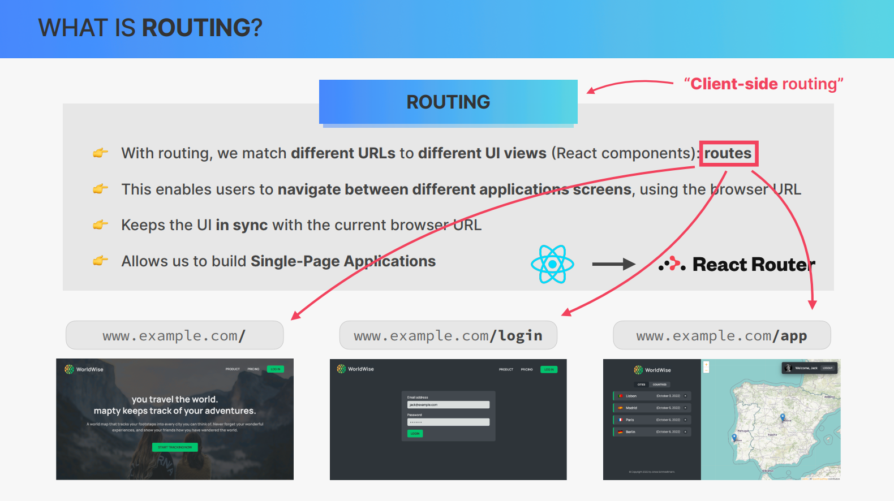

---

#### 205.2.2 **Single-Page** Applications (SPA)

**Subsection Summary:**
- Explains that an SPA loads one HTML file initially; subsequent “navigation” is handled by JavaScript swapping components.
- Contrasts SPA behavior with multi-page apps: no full reloads, no new HTML from the server for each route.
- The image `section17-lecture205-002.png` likely illustrates the SPA lifecycle: initial load, client-side navigation, and how the DOM is updated without full page reloads.
- Connects SPAs to routing: the URL still changes (e.g. via the History API) so users can bookmark and share links while the app stays single-page.

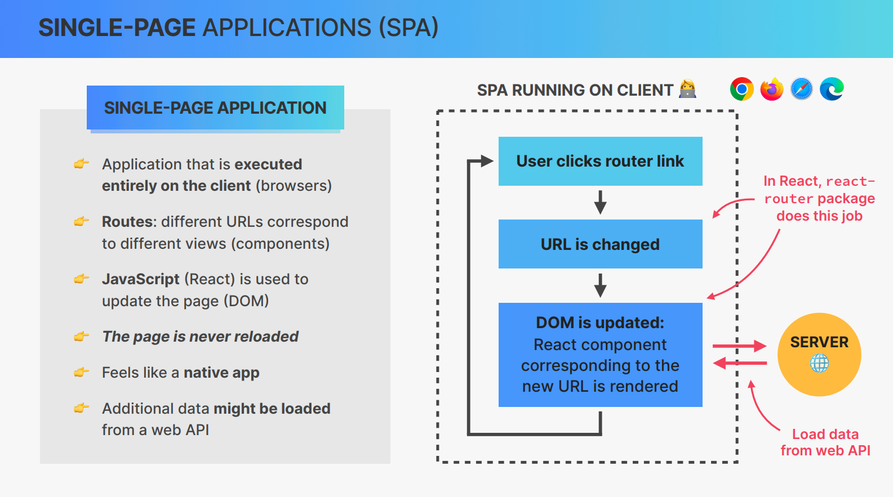

---

### 🐞 205.3 Issues:

- **No routing library installed**: The project does not yet include `react-router-dom`; routing cannot be implemented until the dependency is added.
- **No route configuration**: `src/App.jsx` renders only static content; there is no route setup or view switching based on the URL.
- **Missing image assets**: The referenced images `docs/../img/section17-lecture205-001.png` and `section17-lecture205-002.png` may not exist in the repo; verify the `img` folder and file paths.

| Issue | Status | Log/Error |
|---|---|---|
| No react-router-dom dependency | ⚠️ Identified | `package.json`: project uses only `react` and `react-dom`; no routing library |
| App has no route structure | ⚠️ Identified | `src/App.jsx`: renders only `<h1>Worldwise</h1>` with no `<Routes>` or route config |
| Image paths possibly broken | ℹ️ Informational | `docs/LECTURE_STEPS.md`: references `../img/section17-lecture205-*.png`; ensure `img` folder exists relative to `docs/` |

---

### 🧱 205.4 Pending Fixes (TODO)

- [ ] Install `react-router-dom` via `npm install react-router-dom` and wrap the app with `<BrowserRouter>` in `src/main.jsx`
- [ ] Add route configuration in `src/App.jsx` with `<Routes>` and `<Route>` components (e.g. `/`, `/cities`, `/countries`) — placeholder components can be used initially
- [ ] Verify that `docs/../img/` exists and contains `section17-lecture205-001.png` and `section17-lecture205-002.png`; fix paths if assets are stored elsewhere

[↑ top — 205. Lesson 205 — *Routing and Single-Page Application (SPAs)*](#-205-lesson-205--routing-and-single-page-application-spas)


<br>

## 🔧 206. Lesson 206 — *Implementing Main Pages and Routes*

[🧳 Section 17: *React Route: Building Single-Page Applications (SPA)*](#-section-17-react-route-building-single-page-applications-spa)

### 📑 Table of Contents:
- [206. Lesson 206 — *Implementing Main Pages and Routes*](#-206-lesson-206--implementing-main-pages-and-routes)
- [206.1 Context](#-2061-context)
- [206.2 Updating code according the context](#-2062-updating-code-according-the-context)
  - [206.2.1 Product Page Component](#20621-product-page-component)
  - [206.2.2 Homepage Component](#20622-homepage-component)
  - [206.2.3 Pricing Page Component](#20623-pricing-page-component)
  - [206.2.4 Installing react-router-dom](#20624-installing-react-router-dom)
  - [206.2.5 App Shell with Routes](#20625-app-shell-with-routes)
  - [206.2.6 Configuring Route Definitions](#20626-configuring-route-definitions)
  - [206.2.7 PageNotFound and Catch-All Route](#20627-pagenotfound-and-catch-all-route)
- [206.3 Issues](#-2063-issues)
- [206.4 Pending Fixes (TODO)](#-2064-pending-fixes-todo)

### 🧠 206.1 Context:

**Implementing Main Pages and Routes** is the practical application of client-side routing concepts introduced in Lesson 205. This lesson covers how to structure a React SPA with React Router: creating page components, installing the routing library, and wiring up routes so that different URLs render different views without full page reloads.

In the Worldwise project, we implement three main pages (Homepage, Product, Pricing), a 404 fallback page, and configure `BrowserRouter`, `Routes`, and `Route` so that navigation between `/`, `/product`, `/pricing`, and any unmatched path works correctly.

**Key Concepts:**

1. **Page components** — Each screen or view is a React component living in `src/pages/`. These are simple presentational components that React Router renders based on the current URL.
2. **BrowserRouter** — The top-level router component that enables the HTML5 History API (e.g. `pushState`, `popstate`), so URLs like `/product` work without server round-trips.
3. **Routes and Route** — `Routes` wraps a set of `Route` definitions. Each `Route` maps a `path` (e.g. `/`, `product`, `pricing`) to an `element` (the component to render).
4. **Catch-all route** — A `Route` with `path="*"` matches any URL not matched by earlier routes, used for 404/Page Not Found pages.
5. **Route path conventions** — Using `path="/"` for the root and `path="product"` (or `path="/product"`) for `/product`; both styles work for top-level routes in React Router v6+.

**Advantages:**
- Clear separation: one component per page, easy to locate and maintain.
- Simple route configuration: all routes declared in one place (`App.jsx`).
- Catch-all `*` route ensures no broken links; unknown URLs show a friendly 404.
- Works with Vite dev server out of the box; no extra server config for SPA fallback during development.

**Disadvantages / Gotchas:**
- All routes are defined in one file; as the app grows, consider lazy loading or route modules.
- Path `product` vs `/product`: both work for top-level routes, but `/product` is more explicit; be consistent.
- Server-side routing: in production, the server must serve `index.html` for all non-asset paths so client-side routing works on refresh or direct links.
- `BrowserRouter` placement: wrapping in `App.jsx` vs `main.jsx` both work; keeping it in `App.jsx` keeps routing logic inside the app tree.

**When to Consider Alternatives:**
- For nested layouts (e.g. shared header/footer per section) — use `<Outlet />` and nested routes.
- For data loading per route — consider React Router's `loader` API or data fetching libraries.
- For code-splitting — use `React.lazy()` and `Suspense` with route components.
- If deploying to a static host — configure the server to redirect all routes to `index.html` (e.g. `_redirects` for Netlify, `rewrites` for Vercel).

In Worldwise, this lesson establishes the core SPA structure: Homepage, Product, Pricing, and PageNotFound, all wired through React Router in `src/App.jsx`.

---

### ⚙️ 206.2 Updating code according the context:

#### **Summary**

- Section 206.2 walks through the step-by-step implementation of main pages and routes in the Worldwise app.
- It covers creating page components (Product, Homepage, Pricing, PageNotFound), installing `react-router-dom`, and configuring `App.jsx` with `BrowserRouter`, `Routes`, and `Route`.
- Subsections 206.2.1–206.2.3 define the page components; 206.2.4 adds the dependency; 206.2.5–206.2.6 set up the route shell and definitions; 206.2.7 adds the 404 fallback with a catch-all route.
- The image `section17-lecture206-001.png` illustrates the three main pages (Homepage, Product, Pricing); `section17-lecture206-002.png` shows the Page Not Found screen for unmatched URLs.

---

#### 206.2.1 Product Page Component

**Subsection Summary:**
- Defines the `Product` page component in `src/pages/Product.jsx`.
- Returns a simple `<h1>Product</h1>` placeholder for the product view.
- Demonstrates the pattern: one component per page, default export for use with `Route element`.
- Establishes the structure for the `/product` route.

```jsx
/* src/pages/Product.jsx */
const Product = () => {
  return <h1>Product</h1>;
};

export default Product;
```

---

#### 206.2.2 Homepage Component

**Subsection Summary:**
- Defines the `Homepage` component in `src/pages/Homepage.jsx`.
- Renders `<h1>Worldwise page</h1>` as the landing page content.
- Serves as the root route (`/`) component for the Worldwise app.
- Uses the same pattern as Product: functional component with default export.

```jsx
/* src/pages/Homepage.jsx */
const Homepage = () => {
  return <h1>Worldwise page</h1>;
};

export default Homepage;
```

---

#### 206.2.3 Pricing Page Component

**Subsection Summary:**
- Defines the `Pricing` page component in `src/pages/Pricing.jsx`.
- Returns `<h1>Pricing</h1>` as a placeholder for the pricing view.
- Mirrors the Product and Homepage structure for consistency.
- Will be rendered when the user navigates to `/pricing`.

```jsx
/* src/pages/Pricing.jsx */
const Pricing = () => {
  return <h1>Pricing</h1>;
};

export default Pricing;
```

---

#### 206.2.4 Installing react-router-dom

**Subsection Summary:**
- Runs `npm i react-router-dom` to add the routing library to the project.
- The package is added to `dependencies` in `package.json` (e.g. `react-router-dom": "^7.13.1"`).
- Demonstrates that the install completes without vulnerabilities.
- React Router provides `BrowserRouter`, `Routes`, `Route`, and other APIs used in subsequent steps.

```bash
npm i react-router-dom
```

outcome:
```
added 5 packages, and audited 162 packages in 3s

34 packages are looking for funding
  run `npm fund` for details

found 0 vulnerabilities
```

In the meantime in `package.json` file:
```json
{
  "name": "18-worldwise",
  "private": true,
  "version": "0.0.0",
  "type": "module",
  "scripts": {
    "dev": "vite",
    "build": "vite build",
    "lint": "eslint .",
    "preview": "vite preview"
  },
  "dependencies": {
    "react": "^19.2.0",
    "react-dom": "^19.2.0",
    "react-router-dom": "^7.13.1"                       // 👈🏽 ✅ (1)
  },
  "devDependencies": {
    "@eslint/js": "^9.39.1",
    "@types/react": "^19.2.7",
    "@types/react-dom": "^19.2.3",
    "@vitejs/plugin-react": "^5.1.1",
    "eslint": "^9.39.1",
    "eslint-plugin-react-hooks": "^7.0.1",
    "eslint-plugin-react-refresh": "^0.4.24",
    "globals": "^16.5.0",
    "vite": "^7.3.1"
  }
}
```

---

#### 206.2.5 App Shell with Routes

**Subsection Summary:**
- Sets up the minimal routing structure in `src/App.jsx`: `BrowserRouter` wrapping `Routes`.
- Imports `BrowserRouter` and `Routes` from `react-router-dom`; no `Route` definitions yet.
- Establishes the shell where individual routes will be added.
- `BrowserRouter` must wrap the app (or the part that uses routing) for the History API to work.

```jsx
/* src/App.jsx */
import { BrowserRouter, Routes } from "react-router-dom";   // 👈🏽 ✅ (1)
function App() {
  return (
    <BrowserRouter>                                         {/* 👈🏽 ✅ (2) */}
      <Routes>                                              {/* 👈🏽 ✅ (2) */}

      </Routes>
    </BrowserRouter>
  );
}
export default App;
```

---

#### 206.2.6 Configuring Route Definitions

**Subsection Summary:**
- Adds `Route` components for `/` (Homepage), `product` (Product), and `pricing` (Pricing).
- Imports the three page components and maps each path to its `element`.
- Enables navigation to `http://localhost:5173/`, `http://localhost:5173/product`, and `http://localhost:5173/pricing`.
- The image `section17-lecture206-001.png` illustrates these three pages in the browser.

```jsx
/* src/App.jsx */
import { BrowserRouter, Routes, Route } from "react-router-dom";        // 👈🏽 ✅ (1) import "route"
import Product from "./pages/Product";                                  // 👈🏽 ✅ (2)
import Pricing from "./pages/Pricing";                                  // 👈🏽 ✅ (2)
import Homepage from "./pages/Homepage";                                // 👈🏽 ✅ (2)

function App() {
  return (
    <BrowserRouter>
      <Routes>
        <Route path="/" element={<Homepage />} />                       {/* 👈🏽 ✅ (3) */}
        <Route path="product" element={<Product />} />                  {/* 👈🏽 ✅ (3) */}
        <Route path="pricing" element={<Pricing />} />                  {/* 👈🏽 ✅ (3) */}
      </Routes>
    </BrowserRouter>
  );
}

export default App;
```

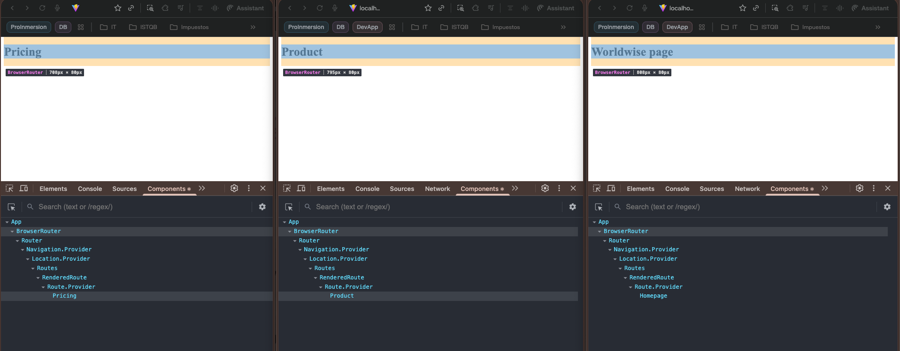

Let's visit:

* [Homepage page](http://localhost:5173/)
* [Product page](http://localhost:5173/product)
* [Pricing page](http://localhost:5173/pricing)

---

#### 206.2.7 PageNotFound and Catch-All Route

**Subsection Summary:**
- Creates `PageNotFound` in `src/pages/PageNotFound.jsx` with a friendly "Page not found 🥹" message.
- Adds a catch-all route `<Route path="*" element={<PageNotFound />} />` in `App.jsx`.
- The `*` path matches any URL not handled by prior routes (e.g. `/unknown`, `/typo`), ensuring users see a 404-like page instead of a blank screen.
- The image `section17-lecture206-002.png` shows the Page Not Found screen when visiting an unmatched URL.

```jsx
/* src/pages/PageNotFound.jsx */
const PageNotFound = () => {
  return <h1>Page not found 🥹</h1>;
};

export default PageNotFound;
```

And meanwhile:

```jsx
/* src/App.jsx */
import { BrowserRouter, Routes, Route } from "react-router-dom";
import Product from "./pages/Product";
import Pricing from "./pages/Pricing";
import Homepage from "./pages/Homepage";
import PageNotFound from "./pages/PageNotFound";                                  // 👈🏽 ✅ (1)

function App() {
  return (
    <BrowserRouter>
      <Routes>
        <Route path="/" element={<Homepage />} />
        <Route path="/product" element={<Product />} />
        <Route path="/pricing" element={<Pricing />} />
        <Route path="*" element={<PageNotFound />} />                             {/* 👈🏽 ✅ (2) */}
      </Routes>
    </BrowserRouter>
  );
}

export default App;
```

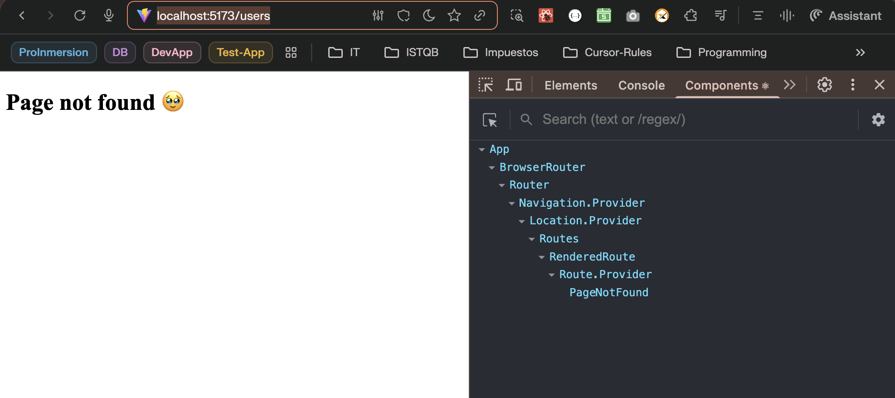

---

### 🐞 206.3 Issues:

| Issue | Status | Log/Error |
|---|---|---|
| Route paths without leading slash | ℹ️ Low Priority | `src/App.jsx:12-13`: `path="product"` and `path="pricing"` work but `path="/product"` and `path="/pricing"` are more explicit |
| Accessibility attributes missing on placeholders | ℹ️ Low Priority | `src/pages/Homepage.jsx`, `Product.jsx`, `Pricing.jsx`, `PageNotFound.jsx`: `<h1>` elements lack `tabIndex`, `aria-label` |

---

### 🧱 206.4 Pending Fixes (TODO)

- [ ] Optionally update `src/App.jsx` route paths to `path="/product"` and `path="/pricing"` for consistency with `path="/"` (lines 12–13)
- [ ] When implementing real page content, add appropriate `aria-label` and semantic markup to page components in `src/pages/`

[↑ top — 206. Lesson 206 — *Implementing Main Pages and Routes*](#-206-lesson-206--implementing-main-pages-and-routes)


<br>

## 🔧 207. Lesson 207 — *Linking Between Routes With `<Link />` and `<NavLink />`*

[🧳 Section 17: *React Route: Building Single-Page Applications (SPA)*](#-section-17-react-route-building-single-page-applications-spa)

### 📑 Table of Contents:
- [207. Lesson 207 — *Linking Between Routes With `<Link />` and `<NavLink />`*](#-207-lesson-207--linking-between-routes-with-link--and-navlink-)
- [207.1 Context](#-2071-context)
- [207.2 Updating code according the context](#-2072-updating-codetheory-according-the-context)
  - [207.2.1 Anchor Tag Causes Full Page Reload](#20721-anchor-tag-causes-full-page-reload)
  - [207.2.2 Replacing Anchor with Link for Client-Side Navigation](#20722-replacing-anchor-with-link-for-client-side-navigation)
  - [207.2.3 Creating PageNav Component with Link](#20723-creating-pagenav-component-with-link)
  - [207.2.4 Adding PageNav to Homepage](#20724-adding-pagenav-to-homepage)
  - [207.2.5 Adding PageNav to PageNotFound](#20725-adding-pagenav-to-pagenotfound)
  - [207.2.6 Adding PageNav to Product Page](#20726-adding-pagenav-to-product-page)
  - [207.2.7 Adding PageNav to Pricing Page](#20727-adding-pagenav-to-pricing-page)
  - [207.2.8 Using NavLink for Active State Styling](#20728-using-navlink-for-active-state-styling)
- [207.3 Issues](#-2073-issues)
- [207.4 Pending Fixes (TODO)](#-2074-pending-fixes-todo)

### 🧠 207.1 Context:

**Linking Between Routes** is the practice of navigating between different views in a React SPA without triggering a full page reload. Instead of using native HTML `<a href="...">` anchors (which cause the browser to request a new document from the server), React Router provides `<Link>` and `<NavLink>` components that perform **client-side navigation**: they update the URL and swap the rendered component while keeping the app state and avoiding a full reload.

In the Worldwise project, we use `Link` for in-page navigation (e.g. a "Pricing" link on the Homepage) and `NavLink` inside a shared `PageNav` component. `NavLink` automatically applies an `active` class (or custom styling) to the current route's link, enabling visual feedback such as highlighting the active nav item.

**Key Concepts:**

1. **`<Link to="...">`** — A React Router component that renders an `<a>` tag but intercepts clicks to perform client-side navigation via the History API. No full page reload occurs.
2. **`<NavLink>`** — An enhanced `Link` that adds an `active` class (or custom `className`/`style` functions) when its `to` path matches the current URL. Essential for navigation UIs where the current page should be visually distinct.
3. **`to` prop** — Accepts a string path (e.g. `"/pricing"`) or a location object. Must be used instead of `href` for React Router links.
4. **Shared navigation component** — A reusable `PageNav` component containing `NavLink` items ensures consistent navigation across all pages and centralizes route definitions.
5. **Avoid `href` for internal routes** — Using `<a href="/path">` triggers a full reload; always use `<Link to="/path">` for routes handled by React Router.

**Advantages:**
- No full page reloads; faster, smoother navigation.
- Preserves React state and component tree; no flicker or re-initialization.
- `NavLink` simplifies active-state styling for nav menus.
- Better UX for SPAs; feels like a native app.
- Browser back/forward and direct URL access work correctly when routing is configured.

**Disadvantages / Gotchas:**
- Must remember to use `Link`/`NavLink` instead of `<a>` for internal routes; easy to slip back to anchors.
- `NavLink` exact matching: by default it uses partial matching; `end` prop ensures exact match for the root `/` route.
- Duplicating `PageNav` in every page component can be tedious; consider lifting it to a layout or `App.jsx`.
- External links (to other domains) should still use `<a href="..." target="_blank" rel="noopener noreferrer">`.

**When to Consider Alternatives:**
- For external URLs — use `<a href="...">` with appropriate `rel` attributes.
- For programmatic navigation (e.g. after form submit) — use `useNavigate()` hook.
- For custom active styling beyond a simple class — use `NavLink`'s `className` or `style` as a function.
- When using nested routes — ensure `NavLink` paths match the route structure correctly.

In Worldwise, we replace the initial `<a href="/pricing">` with `<Link to="/pricing">`, build a `PageNav` component with links to Home, Product, and Pricing, add `PageNav` to all pages, and finally switch to `NavLink` in `PageNav` to enable future active-state styling.

---

### ⚙️ 207.2 Updating code/theory according the context:

#### **Summary**

- Section 207.2 demonstrates how to replace native anchor tags with React Router's `Link` and `NavLink` for client-side navigation.
- It solves the problem of full page reloads when navigating between routes; anchors cause reloads, whereas `Link` and `NavLink` perform in-app navigation.
- Subsections 207.2.1–207.2.2 show the anchor vs. `Link` contrast on the Homepage; 207.2.3 creates the `PageNav` component; 207.2.4–207.2.7 add `PageNav` to all pages; 207.2.8 replaces `Link` with `NavLink` in `PageNav` for active-state styling.
- The images illustrate each step: Homepage with anchor, Homepage with Link, Homepage with PageNav, and NavLink with active class.

---

#### 207.2.1 Anchor Tag Causes Full Page Reload

**Subsection Summary:**
- Uses a native `<a href="/pricing">Pricing</a>` anchor on the Homepage.
- Demonstrates the problem: clicking the link triggers a full page reload because the browser requests a new document.
- The image `section17-lecture207-001.png` shows the Homepage with the anchor tag; this approach defeats the SPA experience.
- Establishes why we need React Router's `Link` for internal navigation.

* reloading page in order to move to Pricing page.

```jsx
/* src/pages/Homepage.jsx */
const Homepage = () => {
  return (
    <>
      <h1>Worldwise page</h1>
      <a href="/pricing">Pricing</a>
    </>
  );
};

export default Homepage;
```
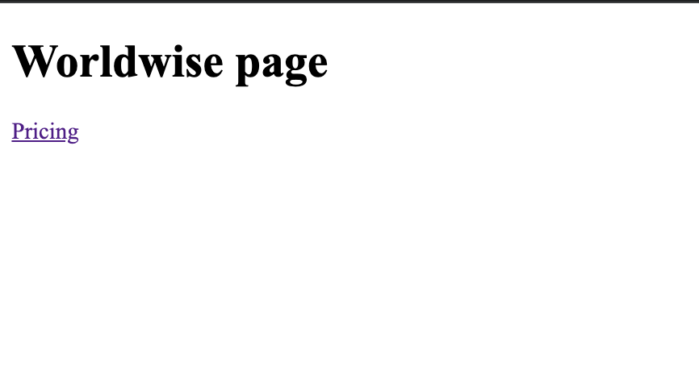

---

#### 207.2.2 Replacing Anchor with Link for Client-Side Navigation

**Subsection Summary:**
- Imports `Link` from `react-router-dom` and replaces `<a href="/pricing">` with `<Link to="/pricing">`.
- Enables client-side navigation: clicking "Pricing" updates the URL and renders the Pricing component without a full reload.
- The image `section17-lecture207-001.png` is reused to show the Homepage with the `Link` component (visually similar, but behavior differs).
- Core pattern: use `to` instead of `href` for routes handled by React Router.

```jsx
/* src/pages/Homepage.jsx */
import { Link } from "react-router-dom";        // 👈🏽 ✅ (1)

const Homepage = () => {
  return (
    <>
      <h1>Worldwise page</h1>
      <Link to="/pricing">Pricing</Link>        {/* 👈🏽 ✅ (2) */}
    </>
  );
};

export default Homepage;
```


---

#### 207.2.3 Creating PageNav Component with Link

**Subsection Summary:**
- Creates `PageNav` in `src/components/PageNav.jsx` with a semantic `<nav>` and unordered list.
- Uses `Link` for Home (`/`), Product (`/product`), and Pricing (`/pricing`).
- Centralizes navigation links in one component for reuse across pages.
- Establishes the structure that will later use `NavLink` for active-state styling.

```jsx
/* src/components/PageNav.jsx */
import { Link } from "react-router-dom";

const PageNav = () => {
  return (
    <nav>
      <ul>
        <li>
          <Link to="/">Home</Link>
        </li>
        <li>
          <Link to="/product">Product</Link>
        </li>
        <li>
          <Link to="/pricing">Pricing</Link>
        </li>
      </ul>
    </nav>
  );
};

export default PageNav;
```

---

#### 207.2.4 Adding PageNav to Homepage

**Subsection Summary:**
- Imports and renders `PageNav` at the top of the Homepage component.
- Keeps the existing `<Link to="/pricing">` in the page body (redundant with PageNav but illustrative).
- The image `section17-lecture207-002.png` shows the Homepage with the PageNav component visible.
- Ensures users can navigate to Product and Pricing from the landing page.

```jsx
/* src/pages/Homepage.jsx */
import { Link } from "react-router-dom";
import PageNav from "../components/PageNav";            // 👈🏽 ✅ (1)

const Homepage = () => {
  return (
    <>
      <PageNav />                                        {/* 👈🏽 ✅ (2) */}
      <h1>Worldwise page</h1>
      <Link to="/pricing">Pricing</Link>
    </>
  );
};

export default Homepage;
```
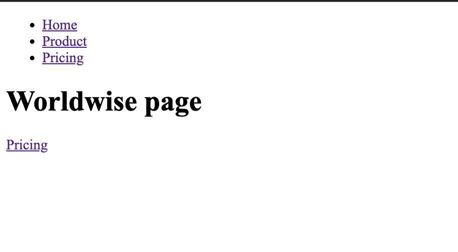

---

#### 207.2.5 Adding PageNav to PageNotFound

**Subsection Summary:**
- Imports and adds `PageNav` to the PageNotFound component.
- Allows users on a 404 page to navigate back to Home, Product, or Pricing without typing the URL.
- The image `section17-lecture207-003.png` shows the NotFound page with PageNav.
- Improves UX: 404 pages should still offer a way to get back into the app.

```jsx
/* src/pages/PageNotFound.jsx */
import PageNav from "../components/PageNav";                      // 👈🏽 ✅ (1)

const PageNotFound = () => {
  return (
    <>
      <PageNav />                                                 {/* 👈🏽 ✅ (2) */}
      <h1>Page not found 🥹</h1>
    </>
  );
};

export default PageNotFound;
```
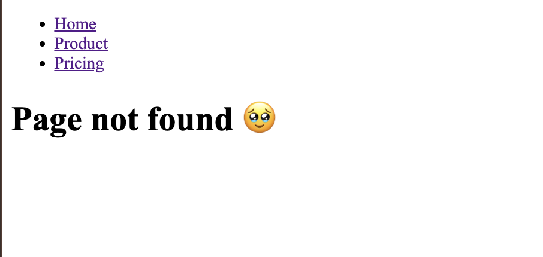

---

#### 207.2.6 Adding PageNav to Product Page

**Subsection Summary:**
- Imports and adds `PageNav` to the Product page component.
- Provides consistent navigation from the Product view to Home, Product, and Pricing.
- The image `section17-lecture207-004.png` shows the Product page with PageNav.
- Follows the same pattern as Homepage and PageNotFound for consistency.

```jsx
/* src/pages/Product.jsx */
import PageNav from "../components/PageNav";                      // 👈🏽 ✅ (1)
const Product = () => {
  return (
    <>
      <PageNav />                                                 {/* 👈🏽 ✅ (2) */}
      <h1>Product</h1>
    </>
  );
};

export default Product;
```
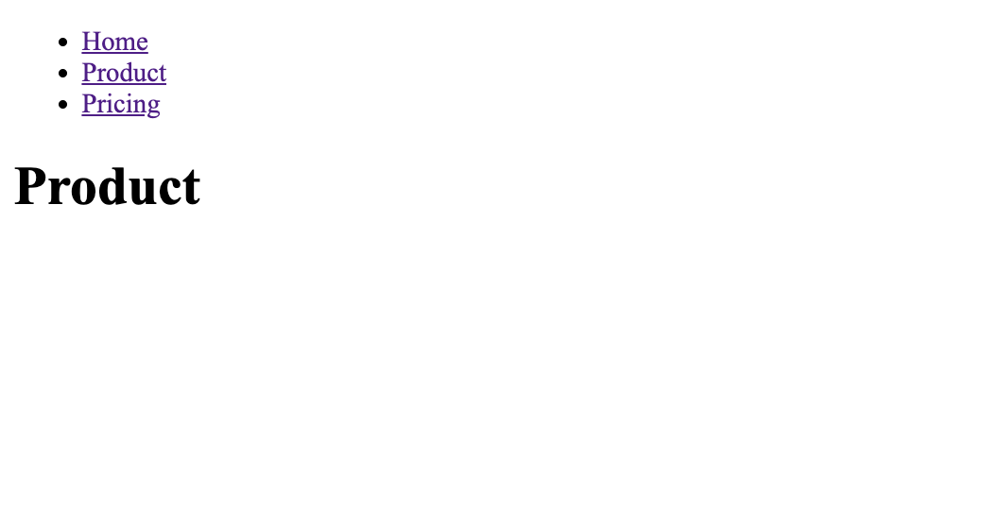

---

#### 207.2.7 Adding PageNav to Pricing Page

**Subsection Summary:**
- Imports and adds `PageNav` to the Pricing page component.
- Completes the navigation pattern across all main pages.
- The image `section17-lecture207-005.png` shows the Pricing page with PageNav.
- Ensures users can navigate between all routes from any page.

```jsx
/* src/pages/Pricing.jsx */
import PageNav from "../components/PageNav";                      //  👈🏽 ✅ (1)
const Pricing = () => {
  return (
    <>
      <PageNav />                                                 {/*  👈🏽 ✅ (2) */}
      <h1>Pricing</h1>
    </>
  );
};

export default Pricing;
```
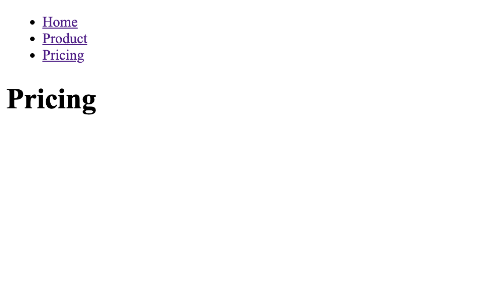

---

#### 207.2.8 Using NavLink for Active State Styling

**Subsection Summary:**
- Replaces `Link` with `NavLink` in `PageNav` for all three nav items.
- `NavLink` automatically adds `class="active"` to the link whose route matches the current URL.
- The image `section17-lecture207-006.png` illustrates the NavLink component and active state.
- Enables future CSS styling (e.g. bold, underline, background) for the active nav item; `className` or `style` props can customize the active appearance.


```jsx
/* src/components/PageNav.jsx */
import { Link, NavLink } from "react-router-dom";                           // 👈🏽 ✅ (1)

const PageNav = () => {
  return (
    <nav>
      <ul>
        <li>
          <NavLink to="/">Home</NavLink>                                    {/* 👈🏽 ✅ (2) */}
        </li>
        <li>
          <NavLink to="/product">Product</NavLink>                          {/* 👈🏽 ✅ (2) */}
        </li>
        <li>
          <NavLink to="/pricing">Pricing</NavLink>                          {/* 👈🏽 ✅ (2) */}
        </li>
      </ul>
    </nav>
  );
};

export default PageNav;
```
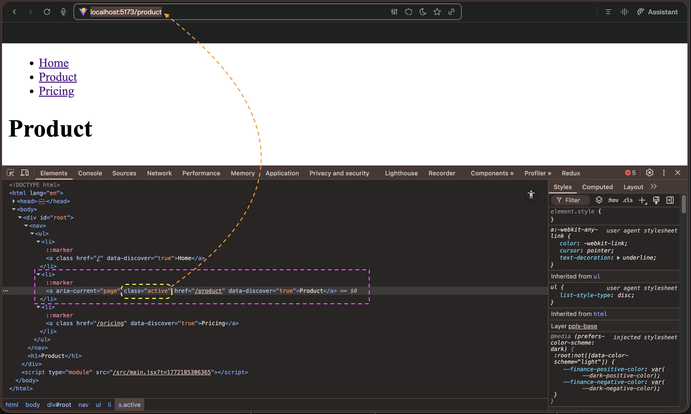

---

### 🐞 207.3 Issues:

- **PageNav duplicated across all pages**: Each page (Homepage, Product, Pricing, PageNotFound) imports and renders `PageNav` individually; this works but creates redundancy. Consider lifting `PageNav` to `App.jsx` or a layout component.
- **Accessibility: nav lacks `aria-label`**: The `<nav>` element in `PageNav` should have an `aria-label` (e.g. `aria-label="Main navigation"`) so screen readers can identify its purpose.
- **NavLink root route matching**: `NavLink to="/"` matches any path that starts with `/` (e.g. `/product`, `/pricing`); adding `end` prop ensures only the exact root path gets the active class.
- **Redundant Link on Homepage**: `Homepage` includes both `PageNav` and a standalone `<Link to="/pricing">Pricing</Link>`, which duplicates the Pricing link; consider removing if not intentional.

| Issue | Status | Log/Error |
|---|---|---|
| PageNav duplicated in every page | ℹ️ Low Priority | `src/pages/Homepage.jsx`, `Product.jsx`, `Pricing.jsx`, `PageNotFound.jsx`: Each imports and renders `PageNav`; consider layout in `App.jsx` |
| nav element missing aria-label | ⚠️ Identified | `src/components/PageNav.jsx:5`: `<nav>` should include `aria-label="Main navigation"` for accessibility |
| NavLink for root path may match child routes | ⚠️ Identified | `src/components/PageNav.jsx:8`: `<NavLink to="/">` should use `end` prop: `<NavLink to="/" end>Home</NavLink>` |
| Redundant Pricing link on Homepage | ℹ️ Informational | `src/pages/Homepage.jsx:9`: `<Link to="/pricing">` duplicates PageNav; remove if not needed for CTA |

---

### 🧱 207.4 Pending Fixes (TODO)

- [ ] Add `aria-label="Main navigation"` to the `<nav>` element in `src/components/PageNav.jsx` (line 5) for screen reader accessibility
- [ ] Add `end` prop to `<NavLink to="/">` in `src/components/PageNav.jsx` (line 8) so only the root path receives the active class: `<NavLink to="/" end>Home</NavLink>`
- [ ] Consider moving `PageNav` to `App.jsx` as a shared layout component to avoid importing it in every page
- [ ] Remove redundant `<Link to="/pricing">Pricing</Link>` from `src/pages/Homepage.jsx` (line 9) if the PageNav already provides sufficient navigation

[↑ top — 207. Lesson 207 — *Linking Between Routes With `<Link />` and `<NavLink />`*](#-207-lesson-207--linking-between-routes-with-link--and-navlink-)

<br>

## 🔧 208. Lesson 208 — *Styling Options For React Applications*

[🧳 Section 17: *React Route: Building Single-Page Applications (SPA)*](#-section-17-react-route-building-single-page-applications-spa)

### 📑 Table of Contents:
- [208. Lesson 208 — *Styling Options For React Applications*](#-208-lesson-208--styling-options-for-react-applications)
- [208.1 Context](#-2081-context)
- [208.2 Updating code according the context](#-2082-updating-codetheory-according-the-context)
  - [208.2.1 Styling Options Comparison Table](#20821-styling-options-comparison-table)
- [208.3 Issues](#-2083-issues)
- [208.4 Pending Fixes (TODO)](#-2084-pending-fixes-todo)

### 🧠 208.1 Context:

**React does not care about styling** — it is a UI library that handles rendering and state, but it does not prescribe how you style your components. Choosing a styling approach is entirely up to the developer. This lesson provides an overview of the main styling options available for React applications so you can make an informed decision for the Worldwise project.

The five main approaches are: **inline CSS**, **CSS/Sass files**, **CSS Modules**, **CSS-in-JS** (e.g. Styled Components), and **utility-first CSS** (e.g. Tailwind). Each has different scope, where/how it is applied, and what it is based on. There are also **UI component libraries** (MUI, Chakra UI, Mantine) that provide pre-styled components as an alternative to writing CSS yourself.

**Key Concepts:**

1. **Inline CSS** — Apply styles via the `style` prop on JSX elements. Scope: local to the element. Based on: CSS. Good for one-off styles or dynamic values, but can become verbose and does not support pseudo-classes or media queries.
2. **CSS or Sass files** — Traditional external `.css` (or `.scss`) files imported globally. Applied via `className`. Scope: entire app; can cause naming collisions and unintended overrides.
3. **CSS Modules** — One external file per component; class names are automatically scoped/hashed to avoid collisions. Applied via `className`. Scope: component. Based on: CSS. Provides component-level encapsulation without extra libraries.
4. **CSS-in-JS** — Write styles in JavaScript (e.g. Styled Components, Emotion). Creates new components; styles are scoped to the component. Based on: JavaScript. Good for dynamic styles and colocation, but adds runtime cost and bundle size.
5. **Utility-first CSS (Tailwind)** — Pre-defined utility classes applied via `className`. Scope: per element. Based on: CSS (but configured via PostCSS). Fast prototyping, consistent design system; can lead to long `className` strings.
6. **UI component libraries** — MUI, Chakra UI, Mantine, etc. Provide pre-built, themed components; little to no custom CSS needed. Trade-off: less control over design and larger bundles.

**Advantages:**

- **Inline CSS**: Quick for prototypes; supports dynamic values; no extra files.
- **CSS/Sass files**: Familiar to all developers; full CSS feature set; easy to integrate with existing stylesheets.
- **CSS Modules**: Component-scoped; no naming collisions; standard CSS syntax.
- **CSS-in-JS**: Colocation of styles and logic; full JS power (variables, conditionals); no class name conflicts.
- **Tailwind**: Rapid development; consistent spacing/colors; purges unused CSS in production.
- **UI libraries**: Quick setup; accessible components; design system out of the box.

**Disadvantages / Gotchas:**

- **Inline CSS**: No pseudo-classes, media queries; verbose; harder to maintain at scale.
- **CSS/Sass files**: Global scope; naming clashes (e.g. `.button` in multiple files); requires discipline (BEM, etc.).
- **CSS Modules**: Extra `.module.css` convention; some learning curve for teams unfamiliar with it.
- **CSS-in-JS**: Runtime overhead; larger bundle; vendor lock-in; SSR considerations.
- **Tailwind**: Long class strings; HTML can look busy; requires build setup.
- **UI libraries**: Opinionated design; bundle size; customization can be cumbersome.

**When to Consider Alternatives:**

- For a small prototype — inline CSS or a single global CSS file is fine.
- For medium-to-large apps with many components — prefer CSS Modules or Tailwind to avoid global scope issues.
- When you need heavy theming and dynamic styles — CSS-in-JS (Styled Components, Emotion) can be useful.
- When you want to ship quickly and don't need a custom design — UI libraries (MUI, Chakra, Mantine) are a good fit.
- For Worldwise — the project currently has no styling; the next lesson will likely choose one approach (e.g. CSS Modules or Tailwind) and implement it.

---

### ⚙️ 208.2 Updating code/theory according the context:

#### **Summary**

- Section 208.2 introduces the different styling options available in React applications.
- It does not modify code; it provides a conceptual overview via a comparison table so developers can choose an approach.
- Subsection 208.2.1 presents the table "Styling Options in React" with columns: Styling Option, Where?, How?, Scope, and Based On.
- The table covers five approaches (Inline CSS, CSS/Sass, CSS Modules, CSS-in-JS, Utility-first) plus UI libraries as an alternative.
- The image highlights that React is styling-agnostic and compares scope (local vs global vs component-level).

---

#### 208.2.1 Styling Options Comparison Table

**Subsection Summary:**

- The image `section17-lecture208-001.png` displays a comparison table titled "STYLING OPTIONS IN REACT".
- A note emphasizes: **"React doesn't care about styling"** — React handles rendering, not styling decisions.
- The table has five rows for: **Inline CSS** (style prop, scope: JSX element, local); **CSS or Sass file** (className, scope: entire app — noted as "global, causes problems"); **CSS Modules** (one file per component, className, scope: component); **CSS-in-JS** (creates new component, scope: component); **Utility-first CSS** e.g. Tailwind (className, scope: JSX element).
- Each row shows WHERE (JSX, external file, etc.), HOW (style prop, className, etc.), SCOPE, and BASED ON (CSS or JavaScript).
- Below the table: **Alternative** — UI libraries (MUI, Chakra UI, Mantine) as an option instead of writing CSS.
- The table helps developers decide which approach fits their project; global CSS is flagged as problematic; component-scoped options (CSS Modules, CSS-in-JS) are highlighted positively.

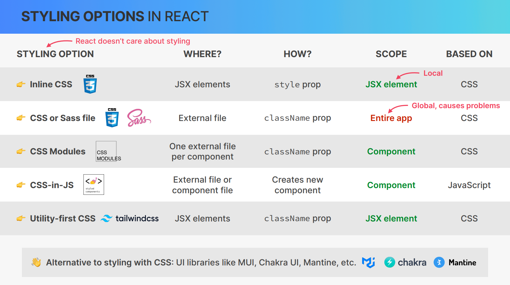

---

### 🐞 208.3 Issues:

- **No styling approach implemented**: The Worldwise project has no CSS files, no Tailwind, and no styled-components; all components (PageNav, Homepage, Product, Pricing, PageNotFound) are unstyled.
- **No global styles or reset**: `index.html` and `main.jsx` do not import any CSS; there is no baseline typography, margin reset, or design tokens.
- **PageNav has no visual styling**: The `<nav>`, `<ul>`, and `<li>` elements in `PageNav` have no classes or styles; nav links are plain and not visually distinct from page content.
- **NavLink active state has no CSS**: Although `NavLink` applies an `active` class when the route matches, there is no CSS to style the active link (e.g. bold, underline, background); the active state is effectively invisible.

| Issue | Status | Log/Error |
|---|---|---|
| No CSS or styling system in use | ⚠️ Identified | `package.json`, `src/main.jsx`: No CSS imports, no Tailwind, no styled-components; project is unstyled |
| No global CSS or reset | ⚠️ Identified | `src/main.jsx`: Does not import any CSS file; `index.html` has no linked stylesheet |
| PageNav lacks visual styling | ℹ️ Identified | `src/components/PageNav.jsx:4-17`: `<nav>`, `<ul>`, `<li>` have no `className` or inline styles |
| NavLink active class has no styles | ℹ️ Identified | `src/components/PageNav.jsx:7-14`: `NavLink` adds `.active` but no CSS targets it |

---

### 🧱 208.4 Pending Fixes (TODO)

- [ ] Choose a styling approach for the project (e.g. CSS Modules, Tailwind, or a single global CSS file) and add the necessary setup (e.g. `npm install -D tailwindcss` or create `src/index.css`)
- [ ] Add global styles: create `src/index.css` (or `src/App.css`) and import it in `src/main.jsx` — include at least a basic reset and typography
- [ ] Apply initial styling to `PageNav` in `src/components/PageNav.jsx`: add `className` or inline styles for layout (e.g. flex/grid for nav items) and spacing
- [ ] Add CSS for the `NavLink` active state: define `.active` (or `[aria-current="page"]`) styles in the chosen styling system so the current route is visually highlighted
- [ ] Consider adding `aria-label` to `<nav>` in `src/components/PageNav.jsx` (line 5) and `end` prop to `<NavLink to="/">` (line 8) as noted in Lesson 207 — these complement styling improvements

[↑ top — 208. Lesson 208 — *Styling Options For React Applications*](#-208-lesson-208--styling-options-for-react-applications)


<br>

## 🔧 209. Lesson 209 — *Using CSS Modules*

[🧳 Section 17: *React Route: Building Single-Page Applications (SPA)*](#-section-17-react-route-building-single-page-applications-spa)

### 📑 Table of Contents:
- [209. Lesson 209 — *Using CSS Modules*](#-209-lesson-209--using-css-modules)
- [209.1 Context](#-2091-context)
- [209.2 Updating code/theory according the context](#-2092-updating-codetheory-according-the-context)
  - [209.2.1 PageNav CSS Module File](#20921-pagenav-css-module-file)
  - [209.2.2 PageNav Component Using CSS Module](#20922-pagenav-component-using-css-module)
  - [209.2.3 AppLayout Page Component](#20923-applayout-page-component)
  - [209.2.4 App Route Configuration with AppLayout](#20924-app-route-configuration-with-applayout)
  - [209.2.5 Homepage Link to App Layout](#20925-homepage-link-to-app-layout)
  - [209.2.6 AppNav Component](#20926-appnav-component)
  - [209.2.7 AppLayout with AppNav](#20927-applayout-with-appnav)
  - [209.2.8 AppNav CSS Module File](#20928-appnav-css-module-file)
  - [209.2.9 AppNav Using CSS Module](#20929-appnav-using-css-module)
  - [209.2.10 Homepage with Both Navigation Components](#209210-homepage-with-both-navigation-components)
  - [209.2.11 Global index.css Styles](#209211-global-indexcss-styles)
  - [209.2.12 Importing Global CSS in main.jsx](#209212-importing-global-css-in-mainjsx)
  - [209.2.13 :global() Selector for Unscoped Styles](#209213-global-selector-for-unscoped-styles)
  - [209.2.14 Applying Global Class in Homepage](#209214-applying-global-class-in-homepage)
  - [209.2.15 NavLink Active Class Not Working](#209215-navlink-active-class-not-working)
  - [209.2.16 Using :global(.active) for NavLink Active State](#209216-using-globalactive-for-navlink-active-state)
- [209.3 Issues](#-2093-issues)
- [209.4 Pending Fixes (TODO)](#-2094-pending-fixes-todo)

### 🧠 209.1 Context:

**CSS Modules** is a build-time feature that scopes CSS class names to the component that imports them. Instead of global CSS (where `.button` in one file can conflict with `.button` in another), each CSS Module generates unique, hashed class names (e.g. `PageNav_nav_a3f2k`) so styles are isolated per component. This eliminates naming collisions and makes styles predictable and maintainable.

In the Worldwise project, we use CSS Modules for both `PageNav` and `AppNav` components. Each component has a companion `.module.css` file (e.g. `PageNav.module.css`). We import the generated class names as a JavaScript object (`import styles from "./PageNav.module.css"`) and apply them via `className={styles.nav}`. For third-party or dynamically added classes (such as React Router's `active` class on `NavLink`), we use the `:global()` wrapper so the class is not hashed and stays globally available.

**Key Concepts:**

1. **Module file convention** — CSS Modules use the `.module.css` suffix (e.g. `PageNav.module.css`). The bundler (Vite) detects this convention and processes the file.
2. **Scoped class names** — Selectors like `.nav` become `.PageNav_nav_a3f2k` (or similar) at build time. Only the importing component can use them.
3. **Import as object** — `import styles from "./PageNav.module.css"` yields an object: `{ nav: "PageNav_nav_a3f2k", list: "PageNav_list_x9k2m" }`. Use `className={styles.nav}`.
4. **Named imports** — `import { nav } from "./AppNav.module.css"` is also valid; it imports the hashed value of `.nav` directly.
5. **:global()** — Wraps selectors that must remain unscoped. Use `:global(.active)` when targeting classes added by libraries (e.g. React Router's `active` on `NavLink`).
6. **Global CSS variables** — `:root` variables in `index.css` are available everywhere; CSS Modules can use `var(--color-brand--1)` etc.

**Advantages:**
- No naming collisions; each component's styles are isolated.
- Standard CSS syntax; no new language or runtime.
- Works with Vite out of the box; no extra configuration.
- Co-location: each component has its own `.module.css` next to it.
- Easy to combine with global styles (reset, typography, variables).

**Disadvantages / Gotchas:**
- Requires the `.module.css` naming convention; teams must adopt it consistently.
- Third-party classes (e.g. `active` from NavLink) need `:global()` to be targeted.
- Composing classes or dynamic class names requires `className={`${styles.nav} ${styles.active}`}` or similar.
- No built-in theming; rely on CSS variables or additional tooling.

**When to Consider Alternatives:**
- For very small apps — a single global CSS file may be sufficient.
- When using Tailwind — utility classes provide similar component-level granularity without Modules.
- For heavy theming or dynamic styles — CSS-in-JS (Styled Components, Emotion) might be preferable.
- When integrating UI libraries (MUI, Chakra) — they bring their own styling; CSS Modules may overlap.

In Worldwise, we apply CSS Modules to `PageNav` and `AppNav`, add global styles via `index.css`, and use `:global(.active)` to style the active navigation link from React Router's `NavLink`.

---

### ⚙️ 209.2 Updating code/theory according the context:

#### **Summary**

- Section 209.2 demonstrates how to implement CSS Modules in the Worldwise app for component-scoped styling.
- It solves global CSS conflicts by scoping styles to `PageNav` and `AppNav`, and shows how to target third-party classes (e.g. `active` from `NavLink`) using `:global()`.
- Subsections 209.2.1–209.2.2 set up PageNav with a CSS Module; 209.2.3–209.2.7 introduce AppLayout and AppNav with their own Module; 209.2.8–209.2.10 apply AppNav styles and show both navs together; 209.2.11–209.2.12 add global `index.css`; 209.2.13–209.2.16 explain `:global()` and fix NavLink active styling.
- Images illustrate each step: PageNav with Module, AppNav styled, both navs, global styles, test global class, active not working, and active working with `:global(.active)`.

---

#### 209.2.1 PageNav CSS Module File

**Subsection Summary:**
- Creates `src/components/PageNav.module.css` with `.nav` and `ul` selectors.
- `.nav` sets `background-color: sandybrown`; `ul` gets flex layout with `list-style: none`, `display: flex`, `justify-content: space-between`.
- Establishes the CSS Module file that will be imported by PageNav.
- Note: `ul` is a bare selector; in CSS Modules it gets hashed. Later the structure changes to `.nav ul` for nested styling.
```css
/* src/components/PageNav.module.css */
.nav {
  background-color: sandybrown
}

ul {
  list-style: none;
  display: flex;
  justify-content: space-between;
}
```

#### 209.2.2 PageNav Component Using CSS Module

**Subsection Summary:**
- Imports the CSS Module as `styles` from `PageNav.module.css` and applies `className={styles.nav}` to the nav element.
- Uses `className={styles.list}` on the `ul` for the flex layout (requires a `.list` class in the Module, or use `.nav ul` in CSS).
- Demonstrates the standard pattern: `import styles from "./Component.module.css"` and `className={styles.className}`.
- The image `section17-lecture209-001.png` shows the PageNav with sandybrown background and styled list after applying the CSS Module.

```jsx
/* src/components/PageNav.jsx */
import { Link, NavLink } from "react-router-dom";

import styles from "./PageNav.module.css";

const PageNav = () => {
  return (
    <nav className={styles.nav}>
      <ul className={styles.list}>
        <li>
          <NavLink to="/">Home</NavLink>
        </li>
        <li>
          <NavLink to="/product">Product</NavLink>
        </li>
        <li>
          <NavLink to="/pricing">Pricing</NavLink>
        </li>
      </ul>
    </nav>
  );
};

export default PageNav;
```

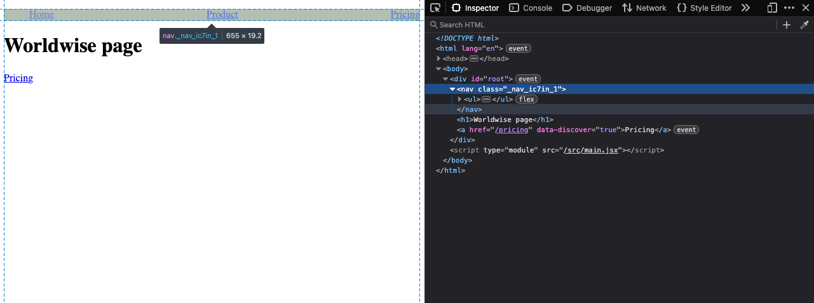

---

#### 209.2.3 AppLayout Page Component

**Subsection Summary:**
- Creates the `AppLayout` component in `src/pages/AppLayout.jsx` as a placeholder for the app section.
- Renders a simple `<div>App Layout</div>`; will later contain `AppNav` and nested routes.
- Establishes the structure for the `/app` route that will wrap app-specific views.

```jsx
/* src/pages/AppLayout.jsx */
const AppLayout = () => {
  return <div>App Layout</div>;
};

export default AppLayout;
```

---

#### 209.2.4 App Route Configuration with AppLayout

**Subsection Summary:**
- Imports `AppLayout` and adds a `<Route path="/app" element={<AppLayout />} />` in `App.jsx`.
- Enables navigation to `/app` for the app-specific layout and future nested routes.
- Keeps the existing routes for Homepage, Product, Pricing, and PageNotFound.

```jsx
/* src/App.jsx */
import { BrowserRouter, Routes, Route } from "react-router-dom";
import Product from "./pages/Product";
import Pricing from "./pages/Pricing";
import Homepage from "./pages/Homepage";
import PageNotFound from "./pages/PageNotFound";
import AppLayout from "./pages/AppLayout";                      // 👈🏽 ✅ (1)

function App() {
  return (
    <BrowserRouter>
      <Routes>
        <Route path="/" element={<Homepage />} />
        <Route path="/product" element={<Product />} />
        <Route path="/pricing" element={<Pricing />} />
        <Route path="/app" element={<AppLayout />} />           {/* 👈🏽 ✅ (2) */}
        <Route path="*" element={<PageNotFound />} />
      </Routes>
    </BrowserRouter>
  );
}

export default App;
```

---

#### 209.2.5 Homepage Link to App Layout

**Subsection Summary:**
- Updates Homepage to include `PageNav` and a `<Link to="/app">Go to the App Layout</Link>`.
- Replaces or comments out the previous `<Link to="/pricing">`; demonstrates navigation to the new app section.
- Prepares for the distinction between marketing pages (Home, Product, Pricing) and the app area (`/app`).

```jsx
/* src/pages/Homepage.jsx */
import { Link } from "react-router-dom";
import PageNav from "../components/PageNav";          // 👈🏽 ✅ (1)

const Homepage = () => {
  return (
    <>
      <PageNav />                                     {/* 👈🏽 ✅ (2) */}
      <h1>Worldwise page</h1>
      {/* <Link to="/pricing">Pricing</Link> */}
      <Link to="/app">Go to the App Layout</Link>
    </>
  );
};

export default Homepage;
```

---

#### 209.2.6 AppNav Component

**Subsection Summary:**
- Creates `AppNav` in `src/components/AppNav.jsx` with a semantic `<nav>` and empty `<ul>`.
- Serves as the app-specific navigation (distinct from `PageNav` for marketing pages).
- Will be used inside `AppLayout` and styled via its own CSS Module in subsequent steps.

```jsx
/* src/components/AppNav.jsx */
const AppNav = () => {
  return (
    <nav>
      App Navigation
      <ul></ul>
    </nav>
  );
};

export default AppNav;
```

---

#### 209.2.7 AppLayout with AppNav

**Subsection Summary:**
- Imports `AppNav` into `AppLayout` and renders it above the layout content.
- Provides a consistent app navigation bar for routes under `/app`.
- Demonstrates composing layout components (AppLayout wraps AppNav and main content).

```jsx
/* src/pages/AppLayout.jsx */
import AppNav from "../components/AppNav";          // 👈🏽 ✅ (1)
const AppLayout = () => {
  return (
    <div>
      <AppNav />                                    {/* 👈🏽 ✅ (2) */}
      <p>App Layout</p>
    </div>
  );
};

export default AppLayout;
```

---

#### 209.2.8 AppNav CSS Module File

**Subsection Summary:**
- Creates `src/components/AppNav.module.css` with a `.nav` class.
- Sets `background-color: lightblue` to differentiate AppNav visually from PageNav (sandybrown).
- Both nav components can use `.nav` without conflict because CSS Modules scope the names per file.

```css
/* src/components/AppNav.module.css */
.nav {
  background-color: lightblue;
}
```

---

#### 209.2.9 AppNav Using CSS Module

**Subsection Summary:**
- Uses named import `import { nav } from "./AppNav.module.css"` to get the hashed class for `.nav`.
- Applies `className={nav}` to the `<nav>` element so AppNav receives the lightblue background.
- Demonstrates an alternative to `import styles from` — named imports work when you need only specific classes.
- The image `section17-lecture209-002.png` shows AppNav with the lightblue styling applied.

```jsx
/* src/components/AppNav.jsx */
import { nav } from "./AppNav.module.css";            // 👈🏽 ✅

const AppNav = () => {
  return (
    <nav className={nav}>
      App Navigation
      <ul></ul>
    </nav>
  );
};

export default AppNav;
```

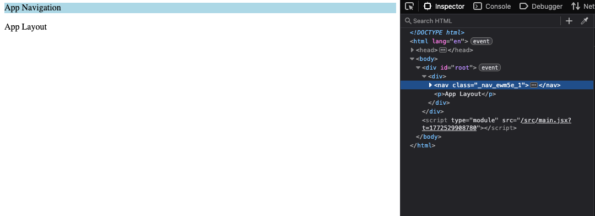

---

#### 209.2.10 Homepage with Both Navigation Components

**Subsection Summary:**
- Adds `AppNav` alongside `PageNav` to the Homepage for demonstration purposes.
- Shows that both components can use the same class name `.nav` in their respective Modules without conflict — each gets a unique hashed class.
- The image `section17-lecture209-003.png` illustrates both navigation bars with distinct backgrounds (sandybrown and lightblue) on the same page.

```jsx
/* src/pages/Homepage.jsx */
import { Link } from "react-router-dom";
import PageNav from "../components/PageNav";
import AppNav from "../components/AppNav";            // 👈🏽 ✅ (1)

const Homepage = () => {
  return (
    <>
      <PageNav />
      <AppNav />                                      {/* 👈🏽 ✅ (2) */}
      <h1>Worldwise page</h1>
      {/* <Link to="/pricing">Pricing</Link> */}
      <Link to="/app">Go to the App Layout</Link>
    </>
  );
};

export default Homepage;
```

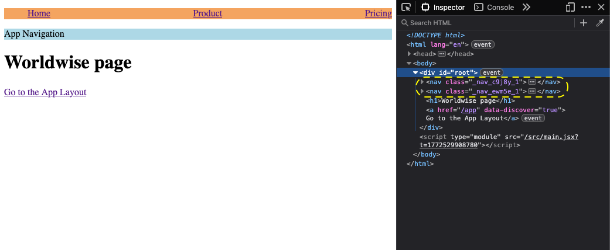

---

#### 209.2.11 Global index.css Styles

**Subsection Summary:**
- Creates or updates `src/index.css` with global styles: Leaflet CSS, Manrope font, CSS variables (`:root`), reset, typography, form elements, and CTA styles.
- CSS variables (e.g. `--color-brand--1`, `--color-dark--1`) are available in all CSS Modules via `var(--variable-name)`.
- Source: [index.css repo link](https://github.com/jonasschmedtmann/ultimate-react-course/blob/main/11-worldwise/starter/index.css)

```css
/* src/index.css */
/* Taken from getting started guide at: https://leafletjs.com/examples/quick-start/ */
@import "https://unpkg.com/leaflet@1.7.1/dist/leaflet.css";
@import "https://fonts.googleapis.com/css2?family=Manrope:wght@400;600;700;800&display=swap";

/* These CSS variables are global, so they are available in all CSS modules */
:root {
  --color-brand--1: #ffb545;
  --color-brand--2: #00c46a;

  --color-dark--0: #242a2e;
  --color-dark--1: #2d3439;
  --color-dark--2: #42484d;
  --color-light--1: #aaa;
  --color-light--2: #ececec;
  --color-light--3: #d6dee0;
}

* {
  margin: 0;
  padding: 0;
  box-sizing: inherit;
}

html {
  font-size: 62.5%;
  box-sizing: border-box;
}

body {
  font-family: "Manrope", sans-serif;
  color: var(--color-light--2);
  font-weight: 400;
  line-height: 1.6;
}

label {
  font-size: 1.6rem;
  font-weight: 600;
}

input,
textarea {
  width: 100%;
  padding: 0.8rem 1.2rem;
  font-family: inherit;
  font-size: 1.6rem;
  border: none;
  border-radius: 5px;
  background-color: var(--color-light--3);
  transition: all 0.2s;
}

input:focus {
  outline: none;
  background-color: #fff;
}

.cta:link,
.cta:visited {
  display: inline-block;
  background-color: var(--color-brand--2);
  color: var(--color-dark--1);
  text-transform: uppercase;
  text-decoration: none;
  font-size: 1.6rem;
  font-weight: 600;
  padding: 1rem 3rem;
  border-radius: 5px;
}

/*
"importCSSModule": {
    "prefix": "csm",
    "scope": "javascript,typescript,javascriptreact",
    "body": ["import styles from './${TM_FILENAME_BASE}.module.css'"],
    "description": "Import CSS Module as `styles`"
  },
*/
```

---

#### 209.2.12 Importing Global CSS in main.jsx

**Subsection Summary:**
- Adds `import "./index.css"` in `src/main.jsx` so global styles apply to the entire app.
- The import order ensures global styles load before the app renders; CSS Modules still scope their own classes.
- The image `section17-lecture209-004.png` shows the app after global styles (Manrope font, colors, reset) are applied.

```jsx
/* src/main.jsx */
import { StrictMode } from "react";
import { createRoot } from "react-dom/client";
import App from "./App.jsx";
import "./index.css";                                     // 👈🏽 ✅

createRoot(document.getElementById("root")).render(
  <StrictMode>
    <App />
  </StrictMode>,
);
```

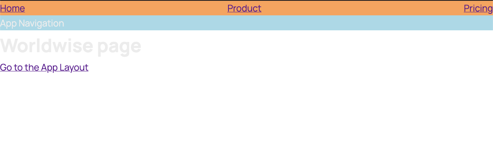

---

#### 209.2.13 :global() Selector for Unscoped Styles

**Subsection Summary:**
- Adds `:global(.test)` to `PageNav.module.css` to demonstrate how to target a class that is not hashed by the Module.
- `:global(.className)` keeps the selector globally available; useful when you need to style elements with fixed class names (e.g. from libraries or shared markup).
- Answers the question: *How can we use a module style class as a global style?* — by wrapping the selector in `:global()`.

```css
/* src/components/PageNav.module.css */
.nav {
  background-color: sandybrown
}

.nav ul {
  list-style: none;
  display: flex;
  justify-content: space-between;
}

:global(.test) {                                            // 👈🏽 ✅
  background-color: red;
}
```

---

#### 209.2.14 Applying Global Class in Homepage

**Subsection Summary:**
- Adds `className="test"` to the `<h1>` in Homepage so it receives the red background from `:global(.test)` in PageNav.module.css.
- Demonstrates that `:global(.test)` applies to any element with `class="test"` anywhere in the app, even though the rule lives in a CSS Module.
- The image `section17-lecture209-005.png` shows the h1 with the red background from the global test class.

```jsx
/* src/pages/Homepage.jsx */
import { Link } from "react-router-dom";
import PageNav from "../components/PageNav";
import AppNav from "../components/AppNav";

const Homepage = () => {
  return (
    <>
      <PageNav />
      <AppNav />
      <h1 className="test">Worldwise page</h1>              {/* 👈🏽 ✅ */}
      {/* <Link to="/pricing">Pricing</Link> */}
      <Link to="/app">Go to the App Layout</Link>
    </>
  );
};

export default Homepage;
```

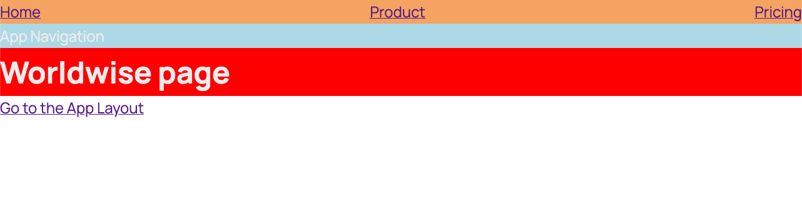

---

#### 209.2.15 NavLink Active Class Not Working

**Subsection Summary:**
- Attempts to style the active NavLink with `.nav .active` in PageNav.module.css.
- **Problem**: In CSS Modules, `.active` is hashed to something like `PageNav_active_x9k2m`, but React Router's `NavLink` adds the literal class `active` (unhashed) to the DOM. The selector `.nav .active` expects the hashed version, so it does not match.
- The image `section17-lecture209-006.png` shows that the active link styling is not applied.

```css
/* src/components/PageNav.module.css - .nav .active does NOT work for NavLink */
.nav {
  background-color: sandybrown
}

.nav ul {
  list-style: none;
  display: flex;
  justify-content: space-between;
}

.nav .active {                                                  // 👈🏽 ✅
  background-color: green;
  color: greenyellow;
  padding: 0.25rem 1.75rem;
  border-radius: 5px;
  text-decoration: none;
  font-weight: none;
}

:global(.test) {
  background-color: red;
}
```

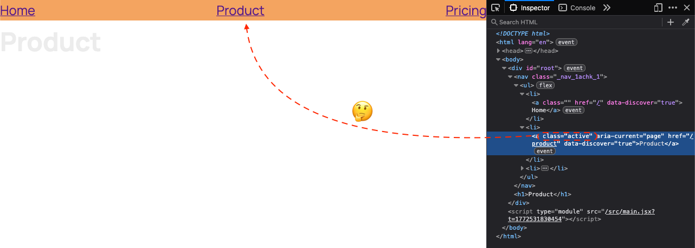

---

#### 209.2.16 Using :global(.active) for NavLink Active State

**Subsection Summary:**
- Replaces `.nav .active` with `.nav :global(.active)` so the `.active` class is not hashed and matches the class React Router adds to the DOM.
- The active NavLink now receives the green background, greenyellow text, padding, and border-radius.
- The image `section17-lecture209-007.png` illustrates the working active state styling for the current route.

```css
/* src/components/PageNav.module.css */
.nav {
  background-color: sandybrown;
}

.nav ul {
  list-style: none;
  display: flex;
  justify-content: space-between;
}

.nav :global(.active) {                                           // 👈🏽 ✅
  background-color: green;
  color: greenyellow;
  padding: 0.25rem 1.75rem;
  border-radius: 5px;
  text-decoration: none;
  font-weight: none;
}

:global(.test) {
  background-color: red;
}
```

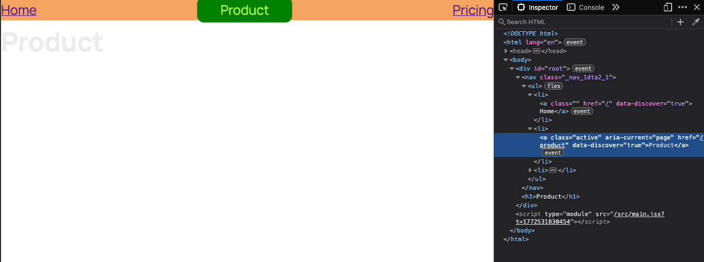

---

### 🐞 209.3 Issues:

| Issue | Status | Log/Error |
|---|---|---|
| AppNav on Homepage (demo only) | ℹ️ Informational | `src/pages/Homepage.jsx:9`: AppNav is for `/app` layout; consider removing from Homepage for production |
| font-weight: none invalid | ⚠️ Identified | `src/components/PageNav.module.css:14`: Use `font-weight: normal` instead of `font-weight: none` |
| :global(.test) demonstration code | ℹ️ Informational | `src/components/PageNav.module.css`: Remove `:global(.test)` and Homepage `className="test"` when cleaning up |
| PageNav .list vs .nav ul | ℹ️ Low Priority | `src/components/PageNav.module.css`, `PageNav.jsx`: Ensure `.list` exists if used, or use `.nav ul` and remove `className` from ul |

---

### 🧱 209.4 Pending Fixes (TODO)

- [ ] Fix `font-weight: none` to `font-weight: normal` in `src/components/PageNav.module.css` (line 14)
- [ ] Remove `:global(.test)` from `src/components/PageNav.module.css` and `className="test"` from `src/pages/Homepage.jsx` when cleaning up demonstration code
- [ ] Consider removing `AppNav` from Homepage and keeping it only in `AppLayout` for production — update `src/pages/Homepage.jsx` accordingly
- [ ] Reconcile PageNav `ul` styling: if using `styles.list`, add `.list` to `PageNav.module.css`; if using `.nav ul`, remove `className={styles.list}` from the `ul` in `PageNav.jsx`

[↑ top — 209. Lesson 209 — *Using CSS Modules*](#-209-lesson-209--using-css-modules)


<br>

## 🔧 210. Lesson 210 — *Building the Pages*

[🧳 Section 17: *React Route: Building Single-Page Applications (SPA)*](#-section-17-react-route-building-single-page-applications-spa)

### 📑 Table of Contents:
- [210. Lesson 210 — *Building the Pages*](#-210-lesson-210--building-the-pages)
- [210.1 Context](#-2101-context)
- [210.2 Updating code according the context](#-2102-updating-code-according-the-context)
  - [210.2.1 Cities Data Structure](#21021-cities-data-structure)
  - [210.2.2 Public Assets Folder Structure](#21022-public-assets-folder-structure)
  - [210.2.3 AppLayout CSS Module](#21023-applayout-css-module)
  - [210.2.4 Homepage Component with Styles](#21024-homepage-component-with-styles)
  - [210.2.5 Login Page with Form](#21025-login-page-with-form)
  - [210.2.6 PageNotFound Simplified](#21026-pagenotfound-simplified)
  - [210.2.7 Pricing Page (Shared Product Styles)](#21027-pricing-page-shared-product-styles)
  - [210.2.8 Product Page with Styles](#21028-product-page-with-styles)
  - [210.2.9 Homepage with CTA Link](#21029-homepage-with-cta-link)
  - [210.2.10 PageNav CSS Module Update](#210210-pagenav-css-module-update)
  - [210.2.11 Homepage with PageNav](#210211-homepage-with-pagenav)
  - [210.2.12 Logo Component](#210212-logo-component)
  - [210.2.13 PageNav with Logo and Login Link](#210213-pagenav-with-logo-and-login-link)
  - [210.2.14 Logo as Link to Home](#210214-logo-as-link-to-home)
  - [210.2.15 Login Page with PageNav](#210215-login-page-with-pagenav)
  - [210.2.16 Product Page with PageNav](#210216-product-page-with-pagenav)
  - [210.2.17 Pricing Page with PageNav](#210217-pricing-page-with-pagenav)
  - [210.2.18 App Route Configuration with Login](#210218-app-route-configuration-with-login)
- [210.3 Issues](#-2103-issues)
- [210.4 Pending Fixes (TODO)](#-2104-pending-fixes-todo)

### 🧠 210.1 Context:

**Building the Pages** is the phase where placeholder page components are transformed into fully styled, content-rich views that match the Worldwise app design. This lesson applies CSS Modules (introduced in Lesson 209) across all pages, introduces shared data and assets, and establishes the layout and navigation structure that users will see.

The lesson covers: (1) setting up the cities data structure for future app features; (2) organising public assets (images, logo, backgrounds); (3) applying CSS Modules to each page (Homepage, Product, Pricing, Login, PageNotFound, AppLayout); (4) creating the Logo component and updating PageNav with a branded header and Login link; (5) wiring the Login route and ensuring all pages share consistent styling and navigation.

**Key Concepts:**

1. **Page structure and layout** — Each page uses a semantic `<main>` (or wrapper) with a CSS Module for scoped styles. Common patterns include full-viewport backgrounds, flex/grid layouts for content sections, and consistent spacing via design tokens (`var(--color-dark--1)`, etc.).
2. **Shared styles across pages** — The Pricing page reuses `Product.module.css` because both share the same two-column layout (image + text block); this avoids duplication while keeping the option to extract a shared module later.
3. **Logo and branded navigation** — The `Logo` component provides a clickable brand identity; wrapping it in `<Link to="/">` allows users to return home from any page. PageNav is updated to show Logo, Product, Pricing, and Login, with the Login link styled as a CTA button.
4. **Public assets** — Vite serves files from the `public/` folder at the root URL. Images (bg.jpg, img-1.jpg, img-2.jpg, logo.png) are referenced with paths like `/logo.png` or in CSS as `url("/bg.jpg")` (or relative paths depending on setup).
5. **Route coverage** — All main views (/, /product, /pricing, /login, /app, *) are configured in `App.jsx` so users can navigate to each page via links or direct URL entry.
6. **Form state and controlled inputs** — The Login page demonstrates controlled components with `useState` for email and password; values are pre-filled for development but the form is not yet wired to authentication.

**Advantages:**
- Consistent look and feel across all pages using CSS Modules and global design tokens.
- Reusable Logo and PageNav; single source of truth for navigation links.
- Separation of marketing pages (Homepage, Product, Pricing, Login) from the app section (`/app`).
- Data structure (`cities.json`) prepared for future map and city list features.
- Clear, maintainable page components with descriptive class names and layout styles.

**Disadvantages / Gotchas:**
- Pricing reusing Product styles can cause confusion if layout diverges later; consider extracting shared layout styles.
- Background image paths in CSS Modules must resolve correctly (e.g. `/bg.jpg` for public assets).
- `PageNav` is still duplicated per page; consider a layout wrapper to reduce repetition.
- Typo in CTA text ("noew" instead of "now") and possible export naming mismatch in Pricing (e.g. exporting `Product` instead of `Pricing`).

**When to Consider Alternatives:**
- For very different page layouts — give each page its own CSS Module instead of sharing.
- For complex form validation — integrate a form library (React Hook Form, Formik) or validation schema.
- For image optimization — use a loader or CDN for production assets.
- For layout nesting — consider React Router nested routes with shared layouts to avoid repeating PageNav.

In Worldwise, this lesson completes the visual foundation of the app: all pages have real content, styled layouts, the Logo, PageNav, and the Login route. The `/app` layout remains a placeholder for future map and city features.

---

### ⚙️ 210.2 Updating code according the context:

#### **Summary**

- Section 210.2 walks through the step-by-step implementation of all Worldwise pages, from data and asset setup to full page layouts and route configuration.
- It transforms placeholder components into styled, content-rich views using CSS Modules, introduces the Logo component, updates PageNav with new links and styles, and adds the Login page and route.
- Subsections 210.2.1–210.2.2 set up data and assets; 210.2.3–210.2.9 build each page’s layout and styles; 210.2.10–210.2.14 refine PageNav and Logo; 210.2.15–210.2.18 add PageNav to remaining pages and configure the Login route.
- Images illustrate the Homepage with CTA, the Homepage with PageNav, and the final route overview.

---

#### 210.2.1 Cities Data Structure

**Subsection Summary:**
- Defines the `cities.json` data structure in `data/` with an array of city objects.
- Each city has `cityName`, `country`, `emoji`, `date`, `notes`, `position` (lat/lng), and `id`.
- Prepares mock data for future map and city list features; not yet consumed by any component.
- Establishes the schema that the app will use when displaying visited cities.
```json
/* data/cities.json */
{
  "cities": [
    {
      "cityName": "Lisbon",
      "country": "Portugal",
      "emoji": "🇵🇹",
      "date": "2027-10-31T15:59:59.138Z",
      "notes": "My favorite city so far!",
      "position": {
        "lat": 38.727881642324164,
        "lng": -9.140900099907554
      },
      "id": 73930385
    },
    {
      "cityName": "Madrid",
      "country": "Spain",
      "emoji": "🇪🇸",
      "date": "2027-07-15T08:22:53.976Z",
      "notes": "",
      "position": {
        "lat": 40.46635901755316,
        "lng": -3.7133789062500004
      },
      "id": 17806751
    },
    {
      "cityName": "Berlin",
      "country": "Germany",
      "emoji": "🇩🇪",
      "date": "2027-02-12T09:24:11.863Z",
      "notes": "Amazing 😃",
      "position": {
        "lat": 52.53586782505711,
        "lng": 13.376933665713324
      },
      "id": 98443197
    }
  ]
}
```

---

#### 210.2.2 Public Assets Folder Structure

**Subsection Summary:**
- Lists the public assets in the `public/` folder: `bg.jpg`, `icon.png`, `img-1.jpg`, `img-2.jpg`, `logo.png`.
- Vite serves these at the root; reference them as `/bg.jpg`, `/logo.png`, etc.
- `bg.jpg` is used as the Homepage background; `img-1.jpg` and `img-2.jpg` for Product and Pricing; `logo.png` for the Logo component.
- Keeps assets separate from source code for correct caching and deployment.

```
18-worldwise/
├── index.html
├── package.json
├── package-lock.json
├── vite.config.js
├── eslint.config.js
├── .gitignore
├── README.md
│
├── data/
│   └── cities.json
│
├── public/
│   ├── bg.jpg
│   ├── icon.png
│   ├── img-1.jpg
│   ├── img-2.jpg
│   └── logo.png
│
└── src/
    ├── App.jsx
    ├── main.jsx
    ├── index.css
    │
    ├── assets/
    │   └── react.svg
    │
    ├── components/
    │   ├── AppLayout.module.css
    │   ├── AppNav.jsx
    │   ├── AppNav.module.css
    │   ├── Logo.jsx
    │   ├── Logo.module.css
    │   ├── PageNav.jsx
    │   └── PageNav.module.css
    │
    └── pages/
        ├── AppLayout.jsx
        ├── AppLayout.module.css
        ├── Homepage.jsx
        ├── Homepage.module.css
        ├── Login.jsx
        ├── Login.module.css
        ├── PageNotFound.jsx
        ├── Pricing.jsx
        ├── Product.jsx
        └── Product.module.css
```

---

#### 210.2.3 AppLayout CSS Module

**Subsection Summary:**
- Creates `AppLayout.module.css` with `.app` class for the app layout container.
- Sets full viewport height (`100vh`), padding, flex layout, and `overscroll-behavior-y: none` to prevent scroll chaining.
- Establishes the base layout styles for the `/app` section where the map and city list will live.
- Uses `display: flex` and `position: relative` for future sidebar/content layout.

```css
/* src/pages/AppLayout.module.css */
.app {
  height: 100vh;
  padding: 2.4rem;
  overscroll-behavior-y: none;
  display: flex;
  position: relative;
}
```

---

#### 210.2.4 Homepage Component with Styles

**Subsection Summary:**
- Rebuilds the Homepage with `Homepage.module.css` for full-page hero layout.
- Uses a background image (bg.jpg) with dark overlay, centred content section with flex, large typography.
- Does not yet include PageNav or CTA link; introduces the core layout and styling structure.
- The `.homepage` class handles height, margin, background, and padding; `.homepage section` centres the text block.

```jsx
/* src/pages/Homepage.jsx */
import styles from "./Homepage.module.css";

export default function Homepage() {
  return (
    <main className={styles.homepage}>
      <section>
        <h1>
          You travel the world.
          <br />
          WorldWise keeps track of your adventures.
        </h1>
        <h2>
          A world map that tracks your footsteps into every city you can think
          of. Never forget your wonderful experiences, and show your friends how
          you have wandered the world.
        </h2>
      </section>
    </main>
  );
}
```

and its style file:

```css
/* src/pages/Homepage.module.css */
.homepage {
  height: calc(100vh - 5rem);
  margin: 2.5rem;
  background-image: linear-gradient(
      rgba(36, 42, 46, 0.8),
      rgba(36, 42, 46, 0.8)
    ),
    url("bg.jpg");
  background-size: cover;
  background-position: center;
  padding: 2.5rem 5rem;
}

.homepage section {
  display: flex;
  flex-direction: column;
  height: 85%;
  align-items: center;
  justify-content: center;
  gap: 2.5rem;
  text-align: center;
}

.homepage h1 {
  font-size: 4.5rem;
  line-height: 1.3;
}

.homepage h2 {
  width: 90%;
  font-size: 1.9rem;
  color: var(--color-light--1);
  margin-bottom: 2.5rem;
}

```

---

#### 210.2.5 Login Page with Form

**Subsection Summary:**
- Creates the Login page with controlled email and password inputs using `useState`.
- Pre-fills values ("jack@example.com", "qwerty") for development; form has no submit handler yet.
- Uses `Login.module.css` for dark background, centred form box, row layout for labels and inputs.
- Demonstrates a typical login form structure with semantic labels and accessible `htmlFor`/`id` associations.

```jsx
/* src/pages/Login.jsx */
import { useState } from "react";
import styles from "./Login.module.css";

export default function Login() {
  // PRE-FILL FOR DEV PURPOSES
  const [email, setEmail] = useState("jack@example.com");
  const [password, setPassword] = useState("qwerty");

  return (
    <main className={styles.login}>
      <form className={styles.form}>
        <div className={styles.row}>
          <label htmlFor="email">Email address</label>
          <input
            type="email"
            id="email"
            onChange={(e) => setEmail(e.target.value)}
            value={email}
          />
        </div>

        <div className={styles.row}>
          <label htmlFor="password">Password</label>
          <input
            type="password"
            id="password"
            onChange={(e) => setPassword(e.target.value)}
            value={password}
          />
        </div>

        <div>
          <button>Login</button>
        </div>
      </form>
    </main>
  );
}
```

and its style file:

```css
/* src/pages/Login.module.css */
.login {
  margin: 2.5rem;
  padding: 2.5rem 5rem;
  background-color: var(--color-dark--1);
  min-height: calc(100vh - 5rem);
}

.form {
  background-color: var(--color-dark--2);
  border-radius: 7px;
  padding: 2rem 3rem;
  width: 100%;
  display: flex;
  flex-direction: column;
  gap: 2rem;

  /* Different from other form */
  width: 48rem;
  margin: 8rem auto;
}

.row {
  display: flex;
  flex-direction: column;
  gap: 0.5rem;
}
```

---

#### 210.2.6 PageNotFound Simplified

**Subsection Summary:**
- Simplifies PageNotFound to a minimal `<div>` with an "Page not found 😢" heading.
- Removes PageNav and previous layout; serves as a basic 404 fallback.
- Will be styled or enhanced later; for now provides a clear fallback for unmatched routes.
- Uses function declaration `export default function PageNotFound()` for consistency with other pages.

```jsx
/* src/pages/PageNotFound.jsx */
export default function PageNotFound() {
  return (
    <div>
      <h1>Page not found 😢</h1>
    </div>
  );
}
```

---

#### 210.2.7 Pricing Page (Shared Product Styles)

**Subsection Summary:**
- Creates the Pricing page reusing `Product.module.css` for the same two-column grid layout.
- Renders "Simple pricing. Just $9/month" heading and Lorem ipsum text with `img-2.jpg` on the right.
- **Note:** The example code exports `function Product` instead of `Pricing`; this is a naming bug — the component should be named and exported as `Pricing`.
- Shares layout and styling with Product page; only content differs (text and image order).

```jsx
/* src/pages/Pricing.jsx */
// Uses the same styles as Product
import styles from "./Product.module.css";

export default function Product() {
  return (
    <main className={styles.product}>
      <section>
        <div>
          <h2>
            Simple pricing.
            <br />
            Just $9/month.
          </h2>
          <p>
            Lorem ipsum dolor, sit amet consectetur adipisicing elit. Vitae vel
            labore mollitia iusto. Recusandae quos provident, laboriosam fugit
            voluptatem iste.
          </p>
        </div>
        
      </section>
    </main>
  );
}
```

---

#### 210.2.8 Product Page with Styles

**Subsection Summary:**
- Builds the Product page with `Product.module.css` for two-column grid layout.
- Image on left (`img-1.jpg`), text block on right with "About WorldWide." heading and paragraphs.
- Uses `clamp()` for responsive section width; grid with `1fr 1fr` for equal columns.
- Establishes the base layout that Pricing will reuse via the same CSS Module.

```jsx
/* src/pages/Product.jsx */
import styles from "./Product.module.css";

export default function Product() {
  return (
    <main className={styles.product}>
      <section>
        
        <div>
          <h2>About WorldWide.</h2>
          <p>
            Lorem ipsum dolor sit amet consectetur adipisicing elit. Illo est
            dicta illum vero culpa cum quaerat architecto sapiente eius non
            soluta, molestiae nihil laborum, placeat debitis, laboriosam at fuga
            perspiciatis?
          </p>
          <p>
            Lorem, ipsum dolor sit amet consectetur adipisicing elit. Corporis
            doloribus libero sunt expedita ratione iusto, magni, id sapiente
            sequi officiis et.
          </p>
        </div>
      </section>
    </main>
  );
}
```

and its style file:

```css
/* src/pages/Product.module.css */
.product {
  margin: 2.5rem;
  padding: 2.5rem 5rem;
  background-color: var(--color-dark--1);
  min-height: calc(100vh - 5rem);
}

.product section {
  width: clamp(80rem, 80%, 90rem);
  margin: 6rem auto;
  display: grid;
  grid-template-columns: 1fr 1fr;
  gap: 7rem;
  align-items: center;
}

.product img {
  width: 100%;
}

.product h2 {
  font-size: 4rem;
  line-height: 1.2;
  margin-bottom: 3rem;
}

.product p {
  font-size: 1.6rem;
  margin-bottom: 2rem;
}

.product section a {
  margin-top: 2rem;
}
```

---

#### 210.2.9 Homepage with CTA Link

**Subsection Summary:**
- Adds a `<Link to="/app" className="cta">` CTA button to the Homepage section.
- The `cta` class is defined globally in `index.css`; provides branded button styling.
- **Note:** The example has a typo: "Start tracking noew" should be "Start tracking now".
- The image `section17-lecture210-001.png` illustrates the Homepage with the CTA button.

```jsx
/* src/pages/Homepage.jsx */
import { Link } from "react-router-dom";
import styles from "./Homepage.module.css";

export default function Homepage() {
  return (
    <main className={styles.homepage}>
      <section>
        <h1>
          You travel the world.
          <br />
          WorldWise keeps track of your adventures.
        </h1>
        <h2>
          A world map that tracks your footsteps into every city you can think
          of. Never forget your wonderful experiences, and show your friends how
          you have wandered the world.
        </h2>
        <Link to="/app" className="cta">Start tracking noew</Link>
      </section>
    </main>
  );
}
```


---

#### 210.2.10 PageNav CSS Module Update

**Subsection Summary:**
- Updates `PageNav.module.css` to replace the earlier sandybrown demo styles with production-ready navigation styles.
- Uses flex layout, dark background for links, `:global(.active)` for NavLink active state (brand color highlight).
- Adds `.ctaLink` for the Login button with branded background and contrast styling.
- Removes the old margin/padding styles; nav aligns with logo and uses `gap` for spacing between items.
- The first code block shows styles to replace; the second shows the final `PageNav.module.css` content.

* Replace this updated code:
```jsx
/*  */
.nav {
  margin-top: 3rem;
  margin-bottom: 2rem;
}

.nav ul {
  list-style: none;
  display: flex;
  background-color: var(--color-dark--2);
  border-radius: 7px;
}

.nav a:link,
.nav a:visited {
  display: block;
  color: inherit;
  text-decoration: none;
  text-transform: uppercase;
  font-size: 1.2rem;
  font-weight: 700;
  padding: 0.5rem 2rem;
  border-radius: 5px;
}

/* CSS Modules feature */
.nav a:global(.active) {
  background-color: var(--color-dark--0);
}
```

and this file

```css
/* src/components/PageNav.module.css */
.nav {
  display: flex;
  align-items: center;
  justify-content: space-between;
}

.nav ul {
  list-style: none;
  display: flex;
  align-items: center;
  gap: 4rem;
}

.nav a:link,
.nav a:visited {
  text-decoration: none;
  color: var(--color-light--2);
  text-transform: uppercase;
  font-size: 1.5rem;
  font-weight: 600;
}

/* CSS Modules feature */
.nav a:global(.active) {
  color: var(--color-brand--2);
}

a.ctaLink:link,
  a.ctaLink:visited {
  background-color: var(--color-brand--2);
  color: var(--color-dark--0);
  padding: 0.8rem 2rem;
  border-radius: 7px;
}
```

---

#### 210.2.11 Homepage with PageNav

**Subsection Summary:**
- Adds `PageNav` to the Homepage component above the hero section.
- Imports `PageNav` and renders it inside the `<main>`; users can navigate to Product, Pricing, or Login from the landing page.
- The image `section17-lecture210-002.png` shows the Homepage with PageNav, Logo, and CTA.
- Ensures consistent navigation across the marketing pages.

```jsx
/* src/pages/Homepage.jsx */
import { Link } from "react-router-dom";
import styles from "./Homepage.module.css";
import PageNav from "../components/PageNav";          // 👈🏽 ✅

export default function Homepage() {
  return (
    <main className={styles.homepage}>
      <PageNav />
      <section>
        <h1>
          You travel the world.
          <br />
          WorldWise keeps track of your adventures.
        </h1>
        <h2>
          A world map that tracks your footsteps into every city you can think
          of. Never forget your wonderful experiences, and show your friends how
          you have wandered the world.
        </h2>
        <Link to="/app" className="cta">Start tracking noew</Link>
      </section>
    </main>
  );
}
```


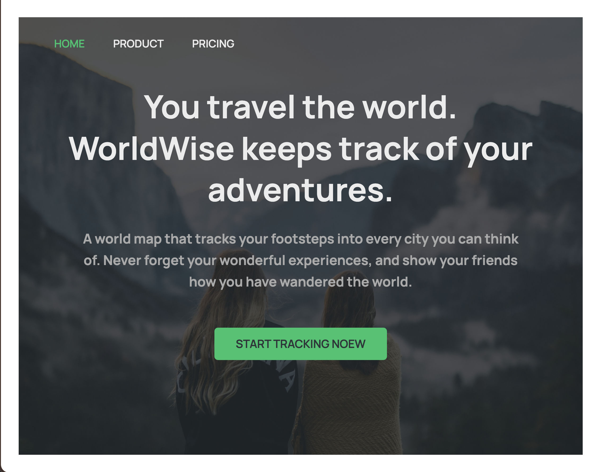

---

#### 210.2.12 Logo Component

**Subsection Summary:**
- Creates the `Logo` component in `src/components/Logo.jsx` displaying the WorldWise logo image.
- Uses `Logo.module.css` for height (`5.2rem`); logo is not yet wrapped in a link.
- Renders `` for accessibility.
- Establishes the brand identity element that will be placed in PageNav.

```jsx
/* src/components/Logo.jsx */
import styles from "./Logo.module.css";

function Logo() {
  return ;
}

export default Logo;
```

and its style file:

```css
/* src/components/Logo.module.css */
.logo {
  height: 5.2rem;
}
```

---

#### 210.2.13 PageNav with Logo and Login Link

**Subsection Summary:**
- Integrates `Logo` into PageNav on the left; nav links (Product, Pricing) and Login (with `ctaLink` style) on the right.
- Removes the Home NavLink since the Logo will serve as the home link once wrapped in `<Link>`.
- Adds Login NavLink with `className={styles.ctaLink}` for CTA button styling.
- Reorders links; Logo provides brand and home navigation in a single element.

```jsx
/* src/components/PageNav.jsx */
import { Link, NavLink } from "react-router-dom";
import Logo from "./Logo";                                        // 👈🏽 ✅
import styles from "./PageNav.module.css";

const PageNav = () => {
  return (
    <nav className={styles.nav}>
      <Logo />
      <ul className={styles.list}>
        <li>
          <NavLink to="/product">Product</NavLink>
        </li>
        <li>
          <NavLink to="/pricing">Pricing</NavLink>
        </li>
        <li>
          <NavLink to="/login">Login</NavLink>                      {/* 👈🏽 ✅ */}
        </li>
      </ul>
    </nav>
  );
};

export default PageNav;
```

---

#### 210.2.14 Logo as Link to Home

**Subsection Summary:**
- Wraps the Logo image in `<Link to="/">` so clicking the logo navigates to the Homepage.
- Imports `Link` from `react-router-dom`; maintains client-side navigation without full reload.
- Provides an expected UX pattern: logo as home link is common on most websites.
- Keeps the same visual appearance; only adds navigational behaviour.

```jsx
/* src/components/Logo.jsx */
import { Link } from "react-router-dom";                          // 👈🏽 ✅
import styles from "./Logo.module.css";

function Logo() {
  return (
    <Link to="/">                                                 {/* 👈🏽 ✅ */}
      
    </Link>
  )
}

export default Logo;
```

---

#### 210.2.15 Login Page with PageNav

**Subsection Summary:**
- Adds `PageNav` to the Login page above the form for consistent navigation.
- Users can navigate back to Product, Pricing, or Home (via Logo) from the login screen.
- Follows the same pattern as Homepage and Product: import PageNav and render at the top of `<main>`.
- Ensures Login is part of the shared navigation experience.

```jsx
/* src/pages/Login.jsx */
import { useState } from "react";
import PageNav from '../components/PageNav'                         // 👈🏽 ✅
import styles from "./Login.module.css";

export default function Login() {
  // PRE-FILL FOR DEV PURPOSES
  const [email, setEmail] = useState("jack@example.com");
  const [password, setPassword] = useState("qwerty");

  return (
    <main className={styles.login}>
      <PageNav />                                                   {/* 👈🏽 ✅ */}
      <form className={styles.form}>
        <div className={styles.row}>
          <label htmlFor="email">Email address</label>
          <input
            type="email"
            id="email"
            onChange={(e) => setEmail(e.target.value)}
            value={email}
          />
        </div>

        <div className={styles.row}>
          <label htmlFor="password">Password</label>
          <input
            type="password"
            id="password"
            onChange={(e) => setPassword(e.target.value)}
            value={password}
          />
        </div>

        <div>
          <button>Login</button>
        </div>
      </form>
    </main>
  );
}
```

---

#### 210.2.16 Product Page with PageNav

**Subsection Summary:**
- Adds `PageNav` to the Product page above the two-column content section.
- Provides navigation to Product (current), Pricing, and Login from the About page.
- Keeps the existing layout and styling; PageNav appears at the top of the dark background.
- Completes the marketing pages’ shared navigation pattern.

```jsx
/* src/pages/Product.jsx */
import PageNav from '../components/PageNav'                           // 👈🏽 ✅
import styles from "./Product.module.css";

export default function Product() {
  return (
    <main className={styles.product}>
      <PageNav />                                                     {/* 👈🏽 ✅ */}
      <section>
        
        <div>
          <h2>About WorldWide.</h2>
          <p>
            Lorem ipsum dolor sit amet consectetur adipisicing elit. Illo est
            dicta illum vero culpa cum quaerat architecto sapiente eius non
            soluta, molestiae nihil laborum, placeat debitis, laboriosam at fuga
            perspiciatis?
          </p>
          <p>
            Lorem, ipsum dolor sit amet consectetur adipisicing elit. Corporis
            doloribus libero sunt expedita ratione iusto, magni, id sapiente
            sequi officiis et.
          </p>
        </div>
      </section>
    </main>
  );
}
```

---

#### 210.2.17 Pricing Page with PageNav

**Subsection Summary:**
- Adds `PageNav` to the Pricing page above the two-column content section.
- Reuses `Product.module.css`; layout mirrors Product with image and text swapped.
- **Note:** The code exports `Product` instead of `Pricing`; should be renamed for clarity.
- Provides navigation to Product, Pricing (current), and Login from the pricing view.

```jsx
/* src/pages/Pricing.jsx */
// Uses the same styles as Product
import PageNav from '../components/PageNav'                           // 👈🏽 ✅
import styles from "./Product.module.css";

export default function Product() {
  return (
    <main className={styles.product}>
      <PageNav />                                                     {/* 👈🏽 ✅ */}
      <section>
        <div>
          <h2>
            Simple pricing.
            <br />
            Just $9/month.
          </h2>
          <p>
            Lorem ipsum dolor, sit amet consectetur adipisicing elit. Vitae vel
            labore mollitia iusto. Recusandae quos provident, laboriosam fugit
            voluptatem iste.
          </p>
        </div>
        
      </section>
    </main>
  );
}
```

---

#### 210.2.18 App Route Configuration with Login

**Subsection Summary:**
- Adds the Login route to `App.jsx`: `<Route path="/login" element={<Login />} />`.
- Imports `Login` from `./pages/Login` and places the route before the catch-all.
- Completes the route configuration: `/`, `/product`, `/pricing`, `/login`, `/app`, and `*` (PageNotFound).
- The image `section17-lecture210-003.png` illustrates the full route structure and app overview.

```jsx
/* src/App.jsx */
import { BrowserRouter, Routes, Route } from "react-router-dom";
import Product from "./pages/Product";
import Pricing from "./pages/Pricing";
import Homepage from "./pages/Homepage";
import PageNotFound from "./pages/PageNotFound";
import AppLayout from "./pages/AppLayout";
import Login from './pages/Login'                                   // 👈🏽 ✅

function App() {
  return (
    <BrowserRouter>
      <Routes>
        <Route path="/" element={<Homepage />} />
        <Route path="/product" element={<Product />} />
        <Route path="/pricing" element={<Pricing />} />
        <Route path="/login" element={<Login />} />                 {/* 👈🏽 ✅ */}
        <Route path="/app" element={<AppLayout />} />
        <Route path="*" element={<PageNotFound />} />
      </Routes>
    </BrowserRouter>
  );
}

export default App;
```

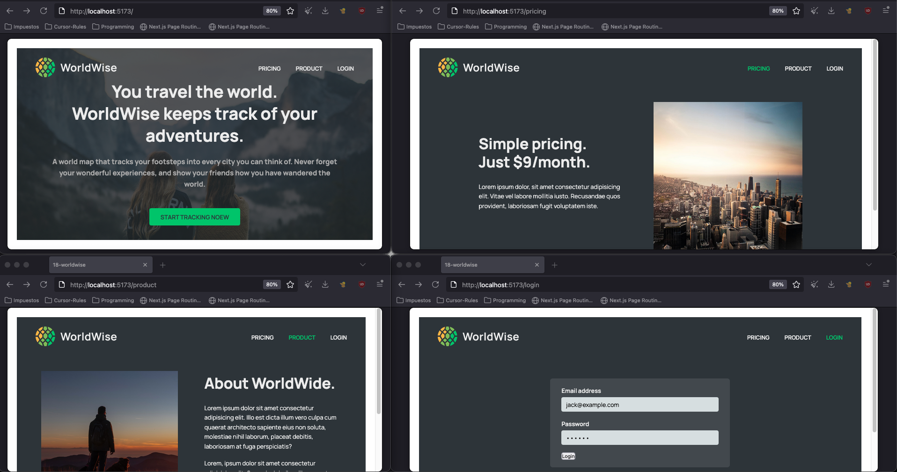

---

### 🐞 210.3 Issues:

- **Pricing.jsx exports wrong component name**: The Pricing page defines and exports `function Product` instead of `Pricing`; the import in App.jsx works (Pricing from "./pages/Pricing") but the component name is misleading and violates naming conventions.
- **Typo in Homepage CTA**: "Start tracking noew" should be "Start tracking now" in the Link text.
- **Background image path may fail**: `Homepage.module.css` uses `url("bg.jpg")`; for Vite public assets, the path should typically be `url("/bg.jpg")` so the browser resolves it from the root.
- **PageNav lacks `.list` class in CSS**: PageNav.jsx uses `className={styles.list}` on the `ul`, but `PageNav.module.css` only defines `.nav` and `.nav ul`; the `.list` class may be missing or redundant.
- **Image paths in Product/Pricing**: Using `src="img-1.jpg"` and `src="img-2.jpg"` without leading slash; Vite serves public assets at root, so `/img-1.jpg` is more explicit for assets in `public/`.
- **PageNav duplicated on every page**: Each page imports and renders PageNav individually; consider a shared layout component to reduce repetition.

| Issue | Status | Log/Error |
|---|---|---|
| Pricing exports Product instead of Pricing | ⚠️ Identified | `src/pages/Pricing.jsx:5`: `export default function Product` should be `export default function Pricing` |
| CTA typo "noew" | ⚠️ Identified | `src/pages/Homepage.jsx:20`: `<Link ...>Start tracking noew</Link>` — change to "now" |
| Background url may not resolve | ⚠️ Identified | `src/pages/Homepage.module.css:8`: `url("bg.jpg")` — consider `url("/bg.jpg")` for public folder |
| PageNav `.list` class | ℹ️ Low Priority | `src/components/PageNav.jsx:9`, `PageNav.module.css`: Verify `.list` exists or use `.nav ul` only |
| Image paths without leading slash | ℹ️ Informational | `src/pages/Product.jsx:9`, `Pricing.jsx:22`: `img-1.jpg`, `img-2.jpg` — `/img-1.jpg` more explicit |
| PageNav duplication | ℹ️ Low Priority | All pages in `src/pages/`: Consider layout wrapper in `App.jsx` |

---

### 🧱 210.4 Pending Fixes (TODO)

- [ ] Fix Pricing component name: change `export default function Product` to `export default function Pricing` in `src/pages/Pricing.jsx` (line 5)
- [ ] Fix typo in Homepage CTA: change "noew" to "now" in `src/pages/Homepage.jsx` (line 20)
- [ ] Verify background image path: update `url("bg.jpg")` to `url("/bg.jpg")` in `src/pages/Homepage.module.css` (line 8) if the image does not load
- [ ] Reconcile PageNav `ul` styling: ensure `.list` exists in `PageNav.module.css` or remove `className={styles.list}` from `src/components/PageNav.jsx` (line 9)
- [ ] Consider using leading slash for public images: update `src="img-1.jpg"` to `src="/img-1.jpg"` in Product and Pricing pages for clarity
- [ ] Consider lifting PageNav to a shared layout component in `App.jsx` to avoid importing it in every page

[↑ top — 210. Lesson 210 — *Building the Pages*](#-210-lesson-210--building-the-pages)


<br>

## 🔧 211. Lesson 211 — *Building the App Layout*

[🧳 Section 17: *React Route: Building Single-Page Applications (SPA)*](#-section-17-react-route-building-single-page-applications-spa)

### 📑 Table of Contents:
- [211. Lesson 211 — *Building the App Layout*](#-211-lesson-211--building-the-app-layout)
- [211.1 Context](#-2111-context)
- [211.2 Updating code according the context](#-2112-updating-code-according-the-context)
  - [211.2.1 Sidebar Component](#21121-sidebar-component)
  - [211.2.2 Sidebar CSS Module](#21122-sidebar-css-module)
  - [211.2.3 AppLayout with Sidebar](#21123-applayout-with-sidebar)
  - [211.2.4 Map Component](#21124-map-component)
  - [211.2.5 AppLayout with Sidebar and Map](#21125-applayout-with-sidebar-and-map)
  - [211.2.6 List of Updated Component Files](#21126-list-of-updated-component-files)
- [211.3 Issues](#-2113-issues)
- [211.4 Pending Fixes (TODO)](#-2114-pending-fixes-todo)

### 🧠 211.1 Context:

**Building the App Layout** is the phase where the `/app` route transforms from a placeholder into a structured two-column layout: a **Sidebar** on the left (containing Logo, AppNav, city list placeholder, and footer) and a **Map** area on the right. This layout provides the main user interface for the Worldwise app—the map view for visited cities and the sidebar for navigation and city controls.

The App Layout uses a flex-based structure defined in `AppLayout.module.css`: the container has `display: flex`, with the Sidebar taking a fixed `flex-basis` and the Map occupying the remaining space via `flex: 1`. This pattern is common in dashboards and map-based applications where a persistent sidebar holds controls while the main content area displays dynamic or interactive content.

**Key Concepts:**

1. **Layout composition** — `AppLayout` composes smaller components (`Sidebar`, `Map`) rather than rendering all UI inline. Each component has a single responsibility; the page orchestrates them.
2. **Flex layout for app shell** — The parent uses `display: flex`; the Sidebar gets `flex-basis: 56rem` (fixed width); the Map gets `flex: 1` to fill remaining space. This ensures responsive behaviour without media queries at this stage.
3. **Sidebar structure** — The Sidebar is a vertical column (`flex-direction: column`) containing Logo, AppNav, a placeholder for the city list, and a footer. The footer uses `margin-top: auto` to stick to the bottom, leveraging flexbox behaviour.
4. **Map placeholder** — The Map component is initially a styled container; later lessons will integrate Leaflet or similar for the actual map. The CSS Module uses `:global()` for Leaflet-specific classes when the map library is added.
5. **Separation of marketing vs app UI** — Marketing pages (Homepage, Product, Pricing, Login) use `PageNav`; the app section (`/app`) uses `AppNav` inside the Sidebar. This keeps navigation context-specific.
6. **CSS Modules for layout** — `AppLayout`, `Sidebar`, and `Map` each use their own `.module.css` file for scoped styles, avoiding conflicts and keeping layout logic co-located.

**Advantages:**
- Clear visual hierarchy: sidebar for controls, map for content.
- Reusable Sidebar; can be extended with city list, forms, and filters without touching Map.
- Flex layout is simple to reason about and adjusts well for different viewport sizes (with future responsive tweaks).
- Footer pinned to bottom via `margin-top: auto` without absolute positioning.
- Prepared for Leaflet integration: `Map.module.css` already includes `:global()` overrides for Leaflet popup styling.

**Disadvantages / Gotchas:**
- Sidebar width (`56rem`) is fixed; on small screens it may consume too much space; responsive breakpoints will be needed later.
- AppNav is still a placeholder with minimal content; needs NavLinks and styling to match the app context.
- Import paths in Sidebar use `../components/Logo` despite being in `components/`; `./Logo` would be simpler and more consistent.
- "List of cities" is a static `<p>` placeholder; the city list component will replace it in subsequent lessons.

**When to Consider Alternatives:**
- For collapsible or resizable sidebars — consider state for sidebar width or a layout library.
- For very narrow viewports — use a drawer or bottom sheet instead of a persistent sidebar.
- For complex nested layouts — consider CSS Grid or a layout component library (e.g. react-grid-layout).
- If the map requires full viewport — the Sidebar could be overlayed or toggled rather than always visible.

In Worldwise, this lesson completes the app shell: users navigating to `/app` see the Sidebar (Logo, AppNav, footer) and the Map area, ready for data integration and interactive map features in later lessons.

---

### ⚙️ 211.2 Updating code according the context:

#### **Summary**

- Section 211.2 demonstrates how to build the App Layout for the `/app` route by introducing the Sidebar and Map components and composing them in `AppLayout`.
- It solves the problem of a placeholder app section by providing a real two-column layout: Sidebar (navigation, city list placeholder, footer) and Map (interactive content area).
- Subsections 211.2.1–211.2.2 define the Sidebar component and its CSS Module; 211.2.3 integrates Sidebar into AppLayout; 211.2.4 defines the Map component; 211.2.5 composes both in AppLayout; 211.2.6 lists the full set of component files introduced or updated in this lesson.
- The image `section17-lecture211-001.png` illustrates the final App Layout with Sidebar and Map.

---

#### 211.2.1 Sidebar Component

**Subsection Summary:**
- Creates the `Sidebar` component in `src/components/Sidebar.jsx`.
- Renders a vertical layout containing Logo, AppNav, a "List of cities" placeholder paragraph, and a footer with dynamic copyright year.
- Uses CSS Modules (`Sidebar.module.css`) for scoped styling.
- Establishes the left-hand column of the app layout; Logo and AppNav provide brand and app-specific navigation; the footer uses `margin-top: auto` to stay at the bottom.

```jsx
/* src/components/Sidebar.jsx */
import styles from './Sidebar.module.css'
import Logo from './Logo'
import AppNav from './AppNav'

const Sidebar = () => {
  return (
    <div className={styles.sidebar}>
      <Logo />
      <AppNav />

      <p>List of cities</p>
      <footer className={styles.footer}>
        <p className={styles.copyright}>
          &copy; Copyright {new Date().getFullYear()} by WorldWise Inc.
        </p>
      </footer>
    </div>
  )
}

export default Sidebar
```

---

#### 211.2.2 Sidebar CSS Module

**Subsection Summary:**
- Creates `src/components/Sidebar.module.css` with `.sidebar`, `.footer`, and `.copyright` classes.
- `.sidebar` sets fixed width (`flex-basis: 56rem`), dark background, padding, flex column layout, and full height minus top padding.
- `.footer` uses `margin-top: auto` to push the copyright to the bottom of the flex container.
- `.copyright` styles the footer text with smaller font size and muted colour.
- Ensures the Sidebar has a distinct visual identity and correct flex behaviour within the App Layout.

```css
/* src/components/Sidebar.module.css */
.sidebar {
  flex-basis: 56rem;
  background-color: var(--color-dark--1);
  padding: 3rem 5rem 3.5rem 5rem;

  display: flex;
  flex-direction: column;
  align-items: center;
  height: calc(100vh - 4.8rem);
}

.footer {
  margin-top: auto;
}

.copyright {
  font-size: 1.2rem;
  color: var(--color-light--1);
}
```

---

#### 211.2.3 AppLayout with Sidebar

**Subsection Summary:**
- Replaces the previous AppNav-only layout in `AppLayout` with the new `Sidebar` component.
- Removes or comments out direct `AppNav` and placeholder text; imports and renders `Sidebar` inside the `.app` container.
- The `.app` class in `AppLayout.module.css` provides `display: flex`, so Sidebar appears as the first flex child.
- Prepares for the Map component to be added as the second flex child in the next step.

```jsx
/* src/pages/AppLayout.jsx */
// import AppNav from "../components/AppNav";
import Sidebar from "../components/Sidebar";
import styles from './AppLayout.module.css';
const AppLayout = () => {
  return (
    <div className={styles.app}>
      {/* <AppNav />
      <p>App Layout</p> */}
      <Sidebar />
    </div>
  );
};

export default AppLayout;
```

---

#### 211.2.4 Map Component

**Subsection Summary:**
- Creates the `Map` component in `src/components/Map.jsx` as a placeholder for the future map view.
- Renders a `div` with `mapContainer` class; displays "Map" text for now.
- Uses `Map.module.css` for layout: `flex: 1`, full height, dark background, `position: relative` for future overlay elements.
- Prepares the structure for Leaflet integration; `Map.module.css` already includes `:global()` overrides for Leaflet popup styling (background, typography, brand colour accents).

```jsx
/* src/components/Map.jsx */
import styles from './Map.module.css';
const Map = () => {
  return (
    <div className={styles.mapContainer}>
      Map
    </div>
  )
}

export default Map;
```

---

#### 211.2.5 AppLayout with Sidebar and Map

**Subsection Summary:**
- Adds the `Map` component to `AppLayout` alongside the `Sidebar`.
- Both components render inside the flex container; Sidebar has `flex-basis: 56rem`, Map has `flex: 1` from its CSS Module.
- Produces the final two-column layout: sidebar on the left, map area on the right.
- The image `section17-lecture211-001.png` illustrates the complete Worldwise app layout with Sidebar and Map visible.

```jsx
/* src/pages/AppLayout.jsx */
import Sidebar from "../components/Sidebar";
import Logo from './Logo'
import AppNav from './AppNav'
const AppLayout = () => {
  return (
    <div className={styles.app}>
      <Sidebar />
      <Map />
    </div>
  );
};

export default AppLayout;
```

* Visit [App Layout page](http://localhost:5173/app)


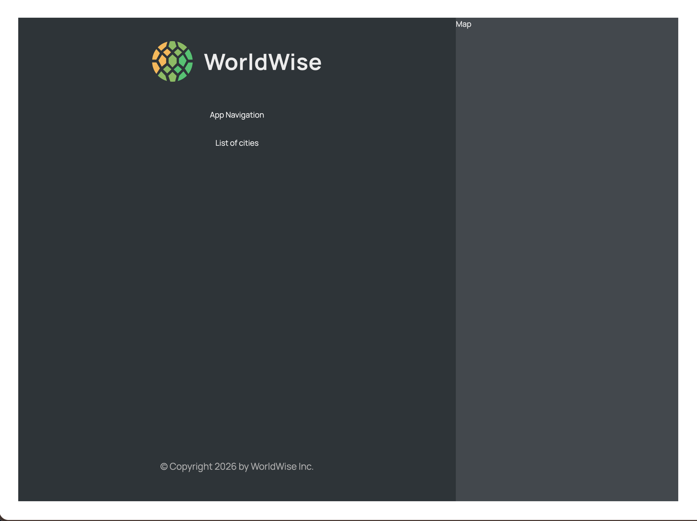

---

#### 211.2.6 List of Updated Component Files

**Subsection Summary:**
- Lists all component files introduced or updated as part of Lesson 211 and the broader app build.
- Includes layout components (Sidebar, Map), UI components (Button, Form, User, City, CityItem, CountryItem), feedback components (Message, Spinner, SpinnerFullPage), and their associated CSS Modules.
- Serves as a reference for the full component inventory; some components (e.g. City, Form, User) may be used in later lessons for city list and user features.
- **Note:** Corrected typo `Buttom.module.ccs` → `Button.module.css` and `City.modules.css` → `City.module.css`; `User.module.csss` → `User.module.css`.

Other updated components files:

```
- components/Button.module.css
- components/City.jsx
- components/City.module.css
- components/CityItem.jsx
- components/CityItem.module.css
- components/CityList.module.css
- components/CountryItem.jsx
- components/CountryItem.module.css
- components/CountryList.module.css
- components/Form.jsx
- components/Form.module.css
- components/Map.jsx
- components/Map.module.css
- components/Message.jsx
- components/Message.module.css
- components/Sidebar.jsx
- components/Sidebar.module.css
- components/Spinner.jsx
- components/Spinner.module.css
- components/SpinnerFullPage.jsx
- components/SpinnerFullPage.module.css
- components/User.jsx
- components/User.module.css
```

---

### 🐞 211.3 Issues:

| Issue | Status | Log/Error |
|---|---|---|
| AppNav is placeholder only | ⚠️ Identified | `src/components/AppNav.jsx`: Renders "App Navigation" and empty `<ul>`; needs NavLinks for Cities, Countries, Account |
| City list not integrated | ⚠️ Identified | `src/components/Sidebar.jsx:11`: Static `<p>List of cities</p>`; CityList/CityItem components exist but not used |
| Logo links to / vs /app | ℹ️ Informational | `src/components/Logo.jsx`: Links to `/`; consider whether app users should navigate to `/app` from within the app |
| Leaflet styles without map | ℹ️ Informational | `src/components/Map.module.css`: `:global()` Leaflet overrides have no effect until Leaflet is integrated |

---

### 🧱 211.4 Pending Fixes (TODO)

- [ ] Simplify Sidebar imports: change `../components/Logo` to `./Logo` and `../components/AppNav` to `./AppNav` in `src/components/Sidebar.jsx` (lines 2-3)
- [ ] Implement AppNav with NavLinks for app routes (e.g. Cities, Countries, Account) and apply appropriate styling in `src/components/AppNav.jsx`
- [ ] Replace static "List of cities" placeholder with `CityList` (and `CityItem`) in `src/components/Sidebar.jsx` (line 11) once data fetching is set up
- [ ] Integrate Leaflet map in `src/components/Map.jsx` so `Map.module.css` Leaflet `:global()` styles take effect
- [ ] Consider responsive breakpoints for Sidebar width (`56rem`) in `src/components/Sidebar.module.css` for smaller viewports

[↑ top — 211. Lesson 211 — *Building the App Layout*](#-211-lesson-211--building-the-app-layout)


<br>

## 🔧 212. Lesson 212 — *Nested Routes and Index Route*

[🧳 Section 17: *React Route: Building Single-Page Applications (SPA)*](#-section-17-react-route-building-single-page-applications-spa)

### 📑 Table of Contents:
- [212. Lesson 212 — *Nested Routes and Index Route*](#-212-lesson-212--nested-routes-and-index-route)
- [212.1 Context](#-2121-context)
- [212.2 Updating code/theory according the context](#-2122-updating-codetheory-according-the-context)
  - [212.2.1 Defining Nested Routes in App.jsx](#21221-defining-nested-routes-in-appjsx)
  - [212.2.2 Using Outlet in Sidebar](#21222-using-outlet-in-sidebar)
  - [212.2.3 Adding Index Route](#21223-adding-index-route)
  - [212.2.4 NavLinks in AppNav](#21224-navlinks-in-appnav)
  - [212.2.5 Cities and Countries Links](#21225-cities-and-countries-links)
  - [212.2.6 NavLink Active Class and React Router Benefits](#21226-navlink-active-class-and-react-router-benefits)
- [212.3 Issues](#-2123-issues)
- [212.4 Pending Fixes (TODO)](#-2124-pending-fixes-todo)

### 🧠 212.1 Context:

**Nested routes** let you define hierarchical URL structures where child routes render inside a parent layout. Instead of repeating the same layout (sidebar, header, etc.) for each page, the parent route provides a shared layout and child routes render into an **`<Outlet />`** — a placeholder where React Router injects the matched child component.

An **index route** is a special child route that renders when the parent path is matched exactly (e.g. `/app` with no suffix). It uses `<Route index element={...} />` instead of `path="..."`, and serves as the default view for that segment.

**Key Concepts:**

1. **`<Outlet />`** — A component from React Router that renders the matched child route. The parent layout wraps the Outlet, so the sidebar/header stay visible while only the content area changes.
2. **Index route** — Renders when the parent URL is matched exactly. Example: `/app` shows the index element; `/app/cities` shows the `cities` child.
3. **Relative paths** — Nested routes use relative paths (e.g. `path="cities"`), which resolve to `/app/cities` when the parent is `/app`.
4. **`<NavLink>`** — Like `<Link>`, but adds `active` / `activeClassName` when the current URL matches, useful for highlighting the active nav item.

**Advantages:**
- DRY layouts: sidebar, header, and shared UI live in one parent component.
- URLs reflect structure: `/app/cities`, `/app/countries` map cleanly to nested route definitions.
- Index route provides a sensible default when visiting `/app` without a child path.
- Easy to add more child routes without duplicating layout code.

**Disadvantages / Gotchas:**
- Must render `<Outlet />` in the parent; otherwise child routes will not appear.
- Index route and a child with `path=""` are mutually exclusive; use `index` for the default view.
- Relative `to` in NavLinks must be used within the nested route context; absolute paths (`/app/cities`) work everywhere.

**When to Consider Alternatives:**
- For very flat route structures (few routes, no shared layout) — simple top-level routes may suffice.
- For deeply nested navigation — consider layout composition or route configuration abstractions to keep things maintainable.

In **Worldwise**, the `/app` route uses `AppLayout` as the parent. `Sidebar` renders `<Outlet />` so child routes (cities, countries, form) display in the sidebar content area. The index route shows the default list view when users visit `/app`.

---

### ⚙️ 212.2 Updating code/theory according the context:

#### **Summary**

- Section 212.2 explains how to implement **nested routes** and an **index route** in the Worldwise app using React Router.
- It shows defining child routes under `/app`, rendering them via `<Outlet />` in `Sidebar`, and using `<NavLink>` for navigation with active states.
- Subsections 212.2.1–212.2.2 cover route definition and the Outlet; 212.2.3 introduces the index route; 212.2.4–212.2.6 cover AppNav NavLinks, links behavior, and React Router benefits.

---

#### 212.2.1 Defining Nested Routes in App.jsx

**Subsection Summary:**
- Demonstrates how to define **nested routes** by placing child `<Route>` elements inside a parent `<Route>` that has an `element` (e.g. `<AppLayout />`).
- Child routes `cities`, `countries`, and `form` are defined with relative paths; they resolve to `/app/cities`, `/app/countries`, `/app/form` when the parent path is `/app`.
- Establishes the route hierarchy that React Router uses to match URLs and render the corresponding components.

```jsx
/* src/App.jsx */
import { BrowserRouter, Routes, Route } from "react-router-dom";
import Product from "./pages/Product";
import Pricing from "./pages/Pricing";
import Homepage from "./pages/Homepage";
import PageNotFound from "./pages/PageNotFound";
import AppLayout from "./pages/AppLayout";
import Login from './pages/Login'

function App() {
  return (
    <BrowserRouter>
      <Routes>
        <Route path="/" element={<Homepage />} />
        <Route path="/product" element={<Product />} />
        <Route path="/pricing" element={<Pricing />} />
        <Route path="/login" element={<Login />} />
        <Route path="/app" element={<AppLayout />}>
          <Route path="cities" element={<p>List of Cities</p>}/>        {/* 👈🏽 ✅ */}
          <Route path="countries" element={<p>Countries</p>}/>          {/* 👈🏽 ✅ */}
          <Route path="form" element={<p>Form</p>}/>                    {/* 👈🏽 ✅ */}
        </Route>
        <Route path="*" element={<PageNotFound />} />
      </Routes>
    </BrowserRouter>
  );
}

export default App;
```

#### 212.2.2 Using Outlet in Sidebar

**Subsection Summary:**
- Introduces **`<Outlet />`** from `react-router-dom` as the placeholder where React Router renders the matched child route component.
- The Outlet is placed inside `Sidebar` because the Sidebar is the component that provides the layout (Logo, AppNav, footer) around the dynamic content area; the child route content (cities list, countries list, form) should appear between AppNav and the footer.
- The image `section17-lecture212-001.png` illustrates the nested route structure: parent layout with Outlet, and how child content is injected into that slot.

```jsx
/* src/components/Sidebar.jsx */
import { Outlet } from 'react-router-dom';          // 👈🏽 ✅
import Logo from './Logo'
import AppNav from './AppNav'
import styles from './Sidebar.module.css'

const Sidebar = () => {
  return (
    <div className={styles.sidebar}>
      <Logo />
      <AppNav />

      <Outlet />                                    {/* 👈🏽 ✅ */}

      <footer className={styles.footer}>
        <p className={styles.copyright}>
          &copy; Copyright {new Date().getFullYear()} by WorldWise Inc.
        </p>
      </footer>
    </div>
  )
}

export default Sidebar;
```

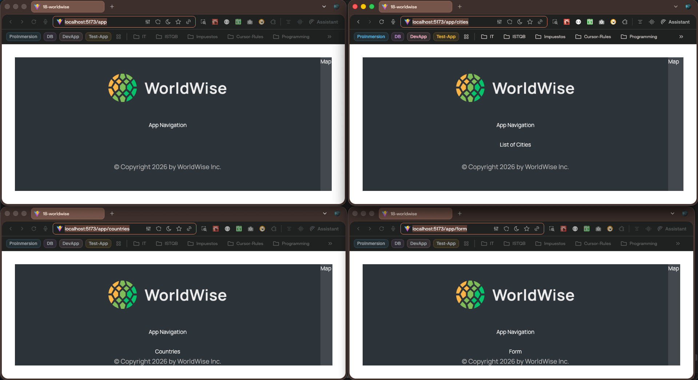

#### 212.2.3 Adding Index Route

**Subsection Summary:**
- Adds an **index route** using `<Route index element={...} />` so that visiting `/app` (without a child path) renders a default view (e.g. `<p>LIST</p>`).
- The index route has no `path`; it matches when the parent path is matched exactly.
- The image `section17-lecture212-002.png` shows the index page content rendered inside the App component layout.

```jsx
/* src/App.jsx */
import { BrowserRouter, Routes, Route } from "react-router-dom";
import Product from "./pages/Product";
import Pricing from "./pages/Pricing";
import Homepage from "./pages/Homepage";
import PageNotFound from "./pages/PageNotFound";
import AppLayout from "./pages/AppLayout";
import Login from './pages/Login'

function App() {
  return (
    <BrowserRouter>
      <Routes>
        <Route path="/" element={<Homepage />} />
        <Route path="/product" element={<Product />} />
        <Route path="/pricing" element={<Pricing />} />
        <Route path="/login" element={<Login />} />
        <Route path="/app" element={<AppLayout />}>
          <Route index element={<p>LIST</p>}/>                    {/* 👈🏽 ✅ */}
          <Route path="cities" element={<p>Cities</p>}/>
          <Route path="countries" element={<p>Countries</p>}/>
          <Route path="form" element={<p>Form</p>}/>
        </Route>
        <Route path="*" element={<PageNotFound />} />
      </Routes>
    </BrowserRouter>
  );
}

export default App;
```

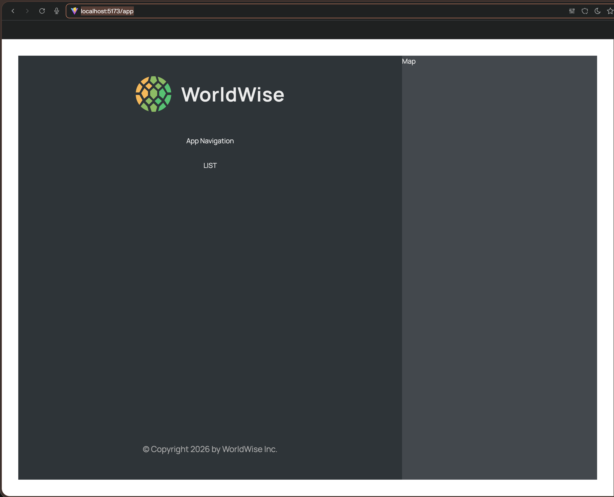

#### 212.2.4 NavLinks in AppNav

**Subsection Summary:**
- Replaces plain links with **`<NavLink>`** from React Router for Cities and Countries navigation.
- Uses relative `to` values (`cities`, `countries`) so links resolve to `/app/cities` and `/app/countries` when rendered within the `/app` route context.
- NavLink provides built-in active state styling when the current URL matches the link.

```jsx
/* src/components/AppNav.jsx */
import { nav } from "./AppNav.module.css";
import { NavLink } from "react-router-dom";                     // 👈🏽 ✅

const AppNav = () => {
  return (
    <nav className={nav}>
      <ul>
        <li>
          <NavLink to='cities'>Cities</NavLink>                 {/* 👈🏽 ✅ */}
        </li>
        <li>
          <NavLink to='countries'>Countries</NavLink>           {/* 👈🏽 ✅ */}
        </li>
      </ul>
    </nav>
  );
};

export default AppNav;
```

#### 212.2.5 Cities and Countries Links

**Subsection Summary:**
- Confirms that Cities and Countries NavLinks navigate correctly to `/app/cities` and `/app/countries`.
- The image `section17-lecture212-003.png` shows the Cities and Countries links in the sidebar nav.
- Visiting the App page at `http://localhost:5173/app` displays the index route content; clicking Cities or Countries updates the URL and the content area via the Outlet.

[App page](http://localhost:5173/app)
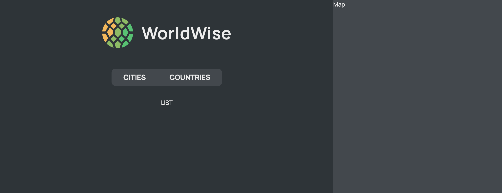


#### 212.2.6 NavLink Active Class and React Router Benefits

**Subsection Summary:**
- Explains why React Router is used: declarative routing, nested layouts, URL-driven navigation, and built-in components (`Link`, `NavLink`, `Outlet`) that integrate with the React tree.
- **Benefits of React Router:** client-side navigation without full reloads, shareable/bookmarkable URLs, browser back/forward support, nested routes with shared layouts, active link styling via NavLink, and programmatic navigation via `useNavigate`.
- The image `section17-lecture212-004.png` illustrates the active class applied to the current nav item when viewing Cities or Countries.

[App page, City page and Countries page](http://localhost:5173/app/cities)
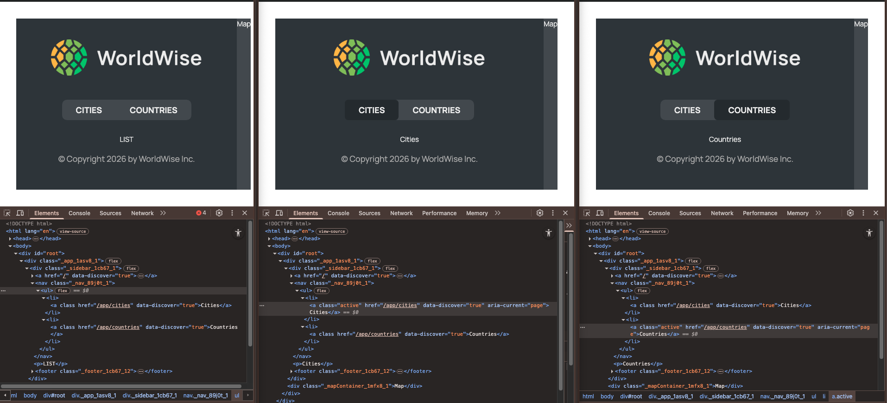

### 🐞 212.3 Issues:

| Issue | Status | Log/Error |
|---|---|---|
| Form route not linked in AppNav | ⚠️ Identified | `src/components/AppNav.jsx`: Only Cities and Countries NavLinks; no link to `/app/form` |
| Index route shows placeholder | ⚠️ Identified | `src/App.jsx:18`: `<Route index element={<p>LIST</p>}/>`; replace with CityList when data is ready |
| NavLink active styling | ✅ Already in place | `src/components/AppNav.module.css:26-28`: `:global(.active)` styles active nav links |
| Form route placeholder content | ⚠️ Identified | `src/App.jsx:21`: `<Route path="form" element={<p>Form</p>}/>`; integrate Form component |

---

### 🧱 212.4 Pending Fixes (TODO)

- [ ] Add NavLink for Form in `src/components/AppNav.jsx` (e.g. `<NavLink to='form'>Add City</NavLink>` or similar)
- [ ] Replace index route placeholder `<p>LIST</p>` in `src/App.jsx:18` with `CityList` once data fetching is implemented
- [ ] Wire `Form` component into the form route in `src/App.jsx:21` (replace `<p>Form</p>` with `<Form />`)
- [ ] *(Optional)* Customize NavLink active state styling in `src/components/AppNav.module.css` if desired (`:global(.active)` already exists)
- [ ] Consider adding `end` prop to the Cities NavLink if it should not show active when on `/app/cities/:id` (e.g. city detail view)

[↑ top — 212. Lesson 212 — *Nested Routes and Index Route*](#-212-lesson-212--nested-routes-and-index-route)


<br>

## 🔧 213. Lesson 213 — *Implementing the Cities List*

[🧳 Section 17: *React Route: Building Single-Page Applications (SPA)*](#-section-17-react-route-building-single-page-applications-spa)

### 📑 Table of Contents:
- [213. Lesson 213 — *Implementing the Cities List*](#-213-lesson-213--implementing-the-cities-list)
- [213.1 Context](#-2131-context)
- [213.2 Updating code/theory according the context](#-2132-updating-codetheory-according-the-context)
  - [213.2.1 Initial CityList Placeholder](#21321-initial-citylist-placeholder)
  - [213.2.2 Wiring CityList in Nested Routes](#21322-wiring-citylist-in-nested-routes)
  - [213.2.3 Installing json-server](#21323-installing-json-server)
  - [213.2.4 Installing concurrently](#21324-installing-concurrently)
  - [213.2.5 Dev Scripts: Vite + json-server](#21325-dev-scripts-vite--json-server)
  - [213.2.6 Running the Stack and Verifying the API](#21326-running-the-stack-and-verifying-the-api)
  - [213.2.7 CityList: Loading State and List Rendering](#21327-citylist-loading-state-and-list-rendering)
  - [213.2.8 App: Fetching Cities and Passing Props](#21328-app-fetching-cities-and-passing-props)
  - [213.2.9 CityItem Placeholder](#21329-cityitem-placeholder)
  - [213.2.10 CityItem: Styling and Formatted Date](#213210-cityitem-styling-and-formatted-date)
  - [213.2.11 Seeding `data/cities.json`](#213211-seeding-datacitiesjson)
  - [213.2.12 CityList: Empty State with Message](#213212-citylist-empty-state-with-message)
- [213.3 Issues](#-2133-issues)
- [213.4 Pending Fixes (TODO)](#-2134-pending-fixes-todo)

### 🧠 213.1 Context:

**Implementing the Cities List** connects the nested `/app` routes to real data: a **REST-shaped mock API** (via **json-server**) serves city records from `data/cities.json`, while **React state** in `App` holds the fetched list and loading flag. **`CityList`** becomes a **container-style presentational component** that shows a **spinner** while loading, a **friendly message** when there are no cities, and a **mapped list** of **`CityItem`** rows when data exists.

This pattern mirrors how many SPAs work: **lift state up** to a common ancestor (`App`) so every nested route that renders `CityList` receives the same `cities` and `isLoading` props; **child components** stay focused on display (`CityItem`) and list orchestration (`CityList`).

**Key Concepts:**

1. **Mock API with json-server** — A JSON file becomes HTTP endpoints (e.g. `GET /cities`), so the UI can be developed before a real backend exists.
2. **`useEffect` + `fetch`** — Load data once on mount (empty dependency array), set loading before/after the request, and store the JSON response in state.
3. **Props drilling (here, intentionally)** — `App` passes `cities` and `isLoading` into `CityList`; alternatives like Context or a data library come later when more routes need the same data.
4. **Conditional UI** — Spinner → empty message → list, driven by `isLoading` and `cities.length`.
5. **`Intl.DateTimeFormat`** — Locale-aware formatting for each city’s `date` without manual string templates.
6. **Index + sibling routes** — `index` and `path="cities"` can both render the same component so `/app` and `/app/cities` show the same list (no redirect required unless you add one).

**Advantages:**
- Fast local development with a real HTTP round-trip and JSON payloads.
- Clear separation: `App` owns data fetching; `CityList` / `CityItem` focus on UI.
- Empty and loading states improve UX compared to a blank list.
- `concurrently` runs API and Vite with one `npm run dev` command.

**Disadvantages / Gotchas:**
- **CORS / URL**: The app must request the same host/port you configure (e.g. `http://localhost:8000`); production needs a real API or proxy.
- **Lecture snippets vs. correct React patterns**: Examples may show `useState({})` for a list or a non-destructured `CityList` signature—those break `.map` / `.length`; the corrected versions use an **array** and **`({ cities, isLoading })`** (see Issues).
- **Delete button** is visual-only until a delete handler and API call exist.
- **json-server** schema must match what the UI expects (`cities` as an array at `GET /cities` with the default resource layout).

**When to Consider Alternatives:**
- **React Query / SWR / RTK Query** — When you need caching, refetching, and error boundaries at scale.
- **Route loaders (React Router data APIs)** — When data should load per-route instead of only in `App`.
- **Context or global store** — When many deep components need cities without passing props through every level.

In **Worldwise**, this lesson wires **`CityList`** and **`CityItem`**, **`Spinner`**, **`Message`**, **`fetch`** in **`src/App.jsx`**, and **`json-server`** + **`concurrently`** in **`package.json`**, backed by **`data/cities.json`**.

---

### ⚙️ 213.2 Updating code/theory according the context:

#### **Summary**

- Section **213.2** walks from a **static `CityList` placeholder** to a **data-driven list** powered by **json-server**, **concurrent dev scripts**, and **`fetch`** in **`App`**.
- It explains why **index** and **`path="cities"`** can both render **`CityList`** (same UI, two URLs) and how **React Router v6** treats **index routes** (no `path` on the same `Route` as `index`).
- Subsections **213.2.1–213.2.2** set up the component and routes; **213.2.3–213.2.6** add the mock API and tooling; **213.2.7–213.2.8** connect loading, list mapping, and app-level state; **213.2.9–213.2.10** build **`CityItem`**; **213.2.11–213.2.12** handle **empty seed data** and the **empty-state message**.
- Images **`section17-lecture213-001.png`** (routes / app shell), **`section17-lecture213-002.png`** (API / JSON), and **`section17-lecture213-003.png`** (empty list message) illustrate the **router wiring**, **API verification**, and **UX** for an empty collection.

---

#### 213.2.1 Initial CityList Placeholder

**Subsection Summary:**
- Introduces a minimal **`CityList`** with a **`ul`** and CSS module class `cityList`.
- Serves as a **visual shell** before data and child items exist.
- Establishes the file **`src/components/CityList.jsx`** and **default export** pattern used by routes.

```jsx
/* src/components/CityList.jsx */
import styles from './CityList.module.css'

const CityList = () => {
  return (
    <ul className={styles.cityList}>
      City List
    </ul>
  )
}

export default CityList
```

---

#### 213.2.2 Wiring CityList in Nested Routes

**Subsection Summary:**
- Imports **`CityList`** into **`App.jsx`** and mounts it on **`/app`** as both the **index** route and **`cities`** child route.
- **`section17-lecture213-001.png`** illustrates the **sidebar + outlet** layout with **Cities** content active.
- Clarifies **React Router v6** rules: an **`index`** route cannot also set a **`path`** on the same **`Route`**; repeating **`CityList`** for **`index`** and **`path="cities"`** is intentional so **`/app`** and **`/app/cities`** share the same screen (unless you later add a **redirect** or a different default).

```jsx
/* src/App.jsx */
import { BrowserRouter, Routes, Route } from "react-router-dom";
import Product from "./pages/Product";
import Pricing from "./pages/Pricing";
import Homepage from "./pages/Homepage";
import PageNotFound from "./pages/PageNotFound";
import AppLayout from "./pages/AppLayout";
import Login from './pages/Login'
import CityList from "./components/CityList";                           // 👈🏽 ✅

function App() {
  return (
    <BrowserRouter>
      <Routes>
        <Route path="/" element={<Homepage />} />
        <Route path="/product" element={<Product />} />
        <Route path="/pricing" element={<Pricing />} />
        <Route path="/login" element={<Login />} />
        <Route path="/app" element={<AppLayout />}>
          <Route index element={<CityList />}/>                         {/* 👈🏽 ✅ */}
          <Route path="cities" element={<CityList />}/>                 {/* 👈🏽 ✅ */}
          <Route path="countries" element={<p>Countries</p>}/>
          <Route path="form" element={<p>Form</p>}/>
        </Route>
        <Route path="*" element={<PageNotFound />} />
      </Routes>
    </BrowserRouter>
  );
}

export default App;
```

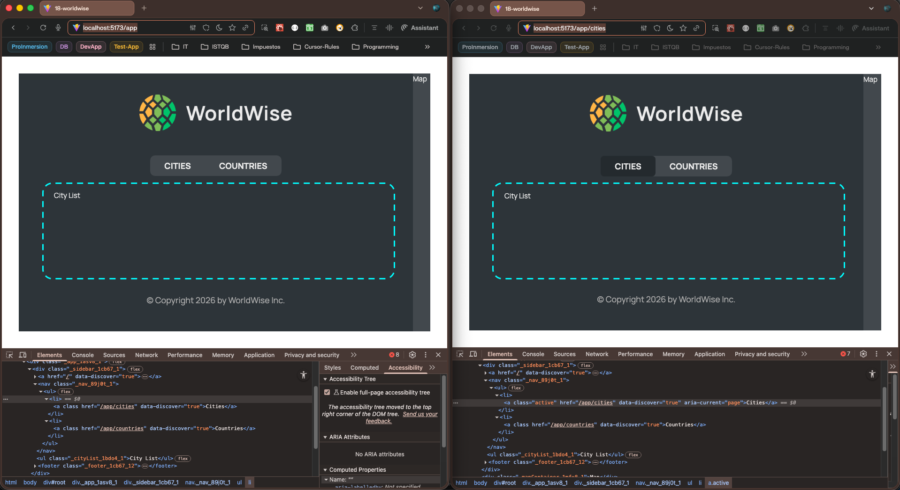

* In **React Router v6**, you cannot combine **`index`** and **`path`** on the same **`Route`**. The **`index`** attribute marks the **default** child when the parent path matches exactly (e.g. **`/app`**). Index routes have **no `path`** because they are implicitly the parent’s default segment.

* Duplicating **`CityList`** on **`index`** and **`path="cities"`** is an explicit way to say **two URLs** should show the **same content** (contrast with redirecting **`/app`** → **`/app/cities`**, which is a different product choice).

* In short: **index** and **path** are separate route shapes by design in **React Router v6**.

---

#### 213.2.3 Installing json-server

**Subsection Summary:**
- Adds **json-server** as a dependency so **`data/cities.json`** can be exposed as HTTP routes during development.

```bash
npm i json-server
```

---

#### 213.2.4 Installing concurrently

**Subsection Summary:**
- Adds **concurrently** as a dev dependency to run **Vite** and **json-server** in parallel from one npm script.

```bash
npm install --save-dev concurrently
```

---

#### 213.2.5 Dev Scripts: Vite + json-server

**Subsection Summary:**
- **`dev`** runs **`concurrently`**: **`npm run server`** (json-server on port **8000**) and **`npm run vite`** (frontend).
- **`server`** watches **`data/cities.json`** so edits reload the mock API.

```jsx
/* package.json */
{
  "name": "18-worldwise",
  "private": true,
  "version": "0.0.0",
  "type": "module",
  "scripts": {
    "dev": "concurrently \"npm run server\" \"npm run vite\"",          // 👈🏽 ✅
    "vite": "vite",                                                     // 👈🏽 ✅
    "server": "json-server --watch data/cities.json --port 8000",       // 👈🏽 ✅
    "build": "vite build",
    "lint": "eslint .",
    "preview": "vite preview"
  },
  "dependencies": {
    "json-server": "^1.0.0-beta.13",
    "react": "^19.2.0",
    "react-dom": "^19.2.0",
    "react-router-dom": "^7.13.1"
  },
  "devDependencies": {
    "@eslint/js": "^9.39.1",
    "@types/react": "^19.2.7",
    "@types/react-dom": "^19.2.3",
    "@vitejs/plugin-react": "^5.1.1",
    "eslint": "^9.39.1",
    "eslint-plugin-react-hooks": "^7.0.1",
    "eslint-plugin-react-refresh": "^0.4.24",
    "globals": "^16.5.0",
    "vite": "^7.3.1"
  }
}
```

---

#### 213.2.6 Running the Stack and Verifying the API

**Subsection Summary:**
- Run **`npm run dev`**, then open **`http://localhost:8000/cities`** to confirm the mock API returns JSON.
- **`section17-lecture213-002.png`** shows the **browser / network** view of the **`cities`** endpoint or the **`data/cities.json`** shape.

```bash
npm run dev
```
[http://localhost:8000/cities](http://localhost:8000/cities)
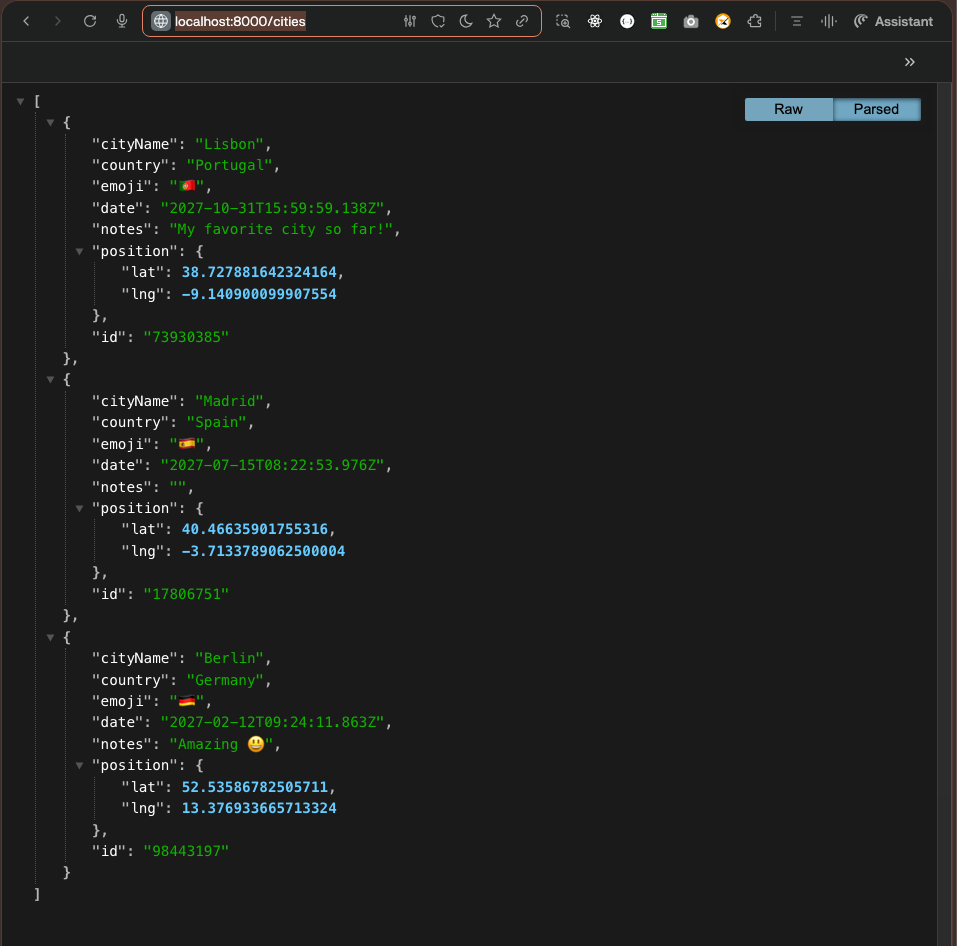


---

#### 213.2.7 CityList: Loading State and List Rendering

**Subsection Summary:**
- Adds **`Spinner`** for **`isLoading`**, maps **`cities`** to **`CityItem`**, and uses **`key={city.id}`** for list reconciliation.
- The snippet below illustrates the **intended** API; **props must be destructured** from the first argument—see **213.3 Issues** if the lecture shows a non-destructured signature.

```jsx
/* src/components/CityList.jsx */
import Spinner from './Spinner';
import styles from './CityList.module.css'

const CityList = (cities, isLoading) => {
  if(isLoading) return <Spinner />;

  return (
    <ul className={styles.cityList}>
      {cities.map(city => (
        <CityItem city={city} key={city.id} />
      ))}
    </ul>
  )
}

export default CityList
```

---

#### 213.2.8 App: Fetching Cities and Passing Props

**Subsection Summary:**
- Defines **`BASE_URL`**, **`useState`** for **`cities`** and **`isLoading`**, and **`useEffect`** to **`fetch`** `GET /cities` once on mount.
- Passes **`cities`** and **`isLoading`** into **`CityList`** for both **index** and **`cities`** routes.
- **Note:** **`cities`** should be initialized as an **array** (e.g. **`useState([])`**), not an object, so **`.map`** / **`.length`** work—see **213.3** if the lecture snippet used **`useState({})`**.

```jsx
/* src/App.jsx */
import { BrowserRouter, Routes, Route } from "react-router-dom";
import { useState, useEffect } from "react";
import Product from "./pages/Product";
import Pricing from "./pages/Pricing";
import Homepage from "./pages/Homepage";
import PageNotFound from "./pages/PageNotFound";
import AppLayout from "./pages/AppLayout";
import Login from './pages/Login'
import CityList from "./components/CityList";

const BASE_URL = "http://localhost:8000"                                                        // 👈🏽 ✅

function App() {
  const [cities, setCities] = useState({});                                                     // 👈🏽 ✅
  const [isLoading, setIsLoading] = useState(false);                                            // 👈🏽 ✅

  useEffect(() => {                                                                             // 👈🏽 ✅
    async function fetchCities() {
      try{
        setIsLoading(true);
        const res = await fetch(`${BASE_URL}/cities`);
        const data = await res.json();
        setCities(data);
      } catch(error) {
        console.error(error);
        alert("There was an error loading data");
      }
      finally {
        setIsLoading(false);
      }
    }
    fetchCities();
  }, []);

  return (
    <BrowserRouter>
      <Routes>
        <Route path="/" element={<Homepage />} />
        <Route path="/product" element={<Product />} />
        <Route path="/pricing" element={<Pricing />} />
        <Route path="/login" element={<Login />} />
        <Route path="/app" element={<AppLayout />}>
          <Route index element={<CityList cities={cities} isLoading={isLoading} />}/>           {/* 👈🏽 ✅ */}
          <Route path="cities" element={<CityList cities={cities} isLoading={isLoading} />}/>   {/* 👈🏽 ✅ */}
          <Route path="countries" element={<p>Countries</p>}/>
          <Route path="form" element={<p>Form</p>}/>
        </Route>
        <Route path="*" element={<PageNotFound />} />
      </Routes>
    </BrowserRouter>
  );
}

export default App;
```

---

#### 213.2.9 CityItem Placeholder

**Subsection Summary:**
- **`CityItem`** starts as a stub returning static **“city”** text inside a **`div`**, validating imports and route composition before styling and fields.

```jsx
/* src/components/CityItem.jsx */
const CityItem = ( {city} ) => {
  return (
    <div>
      city
    </div>
  )
}

export default CityItem
```

---

#### 213.2.10 CityItem: Styling and Formatted Date

**Subsection Summary:**
- Moves markup to **`<li>`** for semantic lists, applies **`CityItem.module.css`**, and renders **`emoji`**, **`cityName`**, and **`date`**.
- **`formatDate`** uses **`Intl.DateTimeFormat`** with **`"en"`** for readable month/day/year.
- **`deleteBtn`** is present for layout; behavior comes in a later lesson.

```jsx
/* src/components/CityItem.jsx */
import styles from './CityItem.module.css';

const formatDate = (date) => 
  new Intl.DateTimeFormat("en", {
    day: "numeric",
    month: "long",
    year: "numeric",
  }).format(new Date(date));

const CityItem = ( {city} ) => {
  const { emoji, cityName, date } = city;
  //console.log(city);

  return (
    <li className={styles.cityItem}>
      <span className={styles.emoji}>{emoji}</span>
      <h3 className={styles.name}>{cityName}</h3>
      <time className={styles.date}>{formatDate(date)}</time>
      <button className={styles.deleteBtn}>&times;</button>
    </li>
  )
}

export default CityItem
```

---

#### 213.2.11 Seeding `data/cities.json`

**Subsection Summary:**
- Copy or create **`data/cities.json`** with a top-level **`cities`** array (empty at first) so the UI can show the **empty state** and **`json-server`** serves **`GET /cities`** consistently.

* Copy/paste the starter **`data/cities.json`** from the course materials first, or create:

```json
/* data/cities.json */
{
  "cities": []
}
```

---

#### 213.2.12 CityList: Empty State with Message

**Subsection Summary:**
- Imports **`Message`** and returns it when **`!cities.length`** so users see guidance instead of a blank panel.
- **`section17-lecture213-003.png`** shows the **empty list** message in the **Cities** sidebar area.

```jsx
/* src/components/CityList.jsx */
import Spinner from './Spinner';
import CityItem from './CityItem';
import Message from './Message';                          // 👈🏽 ✅
import styles from './CityList.module.css';


const CityList = ({ cities, isLoading }) => {
  if(isLoading) return <Spinner />;

  if(!cities.length) return <Message message='Add your first city by clicking on a city on the map' />    {/* 👈🏽 ✅ */}

  return (
    <ul className={styles.cityList}>
      {cities.map(city => (
        <CityItem city={city} key={city.id} />
      ))}
    </ul>
  )
}

export default CityList
```

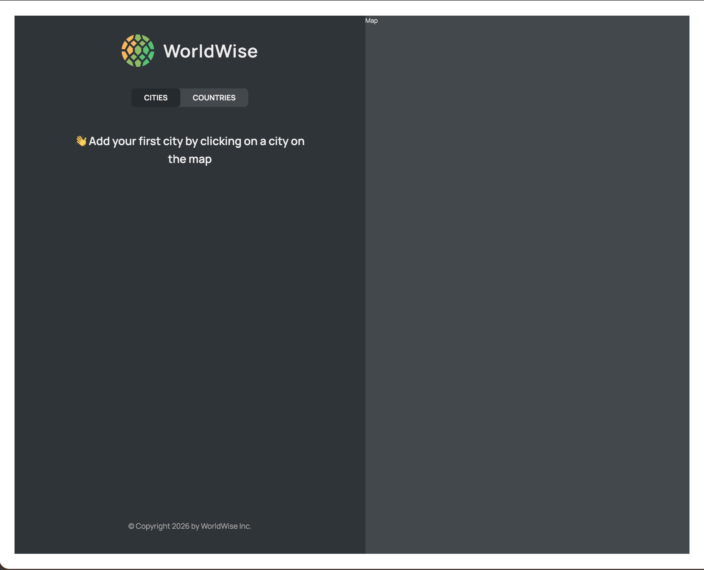

---

### 🐞 213.3 Issues:

- **Incorrect `CityList` parameter list in 213.2.7**: React passes **one props object**; **`(cities, isLoading)`** is wrong—use **`({ cities, isLoading })`** (as in **213.2.12** / project source).
- **`useState({})` for `cities` in 213.2.8**: An **object** has no **`.map`** / **`.length`** like an array; use **`useState([])`** (see **`src/App.jsx`**).
- **Duplicate subsection label**: Two blocks were labeled **213.2.11**; the empty-state **`CityList`** step is **213.2.12** in this doc.
- **Delete control**: **`CityItem`** delete button has **no `onClick`** / API delete yet—expected until a later lesson.
- **Error handling**: **`alert`** in **`fetch`** catch is acceptable for the course; production apps often use **inline error UI** or **toasts**.

| Issue | Status | Log/Error |
|---|---|---|
| `CityList` props not destructured in 213.2.7 snippet | ⚠️ Identified | `docs/LECTURE_STEPS.md` (213.2.7): `const CityList = (cities, isLoading)` breaks props; correct: `const CityList = ({ cities, isLoading })` — compare `src/components/CityList.jsx:7-8` |
| `cities` initialized as `{}` in 213.2.8 snippet | ⚠️ Identified | `docs/LECTURE_STEPS.md` (213.2.8): `useState({})` vs list operations; `src/App.jsx:14` uses `useState([])` |
| Duplicate `213.2.11` headings | ✅ Fixed | `docs/LECTURE_STEPS.md`: second block renamed to **213.2.12** |
| Delete button without handler | ℹ️ Informational | `src/components/CityItem.jsx:19`: `<button className={styles.deleteBtn}>` — no delete logic yet |

---

### 🧱 213.4 Pending Fixes (TODO)

- [ ] Implement **delete city**: wire **`onClick`** on **`src/components/CityItem.jsx`** (delete button) to **`DELETE`** (or **`PATCH`**) on **`json-server`** and update **`cities`** in **`App`** (lift handler or Context).
- [ ] Replace **`alert`** in **`src/App.jsx:26`** with a non-blocking **error message** component or **toast** when **`fetch`** fails.
- [ ] Add **`aria-label`** (e.g. “Delete city”) on the delete **`button`** in **`CityItem`** for screen readers until full behavior exists.
- [ ] *(Optional)* Centralize **`BASE_URL`** via **`.env`** (`VITE_API_URL`) for dev/prod parity.

[↑ top — 213. Lesson 213 — *Implementing the Cities List*](#-213-lesson-213--implementing-the-cities-list)


<br>

## 🔧 214. Lesson 214 — *Implementing the Countries List*

[🧳 Section 17: *React Route: Building Single-Page Applications (SPA)*](#-section-17-react-route-building-single-page-applications-spa)

### 📑 Table of Contents:
- [214. Lesson 214 — *Implementing the Countries List*](#-214-lesson-214--implementing-the-countries-list)
- [214.1 Context](#-2141-context)
- [214.2 Updating code according the context](#-2142-updating-codetheory-according-the-context)
  - [214.2.1 Seeding `data/cities.json` with multiple cities](#21421-seeding-datacitiesjson-with-multiple-cities)
  - [214.2.2 CountryList: first pass (city rows re-used)](#21422-countrylist-first-pass-city-rows-re-used)
  - [214.2.3 App: mounting `CountryList` on `/countries`](#21423-app-mounting-countrylist-on-countries)
  - [214.2.4 CountryList: stub with `CountryItem` and empty `countries`](#21424-countrylist-stub-with-countryitem-and-empty-countries)
  - [214.2.5 CountryList: unique countries via `Set` and derived emoji](#21425-countrylist-unique-countries-via-set-and-derived-emoji)
- [214.3 Issues](#-2143-issues)
- [214.4 Pending Fixes (TODO)](#-2144-pending-fixes-todo)

### 🧠 214.1 Context:

**Implementing the Countries List** turns the **same `cities` collection** you already fetch in **`App`** into a **second view**: one **row per distinct country**, not per city. Users may visit several cities in **Spain**; the **Countries** sidebar should list **Spain once** (with a representative **flag emoji**), alongside **Portugal**, **Germany**, etc.

You **derive** countries **client-side** from `cities`: extract each city’s **`country`** string, **deduplicate** (e.g. with **`Set`**), then build small objects **`{ country, emoji }`** for **`CountryItem`**. **`CountryList`** mirrors **`CityList`**: **`Spinner`** while loading, **`Message`** when there are no cities yet, then a **`<ul>`** of **`CountryItem`** rows. The **`/app/countries`** route receives the same **`cities`** and **`isLoading`** props as **`CityList`**, so **no second network request** is required for this screen.

**Key Concepts:**

1. **Aggregation in the UI** — Reduce many city records to a smaller list of unique countries without changing the API.
2. **`Set` for uniqueness** — `new Set(array)` removes duplicate `country` strings; spread back to an array for `.map`.
3. **Stable list keys** — Use `key={country.country}` because the country name is unique in the derived list (same idea as `city.id` for cities).
4. **Emoji from any matching city** — `cities.find(c => c.country === country)?.emoji` picks one city’s emoji per country (all cities in the same country should share the same emoji in the seed data).
5. **Iterative UI build** — Start by reusing the city list pattern, wire the route, then replace mapping with **country-specific** components and styles.

**Advantages:**
- Reuses existing **`fetch`** and **`App`** state; **DRY** data loading.
- **`Set`** keeps deduplication readable compared to manual **`reduce`** / nested **`includes`** checks.
- **Route-level composition** — `/countries` is a sibling of `/cities` under **`AppLayout`**, consistent with the app shell.

**Disadvantages / Gotchas:**
- **Order** — `Set` iteration order is insertion order in modern JS, but the **order of countries** follows first occurrence in `cities`, not alphabetical, unless you **sort** explicitly.
- **`find` per country** — For very large lists, pairing emoji could be optimized (e.g. a **`Map`**)—not needed for a travel diary scale.
- **First-pass snippet** (214.2.2) may still use **`cityList`** / **`CityItem`** for cities—a pedagogical step, not the final UX (see **214.3**).

**When to Consider Alternatives:**
- **Server-side grouping** — If the API should return **countries** as a first-class resource with counts, expose **`GET /countries`** instead of deriving in the client.
- **`useMemo`** — If `cities` updates often and the derivation is heavy, memoize the `countries` array (usually unnecessary here).
- **i18n** — Display names might come from a locale-aware catalog rather than raw `country` strings alone.

In **Worldwise**, this lesson extends **`data/cities.json`**, adds **`src/components/CountryList.jsx`** (and **`CountryItem`** usage), and updates **`src/App.jsx`** so **`path="countries"`** renders **`CountryList`** with **`cities`** and **`isLoading`**.

---

### ⚙️ 214.2 Updating code/theory according the context:

#### **Summary**

- Section **214.2** moves from **seed data** to a working **Countries** view: **populate JSON**, create **`CountryList`**, **connect the route**, then **replace** the temporary “list of cities” approach with **unique countries** and **`CountryItem`**.
- **214.2.1** adds several cities (and countries) so deduplication is visible (**Spain** and **Portugal** appear more than once in city rows).
- **214.2.2** shows an **intermediate** implementation that still lists **cities** like **`CityList`**—useful to copy-paste, then **fix** in **214.2.4–214.2.5**.
- **214.2.3** imports **`CountryList`** and swaps the **`/app/countries`** placeholder for the real component with **props**.
- **214.2.4** switches to **`CountryItem`** and a **`countries`** array **stub** (empty), preparing the final shape.
- **214.2.5** implements **`Set` + `.map`** to build **`{ country, emoji }`**, uses **`styles.countryList`**, and passes **`key={country.country}`** to **`CountryItem`**.

---

#### 214.2.1 Seeding `data/cities.json` with multiple cities

**Subsection Summary:**
- Expands **`data/cities.json`** so the app has **several cities** across **Portugal**, **Spain**, and **Germany**, with **Barcelona** and **Porto** (and others) ensuring **duplicate country names** appear when listing cities.
- Demonstrates the **json-server** shape: top-level **`cities`** array with **`cityName`**, **`country`**, **`emoji`**, **`date`**, **`notes`**, **`position`**, and **`id`** fields used elsewhere in the course.

* Updating json information.
* adding 2 cities.

```json
/* data/cities.json */
{
  "cities": [
    {
      "cityName": "Lisbon",
      "country": "Portugal",
      "emoji": "🇵🇹",
      "date": "2027-10-31T15:59:59.138Z",
      "notes": "My favorite city so far!",
      "position": {
        "lat": 38.727881642324164,
        "lng": -9.140900099907554
      },
      "id": 73930385
    },
    {
      "cityName": "Madrid",
      "country": "Spain",
      "emoji": "🇪🇸",
      "date": "2027-07-15T08:22:53.976Z",
      "notes": "",
      "position": {
        "lat": 40.46635901755316,
        "lng": -3.7133789062500004
      },
      "id": 17806751
    },
    {
      "cityName": "Berlin",
      "country": "Germany",
      "emoji": "🇩🇪",
      "date": "2027-02-12T09:24:11.863Z",
      "notes": "Amazing 😃",
      "position": {
        "lat": 52.53586782505711,
        "lng": 13.376933665713324
      },
      "id": 98443197
    },
    {
      "cityName": "Barcelona",
      "country": "Spain",
      "emoji": "🇪🇸",
      "date": "2027-05-20T14:10:22.500Z",
      "notes": "Loved the architecture and beaches!",
      "position": {
        "lat": 41.385063,
        "lng": 2.173404
      },
      "id": 56283910
    },
    {
      "cityName": "Porto",
      "country": "Portugal",
      "emoji": "🇵🇹",
      "date": "2027-09-10T11:45:30.250Z",
      "notes": "Beautiful riverside and wine cellars.",
      "position": {
        "lat": 41.157944,
        "lng": -8.629105
      },
      "id": 84726159
    }
  ]
}
```

---

#### 214.2.2 CountryList: first pass (city rows re-used)

**Subsection Summary:**
- Copies the **`CityList`** structure: **`Spinner`**, empty **`Message`**, **`ul`**, and **`cities.map`** → **`CityItem`** with **`city.id`** as **`key`**.
- Still uses **`styles.cityList`** (city list styles) and lists **cities**, not aggregated countries—this is a **deliberate intermediate** step before **`CountryItem`** and **`countryList`** styles in **214.2.4–214.2.5**.

```jsx
/* src/components/CountryList.jsx */
import Spinner from './Spinner';
import CityItem from './CityItem';
import Message from './Message';
import styles from './CountryList.module.css';


const CountryList = ({ cities, isLoading }) => {
  if(isLoading) return <Spinner />;

  if(!cities.length) return <Message message='Add your first city by clicking on a city on the map' />

  return (
    <ul className={styles.cityList}>
      {cities.map(city => (
        <CityItem city={city} key={city.id} />
      ))}
    </ul>
  )
}

export default CountryList
```

---

#### 214.2.3 App: mounting `CountryList` on `/countries`

**Subsection Summary:**
- Imports **`CountryList`** and renders it for **`path="countries"`**, passing **`cities`** and **`isLoading`** from the same **`App`** state used by **`CityList`**.
- Confirms **nested routing**: **`/app/countries`** shows the countries sidebar content inside **`AppLayout`**’s **`<Outlet />`**.

```jsx
/* src/App.jsx */
import { BrowserRouter, Routes, Route } from "react-router-dom";
import { useState, useEffect } from "react";
import Product from "./pages/Product";
import Pricing from "./pages/Pricing";
import Homepage from "./pages/Homepage";
import PageNotFound from "./pages/PageNotFound";
import AppLayout from "./pages/AppLayout";
import Login from './pages/Login'
import CityList from "./components/CityList";
import CountryList from './components/CountryList';           // 👈🏽 ✅

const BASE_URL = "http://localhost:8000"

function App() {
  const [cities, setCities] = useState([]);
  const [isLoading, setIsLoading] = useState(false);

  useEffect(() => {
    async function fetchCities() {
      try{
        setIsLoading(true);
        const res = await fetch(`${BASE_URL}/cities`);
        const data = await res.json();
        setCities(data);
      } catch(error) {
        console.error(error);
        alert("There was an error loading data");
      }
      finally {
        setIsLoading(false);
      }
    }
    fetchCities();
  }, []);

  return (
    <BrowserRouter>
      <Routes>
        <Route path="/" element={<Homepage />} />
        <Route path="/product" element={<Product />} />
        <Route path="/pricing" element={<Pricing />} />
        <Route path="/login" element={<Login />} />
        <Route path="/app" element={<AppLayout />}>
          <Route index element={<CityList cities={cities} isLoading={isLoading} />}/>
          <Route path="cities" element={<CityList cities={cities} isLoading={isLoading} />}/>
          <Route path="countries" element={ <CountryList cities={cities} isLoading={isLoading} /> }/>   {/* 👈🏽 ✅ */}
          <Route path="form" element={<p>Form</p>}/>
        </Route>
        <Route path="*" element={<PageNotFound />} />
      </Routes>
    </BrowserRouter>
  );
}

export default App;
```

---

#### 214.2.4 CountryList: stub with `CountryItem` and empty `countries`

**Subsection Summary:**
- Swaps **`CityItem`** for **`CountryItem`** and prepares a **`countries`** array, initially **empty**, so the UI renders **no rows** until **214.2.5** fills the derivation logic.
- **`CountryItem`** is rendered **without** a **`key`** here—**React** will warn in dev until **214.2.5** adds **`key={country.country}`**.

```jsx
/* src/components/CountryList.jsx */
import Spinner from './Spinner';
import CountryItem from './CountryItem';
import Message from './Message';
import styles from './CountryList.module.css';


const CountryList = ({ cities, isLoading }) => {
  if(isLoading) return <Spinner />;

  if(!cities.length) return <Message message='Add your first city by clicking on a city on the map' />

  const countries = [];
  return (
    <ul className={styles.cityList}>
      {countries.map(country => (
        <CountryItem country={country}/>
      ))}
    </ul>
  )
}

export default CountryList
```

---

#### 214.2.5 CountryList: unique countries via `Set` and derived emoji

**Subsection Summary:**
- Builds **`countries`** as **`[...new Set(cities.map(c => c.country))]`** so each **country name** appears **once**, then maps to **`{ country, emoji }`** using **`cities.find(...)`** for the flag.
- Includes a **commented `reduce`** alternative showing the same uniqueness idea without **`Set`**.
- Uses **`styles.countryList`** (from **`CountryList.module.css`**) and **`key={country.country}`** on **`CountryItem`** for correct reconciliation and accessibility-friendly list semantics.

```jsx
/* src/components/CountryList.jsx */
import Spinner from './Spinner';
import CountryItem from './CountryItem';
import Message from './Message';
import styles from './CountryList.module.css';


const CountryList = ({ cities, isLoading }) => {
  if(isLoading) return <Spinner />;

  if(!cities.length) return <Message message='Add your first city by clicking on a city on the map' />

  const countries = [...new Set(cities.map(c => c.country))]
  .map(country => ({
    country,
    emoji: cities.find(c => c.country === country)?.emoji
  }));

  // const countries = cities.reduce( (arr, city) => {
  //   if(!arr.map((el) => el.country).includes(city.country))
  //     return [...arr, {country: city.country, emoji: city.emoji}]
  //   else return arr;
  // }, []);

  //console.log(countries);
  return (
    <ul className={styles.countryList}>
      {countries.map(country => (
        <CountryItem country={country} key={country.country}/>
      ))}
    </ul>
  )
}

export default CountryList
```


### 🐞 214.3 Issues:

- **214.2.2 still lists cities, not countries**: The first **`CountryList`** version maps **`cities`** to **`CityItem`** and uses **`styles.cityList`**—semantically it is a **city list** inside the Countries route; **214.2.5** fixes the data and styles.
- **214.2.4 missing `key` on `CountryItem`**: In the stub, **`<CountryItem country={country}/>`** has no **`key`** inside **`.map`**; React expects **`key`** on list children (**214.2.5** adds **`key={country.country}`**).
- **214.2.4 uses `styles.cityList`**: The **`ul`** still references **`cityList`** from **`CountryList.module.css`**; **`countryList`** is the intended class (**214.2.5**).
- **Empty-state copy**: **`Message`** text still says “Add your first **city**…” which fits **Cities**; on **Countries** you may want different wording (see **214.4**).
- **`CountryItem` accessibility**: **`src/components/CountryItem.jsx`** renders flag and name in **`<span>`**s without **`aria-label`**—screen readers get less context than a labeled row (optional hardening).

| Issue | Status | Log/Error |
|---|---|---|
| Intermediate `CountryList` lists cities via `CityItem` | ℹ️ Informational | `docs/LECTURE_STEPS.md` (214.2.2): `cities.map` → `CityItem`; pedagogical step before aggregation in **214.2.5** |
| Missing `key` on `CountryItem` in stub | ⚠️ Identified | `docs/LECTURE_STEPS.md` (214.2.4): `<CountryItem country={country}/>` — compare **214.2.5** / `src/components/CountryList.jsx:27-28` |
| Wrong CSS module class (`cityList` vs `countryList`) in stub | ⚠️ Identified | `docs/LECTURE_STEPS.md` (214.2.4): `className={styles.cityList}` vs `src/components/CountryList.jsx:26` `styles.countryList` |
| Generic empty message on Countries route | ℹ️ Low Priority | `src/components/CountryList.jsx:10`: same `Message` as `CityList` — consider route-specific text |
| `CountryItem` spans lack accessible names | ℹ️ Low Priority | `src/components/CountryItem.jsx:6-8`: emoji + country text without `aria-label` on `<li>` |

---

### 🧱 214.4 Pending Fixes (TODO)

- [ ] **Optional copy tweak**: In `src/components/CountryList.jsx` (empty branch, ~line 10), pass a **Countries-specific** `message` prop (e.g. “Add a city from the map to see countries here”) so the empty state matches the **Countries** nav item.
- [ ] **Sort countries for UX**: After building `countries` in `src/components/CountryList.jsx` (~lines 12–16), call **`.sort((a, b) => a.country.localeCompare(b.country))`** (or sort the string array before mapping) so the list order is predictable.
- [ ] **Accessibility**: On `src/components/CountryItem.jsx`, add an **`aria-label`** on the root **`<li>`** that combines the country name and emoji, or set **`aria-hidden`** on the flag span and expose the country name as the primary accessible text.
- [ ] **Course doc alignment**: Keep **214.2.2** as the “wrong first pass” or add a one-line callout that **`CityItem` + `cityList`** are placeholders until **214.2.5**—learners should not ship **214.2.2** as the final Countries UI.

[↑ top — 214. Lesson 214 — *Implementing the Countries List*](#-214-lesson-214--implementing-the-countries-list)

<br>


---


<br>

## 🔧 215. Lesson 215 — *Storing State in the URL*

[🧳 Section 17: *React Route: Building Single-Page Applications (SPA)*](#-section-17-react-route-building-single-page-applications-spa)

### 📑 Table of Contents:
- [215. Lesson 215 — *Storing State in the URL*](#-215-lesson-215--storing-state-in-the-url)
- [215.1 Context](#-2151-context)
- [215.2 Updating code according the context](#-2152-updating-codetheory-according-the-context)
  - [215.2.1 Why React Router and URL-based UI state](#21521-why-react-router-and-url-based-ui-state)
  - [215.2.2 URL anatomy: path, route params, and query string](#21522-url-anatomy-path-route-params-and-query-string)
  - [215.2.3 Params vs query string (illustrated)](#21523-params-vs-query-string-illustrated)
- [215.3 Issues](#-2153-issues)
- [215.4 Pending Fixes (TODO)](#-2154-pending-fixes-todo)

### 🧠 215.1 Context:

**Storing state in the URL** means representing part of your application’s **UI or navigation state** directly in the **address bar**—as **path segments**, **route parameters**, or **query string** pairs—instead of (or in addition to) **React component state** alone. React Router already keeps the UI in sync with the URL; when you **encode** filters, selection, map position, or panel visibility in the URL, users get **shareable links**, **bookmarkable** views, and **back/forward** behavior that matches expectations.

Typical split: **path / params** identify *what resource* you are looking at (e.g. which city), while the **query string** often holds *secondary* or *optional* state (sort order, map center, open sidebar). Together they form a **single source of truth** that survives refresh and can be sent to someone else.

**Key Concepts:**

1. **URL as serializable state** — The location string is a plain-text snapshot of part of your UI; updating it with React Router updates what users see and what they can copy.
2. **Path vs route params** — The **path pattern** (e.g. `/app/cities/:cityId`) declares **named segments**; concrete values (e.g. `lisbon`) are **params** (`useParams()` in React Router v6).
3. **Query string (search)** — Everything after `?` (`lat=…&lng=…`) is **search** state; read/write with **`useSearchParams()`** (or `location.search` + manual parsing).
4. **UI state suitable for the URL** — Selection, filters, sort, pagination, **map viewport**, which tab/panel is open—especially when you want **deep linking**.
5. **What often stays in React state** — Transient input while typing, animation toggles, purely local hover/focus—unless the product needs them in the URL.

**Advantages:**
- **Shareable and bookmarkable** views (same URL → same screen).
- **Browser history** (back/forward) aligns with navigation and filters when the URL drives the view.
- **Refresh-safe** — State encoded in the URL can survive reload; purely in-memory state cannot.
- **Clear mental model** — “Where am I?” is visible in the bar and in server logs when applicable.

**Disadvantages / Gotchas:**
- **Noise and length** — Long query strings are hard to read; sensitive data must not live in URLs.
- **Parsing and validation** — Params and search values are **strings**; you must coerce types and handle invalid/missing values.
- **Coupling** — Over-encoding UI details in the URL can make routes brittle when layouts change.
- **SEO and privacy** — Query params are visible to analytics and referrers; do not put secrets there.

**When to Consider Alternatives:**
- **Sensitive or large payloads** — Use **session storage**, **server session**, or **POST** bodies instead of query strings.
- **Very chatty UI** — High-frequency updates (e.g. every map pan) may debounce URL updates or keep position in state until “share” or navigation.
- **Non-web surfaces** — Embedded WebViews or native apps might prefer app-specific state APIs over long URLs.

In **Worldwise**, this lesson sets up the **mental model** before you wire **city selection** and **map coordinates** into routes like `/app/cities` with a **city id** in the path and **`lat` / `lng`** (or similar) in the **search** string—matching the course diagrams. The current codebase still loads **`cities`** in **`App.jsx`** and lists them on **`/app/cities`** without dynamic segments or search params (**`src/App.jsx`**, **`CityList`**, **`City.jsx`** with temp data); upcoming steps will connect the URL to real components.

---

### ⚙️ 215.2 Updating code/theory according the context:

#### **Summary**

- Section **215.2** explains **why** React Router makes **URL-driven UI** practical and **how** to read a URL: **base path**, **dynamic segments (params)**, and **query string** for extra state.
- **215.2.1** lists **motivation** and **examples** of UI state that belong in the URL (panels, selection, sort, filters).
- **215.2.2** uses a **screenshot** of a concrete URL and labels **path**, **param-style segment**, and **query** (`lat`, `lng`).
- **215.2.3** uses a **second diagram** to reinforce the distinction between **params** and **query string**—the same ideas you will implement with **`useParams`** and **`useSearchParams`** later in the project.

---

#### 215.2.1 Why React Router and URL-based UI state

**Subsection Summary:**
- States the **usefulness of React Router** for keeping the **view aligned with the URL** and for **navigation APIs** (`<Link>`, `useNavigate`).
- Argues for **storing UI state in the URL** so bookmarks, sharing, and history work naturally.
- Gives **concrete UI examples**: **open/closed panels**, **selected list item**, **sort order**, **filters**—all candidates for path or search encoding.
  * open/closed panels
  * selected list item
  * list sorting order
  * apply list filters
- No project files are edited here; this is **conceptual groundwork** for later **`App.jsx`** / **`City`** routing.

#### 215.2.2 URL anatomy: path, route params, and query string

**Subsection Summary:**
- The image **`section17-lecture215-001.png`** shows a **realistic Worldwise-style URL** and splits it into **path**, **city segment**, and **geographic query**—how the course visualizes “state in the bar.”
- The **path** **`/app/cities`** is the **static route prefix** for the cities area; the next segment stands in for a **selected city slug or id** (here illustrated as **`lisbon`**).
- The **query string** **`lat=38.728&lng=-9.141`** carries **numeric map position** (or similar) **without** changing which **city resource** is primary—classic **search** state.
- Together this matches React Router’s split: **`useParams`** for **`:cityId`** / slug, **`useSearchParams`** for **`lat`** and **`lng`**.

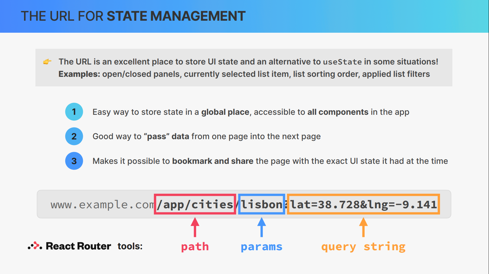

* path: `/app/cities`
* params: `/lisbon` (city identifier segment in the path—e.g. slug or id matched by a dynamic route)
* query string: `lat=38.728&lng=-9.141`

#### 215.2.3 Params vs query string (illustrated)

**Subsection Summary:**
- The image **`section17-lecture215-002.png`** complements the first: it usually **contrasts** **route parameters** (part of the path hierarchy) with **query parameters** (after `?`).
- Reinforces that **params** identify **which entity** (e.g. which city) while **query** often holds **auxiliary** or **optional** data (coordinates, filters).
- Prepares for **consistent naming** in code: **`useParams()`** returns param objects; **`useSearchParams()`** returns **`URLSearchParams`**-like getters/setters.
- Use these figures when implementing **`Route path="cities/:cityId"`** and **`?lat=&lng=`** in **Worldwise** so the **bar**, **map**, and **list** stay in sync.

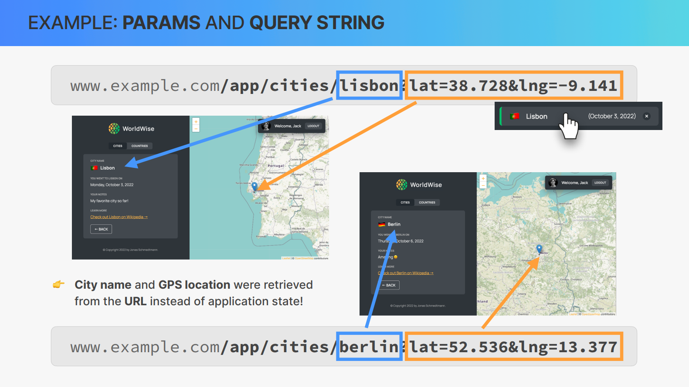

### 🐞 215.3 Issues:

- **URL state not implemented yet**: **`src/App.jsx`** only declares static routes (`cities`, `countries`, `form`); there is no **`cities/:cityId`** or **search** wiring—expected **before** the next implementation lessons.
- **`City.jsx` is disconnected from routing**: **`src/components/City.jsx`** uses **hard-coded `currentCity` (TEMP DATA)** instead of **params** or **loader** data, so the URL cannot drive the detail view yet.
- **Doc phrasing in 215.2.2**: Listing **params** as **`/lisbon`** is **pedagogical**; in React Router the **param value** is typically **`lisbon`** while the **pattern** is **`/app/cities/:citySlug`**—learners should map the diagram to **`useParams()`**, not a second leading slash.
- **Risk of putting secrets in query strings**: Any token or PII must **not** follow the **`lat`/`lng`** pattern in production URLs.

| Issue | Status | Log/Error |
|---|---|---|
| No dynamic city route or `useSearchParams` in app yet | ℹ️ Informational | `src/App.jsx:43-47` — only `path="cities"` / `countries` / `form`; aligns with lesson order before URL state implementation |
| `City` detail uses temp data, not URL | ℹ️ Informational | `src/components/City.jsx:12-18` — `currentCity` object literal; no `useParams` / `useOutletContext` |
| “params: `/lisbon`” can confuse param vs path | ℹ️ Informational | `docs/LECTURE_STEPS.md` (215.2.2): clarify as **segment value** `lisbon` for `:citySlug` vs full path |
| Query string must not carry sensitive data | ℹ️ Low Priority | General: `lat`/`lng` are fine for map demos; never put auth tokens in search |

### 🧱 215.4 Pending Fixes (TODO)

- [ ] **Add a dynamic route** in `src/App.jsx` (nested under `/app`), e.g. **`path="cities/:cityId"`** (or `:citySlug`), rendering a **`City`** (or **`CityDetail`**) that reads **`cityId`** via **`useParams()`**.
- [ ] **Replace `TEMP DATA` in `src/components/City.jsx`** (~lines 12–18) by resolving the city from **`cities`** (from **`useOutletContext`**, loader, or parent state) using **`useParams().cityId`** so the URL is the source of truth.
- [ ] **Persist map position in the search string**: in the **`Map`** component (e.g. `src/components/Map.jsx`), sync center/zoom with **`useSearchParams()`** for **`lat`**, **`lng`** (and optional **`zoom`**) so URLs match **215.2.2**’s example shape.
- [ ] **Validate and coerce query params**: parse **`Number(lat)`** / **`Number(lng)`**, fall back to defaults when missing or **NaN**, to avoid broken map state from malformed links.
- [ ] **Course doc polish**: Optionally add one line under **215.2.2** noting that **`lisbon`** is the **value** of a **dynamic segment**, not a standalone path starting with `/`.

[↑ top — 215. Lesson 215 — *Storing State in the URL*](#-215-lesson-215--storing-state-in-the-url)


<br>

## 🔧 216. Lesson 216 — *Dynamic Routes With URL Parameters*

[🧳 Section 17: *React Route: Building Single-Page Applications (SPA)*](#-section-17-react-route-building-single-page-applications-spa)

### 📑 Table of Contents:
- [216. Lesson 216 — *Dynamic Routes With URL Parameters*](#-216-lesson-216--dynamic-routes-with-url-parameters)
- [216.1 Context](#-2161-context)
- [216.2 Updating code according the context](#-2162-updating-codetheory-according-the-context)
  - [216.2.1 Register a nested route for city detail](#21621-register-a-nested-route-for-city-detail)
  - [216.2.2 City component stub with temporary data](#21622-city-component-stub-with-temporary-data)
  - [216.2.3 Absolute Link paths for index vs cities routes](#21623-absolute-link-paths-for-index-vs-cities-routes)
  - [216.2.4 Reading the dynamic segment with useParams](#21624-reading-the-dynamic-segment-with-useparams)
  - [216.2.5 Top-level route paths with leading slashes in App](#21625-top-level-route-paths-with-leading-slashes-in-app)
- [216.3 Issues](#-2163-issues)
- [216.4 Pending Fixes (TODO)](#-2164-pending-fixes-todo)

### 🧠 216.1 Context:

**Dynamic routes with URL parameters** let a single route **pattern** match many concrete URLs by declaring **named placeholders** in the path (for example `:id`). React Router fills those placeholders from the current location; your components read them with **`useParams()`**. The URL becomes a **stable identifier** for a resource (here, a city), so deep links like `/app/cities/56283910` load the correct detail view without extra global state.

In **Worldwise**, nested routes under **`/app`** combine a **static segment** (`cities`) with a **dynamic segment** (`:id`) so the list and the detail share one URL hierarchy. **`Link`** targets must align with that pattern—especially when the same list appears on both the **index** route (`/app`) and **`/app/cities`**, where purely relative paths would resolve differently.

**Key Concepts:**

1. **Route params (dynamic segments)** — A path such as **`cities/:id`** declares that the final segment is captured as **`id`**; the value is always a **string** in the URL.
2. **`useParams()`** — Returns an object of **param names → values** for the **currently matched** route (e.g. `{ id: "56283910" }`).
3. **Nested routes** — Under **`path="app"`**, child paths like **`cities/:id`** build full paths such as **`/app/cities/:id`** when combined with the parent.
4. **Absolute vs relative `to` in `<Link>`** — Paths starting with **`/`** are resolved from the **app root**; relative paths depend on the **current** route, which matters when two routes render the same list.
5. **URL as the source of truth (incremental)** — This lesson wires **routing** and **links** first; resolving **`id`** to real city data from **`cities`** is a natural follow-up (see **216.4**).

**Advantages:**
- **Bookmarkable and shareable** city detail URLs.
- **One declaration** (`:id`) instead of duplicating routes per city.
- **Clear mapping** between address bar and screen, which pairs well with browser history.

**Disadvantages / Gotchas:**
- **Param values are strings** — Compare or coerce carefully when matching numeric IDs from JSON.
- **Relative links** — Easy to generate wrong targets when **`CityList`** is mounted on more than one path (see **216.2.3**).
- **No automatic data loading** — Params tell you **which** id; you still **look up** the city in **`cities`** (or fetch by id).
- **Missing or unknown ids** — A bad or stale id needs a **not found** or fallback UX.

**When to Consider Alternatives:**
- **Many optional filters** — Prefer **query strings** (`useSearchParams`) for non-hierarchical state (see Lesson **215**).
- **Highly dynamic segment counts** — Splats (`*`) or different route layouts may fit better than a single `:id`.
- **Server-driven slugs** — If SEO needs **`/cities/lisbon`** instead of ids, model the param as a **slug** and resolve it on the server or in a loader.

Implementation touchpoints in this project: **`src/App.jsx`** (nested **`Route path="cities/:id"`**), **`src/components/CityItem.jsx`** (**`to={\`/app/cities/${id}\`}`**), and **`src/components/City.jsx`** (**`useParams()`**).

---

### ⚙️ 216.2 Updating code/theory according the context:

#### **Summary**

- Section **216.2** connects **declared** dynamic segments in **`App.jsx`**, **navigation** from **`CityItem`**, and **reading** the segment in **`City.jsx`**.
- **216.2.1** adds **`cities/:id`** under **`/app`** so each city has a dedicated URL; the screenshot illustrates the resulting path in the bar.
- **216.2.2** keeps **`City`** on **temporary data** while the route exists—focusing the lesson on **routing**, not yet on data joining.
- **216.2.3** explains why **`/app/cities/${id}`** is used so links are correct from both **`/app`** and **`/app/cities`**.
- **216.2.4** introduces **`useParams`** and a minimal UI showing **`id`** from the URL.
- **216.2.5** repeats **`App.jsx`** with **root-level** routes written as **`path="product"`** (no leading **`/`**), which still match **`/product`** in v6—useful to compare with **216.2.1**’s **`path="/product"`** notation.

---

#### 216.2.1 Register a nested route for city detail

**Subsection Summary:**
- Adds **`import City`** and a **nested** route **`path="cities/:id"`** whose element is **`<City />`**.
- The **`:id`** token names the **route parameter** that later maps to **`useParams().id`**.
- **`CityList`** remains on **`index`** and **`cities`**; the new route is **sibling** to those, not a child of **`CityList`**.
- The screenshot below shows how the browser URL reflects **`/app/cities/`** plus an identifier—consistent with this pattern.

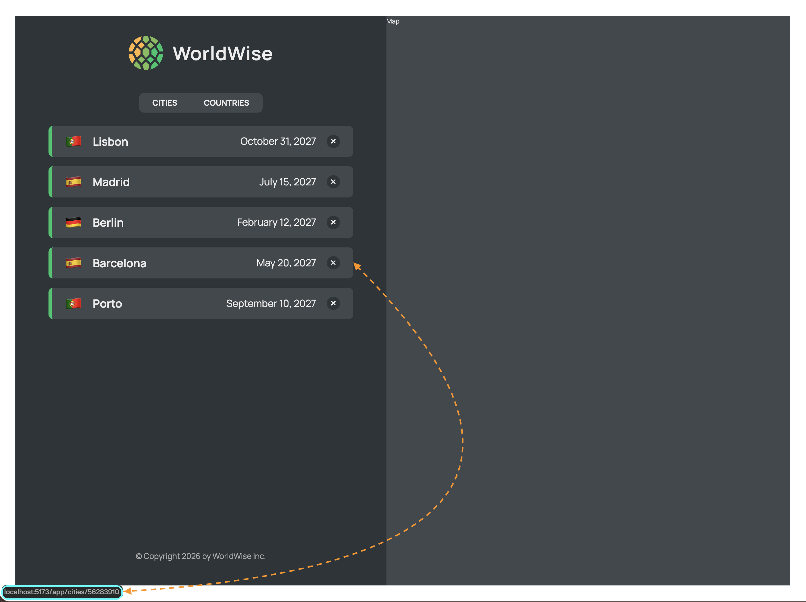

```jsx
/* src/App.jsx */
import { BrowserRouter, Routes, Route } from "react-router-dom";
import { useState, useEffect } from "react";
import Product from "./pages/Product";
import Pricing from "./pages/Pricing";
import Homepage from "./pages/Homepage";
import PageNotFound from "./pages/PageNotFound";
import AppLayout from "./pages/AppLayout";
import Login from './pages/Login'
import CityList from "./components/CityList";
import CountryList from './components/CountryList';
import City from './components/City';                 // 👈🏽 ✅

const BASE_URL = "http://localhost:8000"

function App() {
  const [cities, setCities] = useState([]);
  const [isLoading, setIsLoading] = useState(false);

  useEffect(() => {
    async function fetchCities() {
      try{
        setIsLoading(true);
        const res = await fetch(`${BASE_URL}/cities`);
        const data = await res.json();
        setCities(data);
      } catch(error) {
        console.error(error);
        alert("There was an error loading data");
      }
      finally {
        setIsLoading(false);
      }
    }
    fetchCities();
  }, []);

  return (
    <BrowserRouter>
      <Routes>
        <Route path="/" element={<Homepage />} />
        <Route path="/product" element={<Product />} />
        <Route path="/pricing" element={<Pricing />} />
        <Route path="/login" element={<Login />} />
        <Route path="/app" element={<AppLayout />}>
          <Route index element={<CityList cities={cities} isLoading={isLoading} />}/>
          <Route path="cities" element={<CityList cities={cities} isLoading={isLoading} />}/>
          <Route path="cities/:id" element={<City />}/>                                                 {/* 👈🏽 ✅ */}
          <Route path="countries" element={ <CountryList cities={cities} isLoading={isLoading} /> }/>
          <Route path="form" element={<p>Form</p>}/>
        </Route>
        <Route path="*" element={<PageNotFound />} />
      </Routes>
    </BrowserRouter>
  );
}

export default App;
```

#### 216.2.2 City component stub with temporary data

**Subsection Summary:**
- **`City`** is reachable at **`/app/cities/:id`**, but this step still uses a **hardcoded `currentCity`** (“Lisbon”) for a later lesson that will join URL **`id`** to **`cities`**.
- The **full layout** (rows, Wikipedia link, **`ButtonBack`**) stays **commented out**; only a minimal **`<h1>City</h1>`** renders.
- **`formatDate`** is defined but unused in the active return—dead code until the full UI is restored.
- Demonstrates **incremental adoption**: route first, **data from URL** next.

```jsx
/* src/components/City.jsx */
import styles from "./City.module.css";

const formatDate = (date) =>
  new Intl.DateTimeFormat("en", {
    day: "numeric",
    month: "long",
    year: "numeric",
    weekday: "long",
  }).format(new Date(date));

function City() {
  // TEMP DATA
  const currentCity = {
    cityName: "Lisbon",
    emoji: "🇵🇹",
    date: "2027-10-31T15:59:59.138Z",
    notes: "My favorite city so far!",
  };

  const { cityName, emoji, date, notes } = currentCity;
  return (
    <h1>City</h1>
  )
  //return (
    // <div className={styles.city}>
    //   <div className={styles.row}>
    //     <h6>City name</h6>
    //     <h3>
    //       <span>{emoji}</span> {cityName}
    //     </h3>
    //   </div>

    //   <div className={styles.row}>
    //     <h6>You went to {cityName} on</h6>
    //     <p>{formatDate(date || null)}</p>
    //   </div>

    //   {notes && (
    //     <div className={styles.row}>
    //       <h6>Your notes</h6>
    //       <p>{notes}</p>
    //     </div>
    //   )}

    //   <div className={styles.row}>
    //     <h6>Learn more</h6>
    //     <a
    //       href={`https://en.wikipedia.org/wiki/${cityName}`}
    //       target="_blank"
    //       rel="noreferrer"
    //     >
    //       Check out {cityName} on Wikipedia &rarr;
    //     </a>
    //   </div>

    //   <div>
    //     <ButtonBack />
    //   </div>
    // </div>
  //);
}

export default City;
```

#### 216.2.3 Absolute Link paths for index vs cities routes

**Subsection Summary:**
- **`CityList`** is the **`index`** of **`/app`** **and** the element of **`/app/cities`**, so a **relative** link **`to={id}`** resolves to **`/app/<id>`** from index but **`/app/cities/<id>`** from cities—**inconsistent** with **`path="cities/:id"`**.
- The fix is an **absolute** path **`/app/cities/${id}`** so the destination is **always** the nested dynamic route.
- **`Link`** from **`react-router-dom`** performs client-side navigation without full page reloads.
- The prose uses example host **`localhost:5173`**; the same idea applies to any base URL.

🔥 🔥 🔥 

Since you have `CityList` assigned to both the `index` route and the `cities` route—and you explicitly want to solve this — using a purely relative link like `to={${id}}` creates a conflict.

Here is why:

* If you are on `localhost:5173/app` (the index route) and use `to={${id}}`, it points to `localhost:5173/app/56283910`.
* If you are on `localhost:5173/app/cities` and use `to={${id}}`, it points to `localhost:5173/app/cities/56283910`.

To guarantee that the link always points straight to `localhost:5173/app/cities/56283910` no matter which of those two routes you are looking at it from, you should use the full absolute path in your Link. 

Just update your `CityItem.jsx` to include the `/app` prefix:
```jsx
<Link className={styles.cityItem} to={`/app/cities/${id}`}>
```

Because this path starts with a slash `/`, React Router treats it as absolute from the root—but by spelling out the full route (`/app/cities/`), it perfectly lines up with your `<Route path="cities/:id" element={<City />}/>` parameter every single time


```jsx
/* src/components/CityItem.jsx */
import { Link } from 'react-router-dom';                // 👈🏽 ✅  
import styles from './CityItem.module.css';

const formatDate = (date) => 
  new Intl.DateTimeFormat("en", {
    day: "numeric",
    month: "long",
    year: "numeric",
  }).format(new Date(date));

const CityItem = ( {city} ) => {
  const { emoji, cityName, date, id } = city;
  //console.log(city);

  return (
    <li>
      <Link className={styles.cityItem} to={`/app/cities/${id}`}>   {/* 👈🏽 ✅ */}
        <span className={styles.emoji}>{emoji}</span>
        <h3 className={styles.name}>{cityName}</h3>
        <time className={styles.date}>{formatDate(date)}</time>
        <button className={styles.deleteBtn}>&times;</button>
      </Link>
    </li>
  )
}

export default CityItem;
```

#### 216.2.4 Reading the dynamic segment with `useParams`

**Subsection Summary:**
- Imports **`useParams`** from **`react-router-dom`** and destructures **`id`** so it matches the **`:id`** segment in **`App.jsx`**.
- **`console.log`** is a temporary aid to verify the param in DevTools when navigating from **`CityItem`**.
- The UI shows **`City {id}`**, proving the **URL drives** what the component reads; **`TEMP DATA`** is still unrelated to **`id`** (intentional gap before lookup logic).
- **`styles`** and **`formatDate`** remain **unused** in the active return until the full card UI is uncommented.

```jsx
/* src/components/City.jsx */
import { useParams } from "react-router-dom";         // 👈🏽 ✅
import styles from "./City.module.css";

const formatDate = (date) =>
  new Intl.DateTimeFormat("en", {
    day: "numeric",
    month: "long",
    year: "numeric",
    weekday: "long",
  }).format(new Date(date));

function City() {
    const { id } = useParams();                       // 👈🏽 ✅
    console.log("CityId: ", id)                       // 👈🏽 ✅

  // TEMP DATA
  const currentCity = {
    cityName: "Lisbon",
    emoji: "🇵🇹",
    date: "2027-10-31T15:59:59.138Z",
    notes: "My favorite city so far!",
  };

  const { cityName, emoji, date, notes } = currentCity;
  return (
    <h1>City { id }</h1>                                {/* 👈🏽 ✅ */}
  )
}

export default City;
```


#### 216.2.5 Top-level route paths with leading slashes in App

**Subsection Summary:**
- Same structure as **216.2.1**, but **top-level** routes use **`path="product"`**-style strings **without** a leading **`/`** in the snippet—React Router v6 still matches **`/product`**, **`/pricing`**, **`/login`** at the **root** of the route tree (equivalent to **`/product`** here).
- Highlights consistency: **`path="app"`** for the layout shell and nested **`cities/:id`** under it.
- Serves as a **checkpoint** that **`City`** and **`cities/:id`** remain wired after normalizing path style.
- Compare with **216.2.1** if your repo uses **`path="/product"`**—both styles are common; pick one project-wide.

```jsx
/* src/App.jsx */
import { BrowserRouter, Routes, Route } from "react-router-dom";
import { useState, useEffect } from "react";
import Product from "./pages/Product";
import Pricing from "./pages/Pricing";
import Homepage from "./pages/Homepage";
import PageNotFound from "./pages/PageNotFound";
import AppLayout from "./pages/AppLayout";
import Login from './pages/Login'
import CityList from "./components/CityList";
import CountryList from './components/CountryList';
import City from './components/City';

const BASE_URL = "http://localhost:8000"

function App() {
  const [cities, setCities] = useState([]);
  const [isLoading, setIsLoading] = useState(false);

  useEffect(() => {
    async function fetchCities() {
      try{
        setIsLoading(true);
        const res = await fetch(`${BASE_URL}/cities`);
        const data = await res.json();
        setCities(data);
      } catch(error) {
        console.error(error);
        alert("There was an error loading data");
      }
      finally {
        setIsLoading(false);
      }
    }
    fetchCities();
  }, []);

  return (
    <BrowserRouter>
      <Routes>
        <Route path="/" element={<Homepage />} />
        <Route path="product" element={<Product />} />                        {/* 👈🏽 ✅ */}
        <Route path="pricing" element={<Pricing />} />                        {/* 👈🏽 ✅ */}
        <Route path="login" element={<Login />} />                            {/* 👈🏽 ✅ */}
        <Route path="app" element={<AppLayout />}>                            {/* 👈🏽 ✅ */}
          <Route index element={<CityList cities={cities} isLoading={isLoading} />}/>
          <Route path="cities" element={<CityList cities={cities} isLoading={isLoading} />}/>
          <Route path="cities/:id" element={<City />}/>
          <Route path="countries" element={ <CountryList cities={cities} isLoading={isLoading} /> }/>
          <Route path="form" element={<p>Form</p>}/>
        </Route>
        <Route path="*" element={<PageNotFound />} />
      </Routes>
    </BrowserRouter>
  );
}

export default App;
```

### 🐞 216.3 Issues:

- **`City` shows URL `id` but still displays Lisbon from `TEMP DATA`**: The param is wired, but the **detail content** does not yet reflect the **selected city**—confusing when **`id`** ≠ Lisbon’s id.
- **`console.log` in `City`**: Debugging noise in **`src/components/City.jsx`** should be removed or guarded before production.
- **Commented full UI**: Rows, notes, Wikipedia link, and **`ButtonBack`** are disabled; **accessibility** and layout from the design are not active.
- **Doc vs repo path style**: **216.2.1** uses **`path="/product"`** while **216.2.5** / current **`src/App.jsx`** use **`path="product"`**—behavior is equivalent at root, but the mismatch can confuse readers.
- **`CityItem` delete control**: The **×** **`button`** inside **`Link`** may trigger nested interactive control issues; no **`onClick`** handler yet (out of scope for this lesson).

| Issue | Status | Log/Error |
|---|---|---|
| `TEMP DATA` out of sync with `useParams().id` | ⚠️ Identified | `src/components/City.jsx:16-26` — Lisbon stub while heading shows **`id`** from URL |
| `console.log` left in `City` | ℹ️ Low Priority | `src/components/City.jsx:14` — `console.log("CityId: ", id)` |
| Full city detail UI commented out | ℹ️ Informational | `src/components/City.jsx:28-64` — commented **`return`**; only **`<h1>City {id}</h1>`** active |
| Leading slash inconsistency in `App` route snippets | ℹ️ Informational | `docs/LECTURE_STEPS.md` **216.2.1** vs **216.2.5** vs `src/App.jsx:41-43` |
| Delete button inside `Link` | ℹ️ Low Priority | `src/components/CityItem.jsx:20-21` — consider **`preventDefault`** pattern or move button outside |

### 🧱 216.4 Pending Fixes (TODO)

- [ ] **Resolve city from `id`**: In `src/components/City.jsx`, replace the **Lisbon** object (~lines 16–22) with **`cities.find((c) => String(c.id) === id)`** (or strict equality if types match). Pass **`cities`** via **`useOutletContext`** from `AppLayout` / `App`, or lift a shared context—align with the next course step.
- [ ] **Handle unknown `id`**: If no city matches, render **`Navigate`** to `/app/cities` or a small “City not found” message (~`City.jsx` after lookup).
- [ ] **Remove or gate `console.log`**: Delete line ~14 in `src/components/City.jsx` or wrap in `import.meta.env.DEV` (Vite) / `process.env.NODE_ENV === "development"`.
- [ ] **Restore full `City` UI**: Uncomment the styled **`return`** in `src/components/City.jsx` (~lines 28–64) and bind **`cityName`**, **`emoji`**, **`date`**, **`notes`** from the **found** city, not **`TEMP DATA`**.
- [ ] **Unify `App.jsx` path style**: Choose **`path="/product"`** or **`path="product"`** for root routes in `src/App.jsx` (lines 41–43) and match the **216.2.1** doc snippet for learner consistency.
- [ ] **`CityItem` delete UX**: Either implement delete handler with **`e.preventDefault()`** on the button or restructure so the **×** is not a nested **button** inside **`Link`** (see `src/components/CityItem.jsx:17-22`).

[↑ top — 216. Lesson 216 — *Dynamic Routes With URL Parameters*](#-216-lesson-216--dynamic-routes-with-url-parameters)


<br>

## 🔧 217. Lesson 217 — *Reading and Setting a Query String*

[🧳 Section 17: *React Route: Building Single-Page Applications (SPA)*](#-section-17-react-route-building-single-page-applications-spa)

### 📑 Table of Contents:
- [217. Lesson 217 — *Reading and Setting a Query String*](#-217-lesson-217--reading-and-setting-a-query-string)
- [217.1 Context](#-2171-context)
- [217.2 Updating code/theory according the context](#-2172-updating-codetheory-according-the-context)
  - [217.2.1 Expose position from each city and log it](#21721-expose-position-from-each-city-and-log-it)
  - [217.2.2 Append lat and lng to the city Link as a query string](#21722-append-lat-and-lng-to-the-city-link-as-a-query-string)
  - [217.2.3 Read search params in Map with useSearchParams](#21723-read-search-params-in-map-with-useSearchParams)
  - [217.2.4 Read lat and lng in City alongside the dynamic id](#21724-read-lat-and-lng-in-city-alongside-the-dynamic-id)
  - [217.2.5 Update the query string programmatically with setSearchParams](#21725-update-the-query-string-programmatically-with-setSearchParams)
- [217.3 Issues](#-2173-issues)
- [217.4 Pending Fixes (TODO)](#-2174-pending-fixes-todo)

### 🧠 217.1 Context:

**Query strings** (the part of the URL after `?`, e.g. `?lat=38.72&lng=-9.14`) hold **optional, non-hierarchical** data that still belongs in the address bar: filters, map coordinates, tabs, or sort order. Unlike **path parameters** (`:id`), search params do not define *which* route matches—they refine the view for the **same** matched route.

In **Worldwise**, each city already has a **`position`** object (`lat`, `lng`). The lesson wires those values into the URL when navigating from **`CityItem`** so **`Map`** and **`City`** can read a **shareable, bookmarkable** map position without new global state. React Router exposes this through **`useSearchParams()`**, which mirrors **`useState`** for the query string: you **read** with **`searchParams.get("key")`** and **write** with **`setSearchParams(object)`** (or a functional updater).

**Key Concepts:**

1. **Query string vs path params** — Path segments identify the *resource* (`/app/cities/:id`); search params carry *extra state* (coordinates, UI mode) that can be omitted or changed without replacing the route pattern.
2. **`URLSearchParams` in the location** — The browser parses `?lat=…&lng=…` into key/value pairs; React Router keeps them in sync with navigation.
3. **`useSearchParams()`** — Returns **`[searchParams, setSearchParams]`** where **`searchParams`** behaves like **`URLSearchParams`** (`get`, `has`, etc.) and **`setSearchParams`** merges or replaces the query portion of the URL.
4. **String values** — **`searchParams.get("lat")`** returns a **string** or **`null`** if missing; numeric coords are represented as text in the URL.
5. **Links with search** — A **`Link`** **`to`** value can append a query string to the path (for example using a template literal with **`?lat=`** and **`&lng=`**) so navigation updates both the pathname and the search string.

**Advantages:**

- **Shareable URLs** — Users can copy/paste a link that includes map position or filters.
- **Browser history** — Changing search params can create history entries; back/forward can restore prior queries (depending on how updates are applied).
- **Separation of concerns** — Keep stable resource IDs in the path; put “view options” in the query string.
- **Familiar API** — **`get` / `setSearchParams`** map cleanly to how servers and `fetch` already think about query strings.

**Disadvantages / Gotchas:**

- **`get` returns `null`** — If the user opens `/app/cities/1` with no query, **`lat`** / **`lng`** may be **`null`**; UI may briefly show **`null`** or need defaults.
- **Everything is a string** — Compare and parse carefully (`Number(searchParams.get("lat"))`) when doing math or map APIs.
- **Encoding** — Concatenating simple numeric coordinates into the URL is usually safe; arbitrary text values should use **`encodeURIComponent`** or the **`setSearchParams`** object form to avoid broken URLs.
- **Duplicate sources of truth** — Coordinates might exist both on the **city object** and in the URL; the app must decide which wins when they disagree.

**When to Consider Alternatives:**

- **Complex nested state** — Very large or nested filter objects may be better in **context**, **URL state libraries**, or **session storage** than a long query string.
- **Private or sensitive data** — Do not put secrets in the query string (URLs leak via logs and Referer).
- **When the server must own the ID only** — If only `:id` should matter, fetch **`position`** from an API by **`id`** instead of duplicating it in the query (trade-off: fewer bytes in the URL vs. one round trip).

**In this project:** **`CityItem`** sets **`lat` / `lng`** on the link to **`/app/cities/:id`**. **`Map`** and **`City`** read those values with **`useSearchParams()`**; **`Map`** also demonstrates **`setSearchParams`** to change position from a button.

### ⚙️ 217.2 Updating code/theory according the context:

#### **Summary**

- This section shows how to **pass geographic coordinates through the URL** as a **query string** while keeping the **dynamic city id** in the **path**.
- It connects **list navigation** (`CityItem` → `Link`), **map display** (`Map`), and **city detail** (`City`) so all three read the **same** `lat` / `lng` search params.
- Subsections progress from **inspecting data** (`position`), **writing** the query on links, **reading** it in **`Map`**, **reusing** the read pattern in **`City`**, then **mutating** the query with **`setSearchParams`** for interactive demos.

#### 217.2.1 Expose `position` from each `city` and log it

**Subsection Summary**

- Confirms each **`city`** includes a **`position`** object suitable for map centering (and logs it for debugging).
- Prepares the next step: values are available to append to the **`Link`** as **`lat`** / **`lng`** query keys.
- The screenshot **`section17-lecture217-001.png`** illustrates **`console.log(position)`** output (e.g. `{ lat, lng }`) in DevTools.

```jsx
/* src/components/CityItem.jsx */
import { Link } from 'react-router-dom';
import styles from './CityItem.module.css';

const formatDate = (date) => 
  new Intl.DateTimeFormat("en", {
    day: "numeric",
    month: "long",
    year: "numeric",
  }).format(new Date(date));

const CityItem = ( {city} ) => {
  const { emoji, cityName, date, id, position } = city;             // 👈🏽 ✅
  console.log(position);                                            // 👈🏽 ✅

  return (
    <li>
      <Link className={styles.cityItem} to={`/app/cities/${id}`}>
        <span className={styles.emoji}>{emoji}</span>
        <h3 className={styles.name}>{cityName}</h3>
        <time className={styles.date}>{formatDate(date)}</time>
        <button className={styles.deleteBtn}>&times;</button>
      </Link>
    </li>
  )
}

export default CityItem;
```

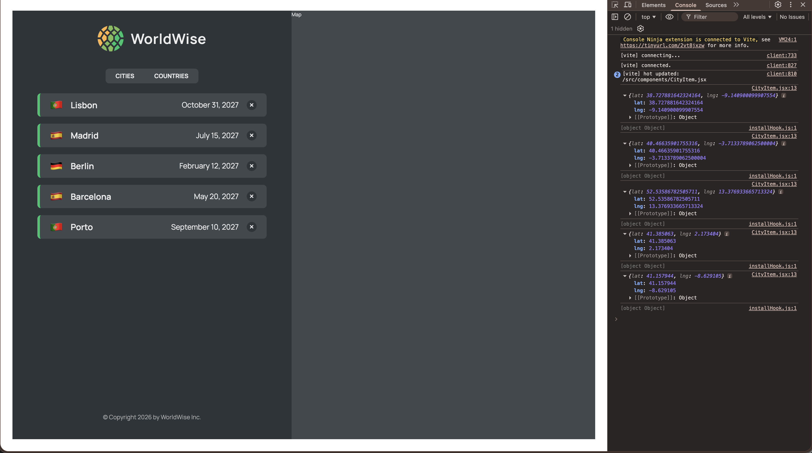

#### 217.2.2 Append `lat` and `lng` to the city Link as a query string

**Subsection Summary**

- Extends the **`to`** prop so the URL includes **`?lat=…&lng=…`** taken from **`position`**, alongside the existing **`/app/cities/${id}`** path.
- Encodes the idea that **map coordinates are “optional view state”** carried in the search string while the **city id** remains the path param.
- **`section17-lecture217-002.png`** shows the browser address bar (or link preview) with **`lat`** and **`lng`** present in the query.

```jsx
/* src/components/CityItem.jsx */
import { Link } from 'react-router-dom';
import styles from './CityItem.module.css';

const formatDate = (date) => 
  new Intl.DateTimeFormat("en", {
    day: "numeric",
    month: "long",
    year: "numeric",
  }).format(new Date(date));

const CityItem = ( {city} ) => {
  const { emoji, cityName, date, id, position } = city;
  console.log(position);

  return (
    <li>
      <Link 
        className={styles.cityItem} 
        to={`/app/cities/${id}?lat=${position.lat}&lng=${position.lng}`}      // 👈🏽 ✅
      >
        <span className={styles.emoji}>{emoji}</span>
        <h3 className={styles.name}>{cityName}</h3>
        <time className={styles.date}>{formatDate(date)}</time>
        <button className={styles.deleteBtn}>&times;</button>
      </Link>
    </li>
  )
}

export default CityItem;
```

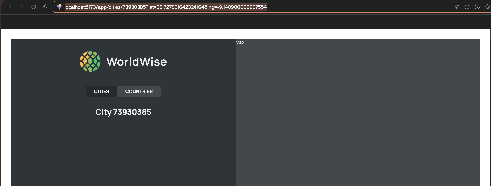

#### 217.2.3 Read search params in Map with `useSearchParams`

**Subsection Summary**

- Introduces **`useSearchParams`** from **`react-router-dom`** to **read** the current **`lat`** / **`lng`** from the URL inside **`Map`**.
- Uses **`searchParams.get('lat')`** and **`searchParams.get('lng')`** and renders them in the UI as **`Position: {lat}, {lng}`**.
- **`section17-lecture217-003.png`** shows the **Map** view displaying the parsed coordinates after navigation from a city link.

```jsx
/* src/components/Map.jsx */
import { useSearchParams } from 'react-router-dom';
import styles from './Map.module.css';

const Map = () => {
  const [searchParams, setSearchParams] = useSearchParams();

  const lat = searchParams.get('lat');
  const lng = searchParams.get('lng');

  return (
    <div className={styles.mapContainer}>
      <h1>Map</h1>
      <h2>
        Position: {lat}, {lng}
      </h2>
    </div>
  )
}

export default Map;
```

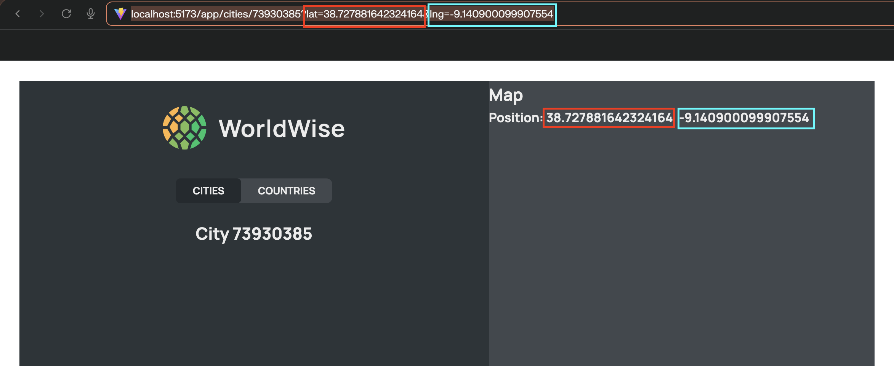

#### 217.2.4 Read `lat` and `lng` in `City` alongside the dynamic `id`

**Subsection Summary**

- Combines **`useParams()`** (for **`id`**) with **`useSearchParams()`** (for **`lat`** / **`lng`**) in the same component—typical for detail pages that need both **resource id** and **view/search state**.
- Renders **`latitude`** / **`longitude`** from the query string under the city heading while **`TEMP DATA`** still supplies label fields for the stub UI.
- **`section17-lecture217-004.png`** shows **City** with **`Id`** from the path and coordinates from the query.

```jsx
/* src/components/City.jsx */
import { useParams, useSearchParams } from "react-router-dom";
import styles from "./City.module.css";

const formatDate = (date) =>
  new Intl.DateTimeFormat("en", {
    day: "numeric",
    month: "long",
    year: "numeric",
    weekday: "long",
  }).format(new Date(date));

function City() {
  const [searchParams, setSearchParams] = useSearchParams();    // 👈🏽 ✅

  const lat = searchParams.get("lat");                          // 👈🏽 ✅
  const lng = searchParams.get("lng");                          // 👈🏽 ✅

  const { id } = useParams();
  console.log("CityId: ", id);

  // TEMP DATA
  const currentCity = {
    cityName: "Lisbon",
    emoji: "🇵🇹",
    date: "2027-10-31T15:59:59.138Z",
    notes: "My favorite city so far!",
  };

  const { cityName, emoji, date, notes } = currentCity;
  return (
    <>
      <h1>{emoji} {cityName} city</h1>
      <h2>Id: {id}</h2>
      <h2>
        Position: 
      </h2>
      <p>latitude: {lat}, longitude: {lng}</p>                      {/* 👈🏽 ✅ */}
    </>
  );
}

export default City;
```

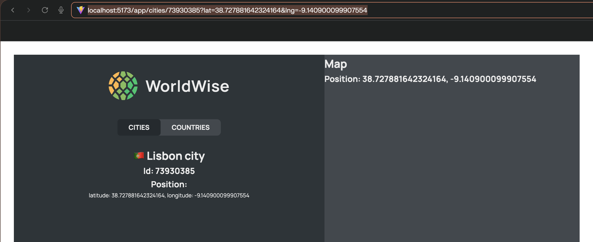

#### 217.2.5 Update the query string programmatically with `setSearchParams`

**Subsection Summary**

- Demonstrates **writing** search params: **`setSearchParams({ lat: 23, lng: 50 })`** updates the URL without a full navigation component, so **`Map`** (and any other reader) sees new **`lat`** / **`lng`** values.
- Shows the **second element** of the **`useSearchParams`** tuple as the imperative counterpart to declarative **`Link`** updates.
- **`section17-lecture217-005.png`** captures the UI after clicking **“Change position”**, with the address bar / on-screen position reflecting the new query.

```jsx
/* src/components/Map.jsx */
import { useSearchParams } from 'react-router-dom';
import styles from './Map.module.css';

const Map = () => {
  const [searchParams, setSearchParams] = useSearchParams();

  const lat = searchParams.get('lat');
  const lng = searchParams.get('lng');

  return (
    <div className={styles.mapContainer}>
      <h1>Map</h1>
      <h2>
        Position: {lat}, {lng}
      </h2>
      <button onClick={() => {setSearchParams({ lat: 23, lng: 50 })}}>Change position</button>
    </div>
  )
}

export default Map;
```

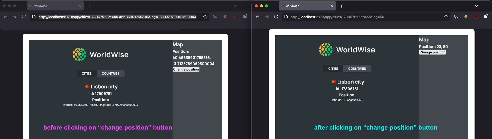

### 🐞 217.3 Issues:

- **`City` still uses `TEMP DATA`**: The **`id`** and query **`lat` / `lng`** come from the URL, but **`cityName`**, **`emoji`**, etc. remain hard-coded to Lisbon—misleading when opening another city.
- **`console.log` noise**: **`CityItem`** logs **`position`** and **`City`** logs **`CityId`** on every render—should be removed or dev-only before shipping.
- **Unused bindings**: **`City`** destructures **`setSearchParams`** and imports **`styles`** / **`formatDate`** while the active return does not use them—dead code and linter warnings.
- **Missing query string**: If the user navigates to **`/app/cities/:id`** without **`?lat=&lng=`**, **`searchParams.get`** returns **`null`**; the UI may show **`Position: null, null`** until a link with params is used.
- **`setSearchParams` demo uses numeric literals**: React Router serializes them; consistent with the lesson, but real map code may want **`String(lat)`** or fixed precision for URLs.
- **`CityItem` delete button inside `Link`**: Nested **`button`** inside **`Link`** remains an accessibility / event-propagation concern (carried from earlier lessons).

| Issue | Status | Log/Error |
|---|---|---|
| `TEMP DATA` out of sync with URL `id` | ⚠️ Identified | `src/components/City.jsx:21-37` — Lisbon stub while **`id`** reflects the selected city |
| `console.log` in `CityItem` / `City` | ℹ️ Low Priority | `src/components/CityItem.jsx:13` — `console.log(position)`; `src/components/City.jsx:19` — `console.log("CityId: ", id)` |
| Unused `setSearchParams`, `styles`, `formatDate` in `City` | ℹ️ Low Priority | `src/components/City.jsx:1-16` — `setSearchParams` unused; `styles` / `formatDate` unused in active JSX |
| Null **`lat` / `lng`** when query missing | ℹ️ Informational | `src/components/Map.jsx:7-15`, `src/components/City.jsx:15-16` — **`get`** returns **`null`**; consider defaults or conditional UI |
| Nested delete **`button`** in **`Link`** | ℹ️ Low Priority | `src/components/CityItem.jsx:17-22` — prefer **`preventDefault`** pattern or restructure |

### 🧱 217.4 Pending Fixes (TODO)

- [ ] **Resolve city from `id`**: Replace **`TEMP DATA`** in `src/components/City.jsx` (~lines 21–29) with **`cities.find((c) => String(c.id) === id)`** and pass **`cities`** via **`useOutletContext`** (or equivalent) from `AppLayout` / `App`.
- [ ] **Align coordinates with city data**: Either treat URL **`lat` / `lng`** as the source of truth for the map or derive them from the found city’s **`position`** when the query is absent—avoid contradictory state.
- [ ] **Remove or guard logs**: Delete `console.log` in `src/components/CityItem.jsx:13` and `src/components/City.jsx:19`, or wrap with **`import.meta.env.DEV`** (Vite).
- [ ] **Handle missing search params**: In `Map.jsx` and `City.jsx`, default **`lat` / `lng`** (e.g. city center) or show a short hint when **`searchParams.get`** returns **`null`**.
- [ ] **Clean up `City` imports**: Remove unused **`setSearchParams`** from the hook destructure if only reading; use **`styles`** and **`formatDate`** when restoring the full layout, or remove unused imports until then.
- [ ] **`CityItem` delete control**: Implement delete with **`e.preventDefault()`** on the button or move the **×** outside the **`Link`** (`src/components/CityItem.jsx:17-22`).

[↑ top — 217. Lesson 217 — *Reading and Setting a Query String*](#-217-lesson-217--reading-and-setting-a-query-string)


<br>

## 🔧 218. Lesson 218 — *Programmatic Navigation with useNavigate*

[🧳 Section 17: *React Route: Building Single-Page Applications (SPA)*](#-section-17-react-route-building-single-page-applications-spa)

### 📑 Table of Contents:
- [218. Lesson 218 — *Programmatic Navigation with useNavigate*](#-218-lesson-218--programmatic-navigation-with-usenavigate)
- [218.1 Context](#-2181-context)
- [218.2 Updating code/theory according the context](#-2182-updating-codetheory-according-the-context)
  - [218.2.1 Registering the Form route in App](#21821-registering-the-form-route-in-app)
  - [218.2.2 Imperative navigation on the Map with `useNavigate`](#21822-imperative-navigation-on-the-map-with-usenavigate)
  - [218.2.3 Reusable `Button` component](#21823-reusable-button-component)
  - [218.2.4 Form with `Button` for Add and Back](#21824-form-with-button-for-add-and-back)
  - [218.2.5 `useNavigate` and `navigate(-1)` on Back](#21825-usenavigate-and-navigate-1-on-back)
  - [218.2.6 `preventDefault` on Back inside the form](#21826-preventdefault-on-back-inside-the-form)
- [218.3 Issues](#-2183-issues)
- [218.4 Pending Fixes (TODO)](#-2184-pending-fixes-todo)

### 🧠 218.1 Context:

**Programmatic navigation** means changing the current route (URL and matched components) from **JavaScript**—for example after a button click, a timer, or an API response—without requiring the user to activate a **`<Link>`**. In React Router v6, the **`useNavigate`** hook returns a **`navigate`** function that can **push** or **replace** a path, go **back** or **forward** in history (`navigate(-1)`), or pass **state**.

This lesson connects **declarative** navigation (**`<Link to="…">`**, which describes *where* to go in JSX) with **imperative** navigation (**`navigate(…)`**, which you call when some logic decides it is time to move). Typical uses: closing a wizard step, redirecting after login, “Back” that mirrors the browser back button, or jumping to a nested route like **`form`** from the map.

In **Worldwise**, the **`Form`** page is registered under **`/app/form`**, **`Map`** navigates to **`form`** when the map area is clicked, and the **Back** button uses **`navigate(-1)`** so the user returns to the previous history entry—often the city or map view they came from.

**Key Concepts:**

1. **`useNavigate()`** — A hook that must be used **inside** a component tree wrapped by React Router (e.g. under **`BrowserRouter`**). It returns **`navigate`**, a stable function for imperative navigation.
2. **Relative paths** — From a route like **`/app/cities/123`**, calling **`navigate('form')`** resolves to **`/app/form`** (relative to the current route’s parent), which matches the nested **`path="form"`** route in **`App.jsx`**.
3. **History delta** — **`navigate(-1)`** is equivalent to the browser **Back** button: it pops one entry off the history stack (if there is a previous page in the same tab session).
4. **Buttons inside `<form>`** — A **`<button>`** without an explicit **`type`** defaults to **`type="submit"`** in HTML. Click handlers that only call **`navigate`** may still need **`e.preventDefault()`** so the form does not submit and reload behavior stays predictable.
5. **Separation of concerns** — **`Button`** is a small presentational wrapper so **`Form`** can attach **`onClick`** handlers (e.g. Back) without duplicating class names.

**Advantages:**
- Navigation can follow **business rules** (validation, async work) before changing the URL.
- **`navigate(-1)`** gives a **consistent “Back”** UX aligned with browser history.
- Relative navigation keeps URLs correct under nested layouts (**`/app/...`**).
- Programmatic API complements **`<Link>`** without replacing it for primary navigation.

**Disadvantages / Gotchas:**
- Over-using **`navigate`** for every transition makes flow **harder to see** than declarative links; reserve it for **conditional** or **event-driven** moves.
- **`navigate(-1)`** depends on **actual history**; if the user landed directly on the form, “back” may leave the app or go somewhere unexpected—sometimes you need an explicit path instead.
- **Event bubbling**: Clicks on **child** elements (e.g. “Change position”) may **bubble** to a parent **`onClick`** that also calls **`navigate`**—can cause **double actions** unless **`stopPropagation`** is used where appropriate.
- **Accessibility**: Relying on **`div onClick`** for navigation is weaker than a **button** or **link** for keyboard users unless you add roles and keyboard handlers.

**When to Consider Alternatives:**
- Prefer **`<Link>`** or **`<NavLink>`** for **static** navigation in the UI (menus, list items).
- Use **`<Navigate replace>`** or a **loader/redirect** when the route itself should **guard** access (e.g. auth), not only a button.
- If “Back” must always go to a **known** screen (e.g. always **`/app/cities`**), use **`navigate('/app/cities')`** instead of **`-1`**.

### ⚙️ 218.2 Updating code/theory according the context:

#### **Summary**

- Section 218.2 wires **`useNavigate`** into **Worldwise**: register **`Form`**, navigate from **`Map`** to **`/app/form`**, refactor **`Button`**, and implement **Back** with **`navigate(-1)`** and **`preventDefault`**.
- It contrasts **declarative** links with **imperative** **`navigate`** and shows **nested** relative paths under **`/app`**.
- Subsections build in order: **route registration** → **map click navigation** → **shared button** → **form UI** → **hook + history back** → **form submit safety**.

---

#### 218.2.1 Registering the Form route in App

**Subsection Summary:**
- Introduces **programmatic navigation** as changing the URL **without** clicking a **`<Link>`** (the actual hook usage appears in later subsections).
- Adds **`import Form`** and a **nested** **`<Route path="form" element={<Form />} />`** so **`/app/form`** renders the trip form.
- **`section17-lecture218-001.png`** shows the **Form** view available under the app layout after the route exists.

* **Programmatic navigation:** move to a new URL without the user having to click a link (you will call **`navigate`** from code in **`Map`** and **`Form`**).

[Jonas Schmedtmann React repo](https://github.com/jonasschmedtmann/ultimate-react-course/tree/main/11-worldwise/starter)
```jsx
/* src/components/Form.jsx */
// "https://api.bigdatacloud.net/data/reverse-geocode-client?latitude=0&longitude=0"

import { useState } from "react";

import styles from "./Form.module.css";

export function convertToEmoji(countryCode) {
  const codePoints = countryCode
    .toUpperCase()
    .split("")
    .map((char) => 127397 + char.charCodeAt());
  return String.fromCodePoint(...codePoints);
}

function Form() {
  const [cityName, setCityName] = useState("");
  const [country, setCountry] = useState("");
  const [date, setDate] = useState(new Date());
  const [notes, setNotes] = useState("");

  return (
    <form className={styles.form}>
      <div className={styles.row}>
        <label htmlFor="cityName">City name</label>
        <input
          id="cityName"
          onChange={(e) => setCityName(e.target.value)}
          value={cityName}
        />
        {/* <span className={styles.flag}>{emoji}</span> */}
      </div>

      <div className={styles.row}>
        <label htmlFor="date">When did you go to {cityName}?</label>
        <input
          id="date"
          onChange={(e) => setDate(e.target.value)}
          value={date}
        />
      </div>

      <div className={styles.row}>
        <label htmlFor="notes">Notes about your trip to {cityName}</label>
        <textarea
          id="notes"
          onChange={(e) => setNotes(e.target.value)}
          value={notes}
        />
      </div>

      <div className={styles.buttons}>
        <button>Add</button>
        <button>&larr; Back</button>
      </div>
    </form>
  );
}

export default Form;
```

and

```jsx
/* src/App.jsx */
import { BrowserRouter, Routes, Route } from "react-router-dom";
import { useState, useEffect } from "react";
import Product from "./pages/Product";
import Pricing from "./pages/Pricing";
import Homepage from "./pages/Homepage";
import PageNotFound from "./pages/PageNotFound";
import AppLayout from "./pages/AppLayout";
import Login from './pages/Login'
import CityList from "./components/CityList";
import CountryList from './components/CountryList';
import City from './components/City';
import Form from './components/Form';                         // 👈🏽 ✅

const BASE_URL = "http://localhost:8000"

function App() {
  const [cities, setCities] = useState([]);
  const [isLoading, setIsLoading] = useState(false);

  useEffect(() => {
    async function fetchCities() {
      try{
        setIsLoading(true);
        const res = await fetch(`${BASE_URL}/cities`);
        const data = await res.json();
        setCities(data);
      } catch(error) {
        console.error(error);
        alert("There was an error loading data");
      }
      finally {
        setIsLoading(false);
      }
    }
    fetchCities();
  }, []);

  return (
    <BrowserRouter>
      <Routes>
        <Route path="/" element={<Homepage />} />
        <Route path="product" element={<Product />} />
        <Route path="pricing" element={<Pricing />} />
        <Route path="login" element={<Login />} />
        <Route path="app" element={<AppLayout />}>
          <Route index element={<CityList cities={cities} isLoading={isLoading} />}/>
          <Route path="cities" element={<CityList cities={cities} isLoading={isLoading} />}/>
          <Route path="cities/:id" element={<City />}/>
          <Route path="countries" element={ <CountryList cities={cities} isLoading={isLoading} /> }/>
          <Route path="form" element={<Form />}/>               {/* 👈🏽 ✅ */}
        </Route>
        <Route path="*" element={<PageNotFound />} />
      </Routes>
    </BrowserRouter>
  );
}

export default App;
```

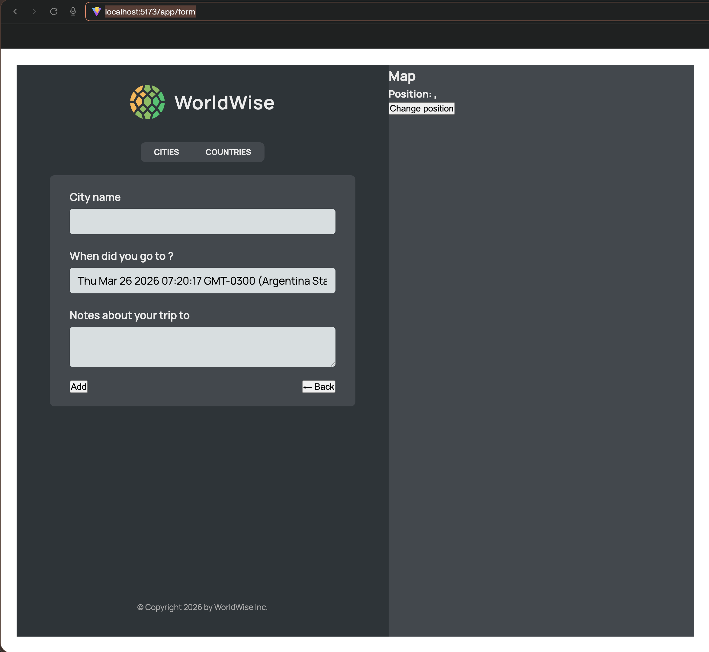

#### 218.2.2 Imperative navigation on the Map with `useNavigate`

**Subsection Summary:**
- Contrasts **declarative** navigation (**`<Link>`**) with **imperative** **`navigate(...)`** invoked from an **`onClick`** on the map container.
- **`navigate('form')`** performs a **relative** jump to the nested **`form`** route under **`/app`**, so the **Form** page appears without a dedicated link click.
- **`section17-lecture218`** steps (see below) describe opening **`/app`**, clicking the map, and expecting the **Form**—the screenshot flow matches the new behavior.
- **Caveat:** the inner **“Change position”** button sits inside the same clickable **`div`**; clicks may **bubble** and also trigger **`navigate('form')`** unless propagation is stopped (see Issues).

* **Declarative vs imperative navigation:** links declare targets in JSX; **`useNavigate`** lets events or logic trigger a route change.

```jsx
/* src/components/Map.jsx */
import { useSearchParams, useNavigate } from 'react-router-dom';                        // 👈🏽 ✅
import styles from './Map.module.css';

const Map = () => {
  const navigate = useNavigate();                                                       // 👈🏽 ✅
  const [searchParams, setSearchParams] = useSearchParams();

  const lat = searchParams.get('lat');
  const lng = searchParams.get('lng');

  return (
    <div className={styles.mapContainer} onClick={() => navigate('form')}>              {/* 👈🏽 ✅ */}
      <h1>Map</h1>
      <h2>
        Position: {lat}, {lng}
      </h2>
      <button onClick={() => {setSearchParams({ lat: 23, lng: 50 })}}>Change position</button>
    </div>
  )
}

export default Map;
```

Steps:

* go to [/app](http://localhost:5173/app).
* click on any map part.
* Expected: Form component is visible.

#### 218.2.3 Reusable `Button` component

**Subsection Summary:**
- Extracts a small **`Button`** that applies **`Button.module.css`** classes from a **`type`** prop (**`primary`**, **`back`**, etc.).
- Accepts **`onClick`** so parents (**`Form`**) can attach navigation or other handlers without duplicating markup.
- This pattern keeps the form’s actions visually consistent while remaining a plain **`<button>`** under the hood.

```jsx
/* src/components/Button.jsx */
import styles from './Button.module.css';

const Button = ({children, onClick, type}) => {
  return (
    <button onClick={onClick} className={`${styles.btn} ${styles[type]}`}>
      {children}
    </button>
  )
}

export default Button;
```

#### 218.2.4 Form with `Button` for Add and Back

**Subsection Summary:**
- Replaces raw **`<button>`** elements with **`Button`** for **Add** and **Back** so styles stay centralized.
- **Back** has **no** **`onClick`** yet—this step is layout-only before wiring **`useNavigate`**.
- **`section17-lecture218-002.png`** shows the styled **Add** / **Back** pair in the form footer.

```jsx
/* src/components/Form.jsx */
import { useState } from "react";

import Button from "./Button";                                            // 👈🏽 ✅

import styles from "./Form.module.css";

export function convertToEmoji(countryCode) {
  const codePoints = countryCode
    .toUpperCase()
    .split("")
    .map((char) => 127397 + char.charCodeAt());
  return String.fromCodePoint(...codePoints);
}

function Form() {
  const [cityName, setCityName] = useState("");
  const [country, setCountry] = useState("");
  const [date, setDate] = useState(new Date());
  const [notes, setNotes] = useState("");

  return (
    <form className={styles.form}>
      <div className={styles.row}>
        <label htmlFor="cityName">City name</label>
        <input
          id="cityName"
          onChange={(e) => setCityName(e.target.value)}
          value={cityName}
        />
        {/* <span className={styles.flag}>{emoji}</span> */}
      </div>

      <div className={styles.row}>
        <label htmlFor="date">When did you go to {cityName}?</label>
        <input
          id="date"
          onChange={(e) => setDate(e.target.value)}
          value={date}
        />
      </div>

      <div className={styles.row}>
        <label htmlFor="notes">Notes about your trip to {cityName}</label>
        <textarea
          id="notes"
          onChange={(e) => setNotes(e.target.value)}
          value={notes}
        />
      </div>

      <div className={styles.buttons}>
        {/* <button>Add</button> */}
        <Button type='primary'>Add</Button>                                 {/* 👈🏽 ✅ */}
        {/* <button>&larr; Back</button> */}
        <Button type='back'>&larr; Back</Button>                            {/* 👈🏽 ✅ */}
      </div>
    </form>
  );
}

export default Form;
```

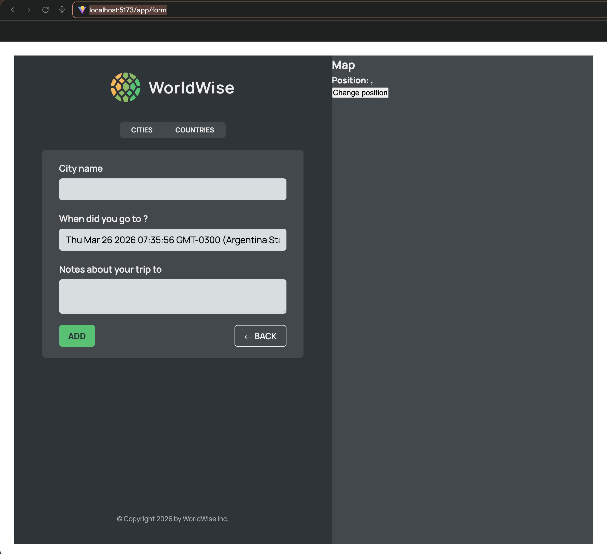

#### 218.2.5 `useNavigate` and `navigate(-1)` on Back

**Subsection Summary:**
- Imports **`useNavigate`**, calls **`const navigate = useNavigate()`**, and wires **Back** with **`onClick={() => navigate(-1)}`** to mirror **browser history back**.
- **`navigate(-1)`** does **not** require a path string—it moves one step backward in the stack (when possible).
- Inside a **`<form>`**, a **`<button>`** without **`type="button"`** may act as **submit**; this snippet illustrates the hook first—**218.2.6** adds **`preventDefault`** (see Issues).

```jsx
/* src/components/Form.jsx */
import { useState } from "react";
import { useNavigate } from "react-router-dom";                                   // 👈🏽 ✅

import Button from "./Button";

import styles from "./Form.module.css";

export function convertToEmoji(countryCode) {
  const codePoints = countryCode
    .toUpperCase()
    .split("")
    .map((char) => 127397 + char.charCodeAt());
  return String.fromCodePoint(...codePoints);
}

function Form() {
  const navigate = useNavigate();                                                 // 👈🏽 ✅
  const [cityName, setCityName] = useState("");
  const [country, setCountry] = useState("");
  const [date, setDate] = useState(new Date());
  const [notes, setNotes] = useState("");

  return (
    <form className={styles.form}>
      <div className={styles.row}>
        <label htmlFor="cityName">City name</label>
        <input
          id="cityName"
          onChange={(e) => setCityName(e.target.value)}
          value={cityName}
        />
        {/* <span className={styles.flag}>{emoji}</span> */}
      </div>

      <div className={styles.row}>
        <label htmlFor="date">When did you go to {cityName}?</label>
        <input
          id="date"
          onChange={(e) => setDate(e.target.value)}
          value={date}
        />
      </div>

      <div className={styles.row}>
        <label htmlFor="notes">Notes about your trip to {cityName}</label>
        <textarea
          id="notes"
          onChange={(e) => setNotes(e.target.value)}
          value={notes}
        />
      </div>

      <div className={styles.buttons}>
        {/* <button>Add</button> */}
        <Button type='primary'>Add</Button>
        {/* <button>&larr; Back</button> */}
        <Button type='back' onClick={() => navigate(-1)}>&larr; Back</Button>   {/* 👈🏽 ✅ */}
      </div>
    </form>
  );
}

export default Form;
```

#### 218.2.6 `preventDefault` on Back inside the form

**Subsection Summary:**
- Wraps the Back handler so **`e.preventDefault()`** runs before **`navigate(-1)`**, avoiding unintended **form submission** when the default **`<button>`** type would submit.
- Matches the **current project** implementation in **`src/components/Form.jsx`** (handler receives the event, prevents default, then navigates).
- **Add** may still need **`type="button"`** on **`Button`** if it must never submit—addressed in Pending Fixes.

```jsx
/* src/components/Form.jsx */
import { useState } from "react";
import { useNavigate } from "react-router-dom";

import Button from "./Button";

import styles from "./Form.module.css";

export function convertToEmoji(countryCode) {
  const codePoints = countryCode
    .toUpperCase()
    .split("")
    .map((char) => 127397 + char.charCodeAt());
  return String.fromCodePoint(...codePoints);
}

function Form() {
  const navigate = useNavigate();
  const [cityName, setCityName] = useState("");
  const [country, setCountry] = useState("");
  const [date, setDate] = useState(new Date());
  const [notes, setNotes] = useState("");

  return (
    <form className={styles.form}>
      <div className={styles.row}>
        <label htmlFor="cityName">City name</label>
        <input
          id="cityName"
          onChange={(e) => setCityName(e.target.value)}
          value={cityName}
        />
        {/* <span className={styles.flag}>{emoji}</span> */}
      </div>

      <div className={styles.row}>
        <label htmlFor="date">When did you go to {cityName}?</label>
        <input
          id="date"
          onChange={(e) => setDate(e.target.value)}
          value={date}
        />
      </div>

      <div className={styles.row}>
        <label htmlFor="notes">Notes about your trip to {cityName}</label>
        <textarea
          id="notes"
          onChange={(e) => setNotes(e.target.value)}
          value={notes}
        />
      </div>

      <div className={styles.buttons}>
        {/* <button>Add</button> */}
        <Button type='primary'>Add</Button>
        {/* <button>&larr; Back</button> */}
        <Button type='back' onClick={(e) => {                                   {/* 👈🏽 ✅ */}
          e.preventDefault();                                                   {/* 👈🏽 ✅ */}
          navigate(-1);
        }}>&larr; Back</Button>
      </div>
    </form>
  );
}

export default Form;
```

### 🐞 218.3 Issues:

- **`Map` container click vs inner button:** The **`mapContainer`** **`onClick`** calls **`navigate('form')`** while **“Change position”** is a child **`button`**. Without **`stopPropagation`** on the button, a click can **bubble** to the container and **also** navigate away—undesirable double behavior.
- **Default `button` type in forms:** **`Button`** renders **`<button>`** without **`type`**. Inside **`<form>`**, the HTML default is often **`submit`**. **Back** is fixed with **`preventDefault`** in the **final** code; **Add** may still submit the form in some browsers until **`type="button"`** is set.
- **Date input `value` type:** **`Form`** uses **`useState(new Date())`** but passes **`value={date}`** to **`type="date"`** (or text) — a **`Date`** object is not a valid controlled string for **`input`**; may show **`[object Object]`** or warn until refactored to **`YYYY-MM-DD`** string state.
- **`navigate('form')` on a `div`:** Using a **`div`** as the sole click target for navigation is **not keyboard-accessible** by default (no **`role`**, **`tabIndex`**, **`onKeyDown`**); prefer a **`<button>`** overlay or link-styled control for production.
- **History depth:** **`navigate(-1)`** on **Back** depends on prior history; deep-linking directly to **`/app/form`** can make “back” exit the app or behave unexpectedly.

| Issue | Status | Log/Error |
|---|---|---|
| Clicks bubble from map **“Change position”** to **`navigate('form')`** | ⚠️ Identified | `src/components/Map.jsx:11-18` — `onClick` on `mapContainer` wraps the inner `button`; add `e.stopPropagation()` on the button handler or restructure layout |
| **`Button` lacks explicit `type` inside forms** | ⚠️ Identified | `src/components/Button.jsx:3-6` — `button` defaults to `submit` in forms; `src/components/Form.jsx:55-62` — Back uses `preventDefault`; Add may still submit |
| `Date` object as `input` **value** | ⚠️ Identified | `src/components/Form.jsx:20-42` — `useState(new Date())` with `value={date}` on `input` |
| `div` + `onClick` for navigation (a11y) | ℹ️ Low Priority | `src/components/Map.jsx:11-12` — not keyboard-focusable; use `button`/`Link` or ARIA pattern |
| **`navigate(-1)`** with empty history | ℹ️ Informational | `src/components/Form.jsx:59-62` — direct visits to `/app/form` may leave app on back |

### 🧱 218.4 Pending Fixes (TODO)

- [ ] **Stop propagation on `Map`:** In `src/components/Map.jsx`, on the **“Change position”** `button` `onClick`, call `e.stopPropagation()` (or move navigation off the outer `div`) so updating search params does not also trigger `navigate('form')`.
- [ ] **Set `type` on `Button`:** In `src/components/Button.jsx`, render `<button type="button" …>` (or add a `buttonType` prop defaulting to `'button'`) so **Add** and **Back** never submit the form unless intentionally submitted via `form`’s `onSubmit`.
- [ ] **Normalize date state:** In `src/components/Form.jsx`, store the date as an ISO date string (`YYYY-MM-DD`) for the date input, or use `type="date"` with string state initialized from `new Date().toISOString().slice(0, 10)`.
- [ ] **Accessible map navigation:** Replace or supplement `div` onClick in `Map.jsx` with a focusable control (`<button>` or `<Link>`) and `aria-label` describing “Open add trip form”.
- [ ] **Optional explicit back target:** If UX should always return to `CityList` or `/app/cities`, consider `navigate('/app/cities')` instead of `navigate(-1)` when history is shallow.

[↑ top — 218. Lesson 218 — *Programmatic Navigation with useNavigate*](#-218-lesson-218--programmatic-navigation-with-usenavigate)


<br>

## 🔧 219. Lesson 219 — *Programmatic Navigation with `<Navigate />`*

[🧳 Section 17: *React Route: Building Single-Page Applications (SPA)*](#-section-17-react-route-building-single-page-applications-spa)

### 📑 Table of Contents:
- [219. Lesson 219 — *Programmatic Navigation with `<Navigate />`*](#-219-lesson-219--programmatic-navigation-with-navigate)
- [219.1 Context](#-2191-context)
- [219.2 Updating code/theory according the context](#-2192-updating-codetheory-according-the-context)
  - [219.2.1 Reproducing the `/app` index issue (nav vs URL)](#21921-reproducing-the-app-index-issue-nav-vs-url)
  - [219.2.2 Index route redirect with `<Navigate to="cities" />`](#21922-index-route-redirect-with-navigate-tocities-)
  - [219.2.3 Adding `replace` for sensible browser Back behavior](#21923-adding-replace-for-sensible-browser-back-behavior)
  - [219.2.4 History stack: with vs without `replace`](#21924-history-stack-with-vs-without-replace)
- [219.3 Issues](#-2193-issues)
- [219.4 Pending Fixes (TODO)](#-2194-pending-fixes-todo)

### 🧠 219.1 Context:

When users land on **`/app`** (the parent layout for the tracker) without a **nested** segment such as **`cities`**, React Router matches the **index** route of **`/app`**—not **`/app/cities`**. Nested **`<NavLink>`** items (for example **“Cities”**) compare the current URL to their **`to`** paths; if the URL stays at **`/app`**, the **Cities** tab may not appear **active**, and deep links or bookmarks that omit **`cities`** feel inconsistent.

**`<Navigate />`** is a **declarative redirect** component from **React Router v6**. You render it as a route’s **`element`** (often on an **index** route) so that when that route matches, the router **immediately navigates** to another path—**without** writing **`useNavigate`** in a **`useEffect`**. The optional **`replace`** prop controls whether this redirect **replaces** the current history entry (**`replace`**) or **pushes** a new one (default **push**), which directly affects whether the browser **Back** button can return to the “intermediate” URL.

In **Worldwise**, the fix is an **index** route under **`path="app"`** that renders **`<Navigate to="cities" />`** (and, after noticing Back-button issues, **`<Navigate replace to="cities" />`**). That way **`/app`** always resolves to the same nested view as **`/app/cities`**, the sidebar highlights **Cities**, and history behaves predictably.

**Key Concepts:**

1. **Index route (`<Route index />`)** — A child route that matches when the parent path is matched **exactly** and no further path segment is present (e.g. **`/app`** but not **`/app/cities`**).
2. **`<Navigate to="…" />`** — A component that triggers navigation when rendered; **`to`** can be **relative** (resolved against the current route) or absolute.
3. **`replace`** — When **`true`**, the redirect does not add an extra history entry, so **Back** skips the redirecting URL and goes to the previous site the user visited.
4. **Nested relative `to="cities"`** — Under **`/app`**, this resolves to **`/app/cities`**, aligning the URL with the **`path="cities"`** child route and **`NavLink`** expectations.
5. **Declarative vs imperative redirects** — **`<Navigate />`** is ideal when “matching this route” should **always** mean “go here”; **`useNavigate`** fits **event-driven** or **conditional** navigation.

**Advantages:**

- **No effect boilerplate** — Redirect logic stays in the route configuration as a single **`element`**.
- **Consistent default child** — Users hitting **`/app`** see the same screen as **`/app/cities`** without duplicating layout or data-fetch assumptions.
- **`replace` mitigates “Back traps”** — Avoids stacking **`/app` → `/app/cities`** so **Back** does not ping-pong between two equivalent app states.
- **Composable with `<Routes>`** — Works naturally beside other **`Route`** definitions and code splitting.

**Disadvantages / Gotchas:**

- **Extra render** — The index route matches briefly before navigation; usually negligible but worth knowing for analytics or flicker debugging.
- **Wrong `to` paths** — A mistaken relative **`to`** can send users to an unexpected nested URL; verify against **`path`** definitions.
- **Auth and guards** — **`<Navigate />`** redirects everyone who hits the route; for **conditional** redirects (e.g. role-based), a **loader**, **wrapper component**, or **`useNavigate`** may be clearer.
- **Confusion with server redirects** — This is **client-side** routing only; the server must still serve **`index.html`** for SPA deep links.

**When to Consider Alternatives:**

- **`useNavigate`** (or **`redirect`** in data routers) when navigation depends on **runtime state** (form validation, API response).
- **`<Navigate state>`** sparingly; prefer **URL params** or **search params** for shareable state when possible.
- **Server-side HTTP redirects** (301/302) if you need **SEO-canonical** URLs or non-JS clients.

### ⚙️ 219.2 Updating code/theory according the context:

#### **Summary**

- Section 219.2 walks through a **real UX bug**: visiting **`/app`** leaves the **Cities** nav inactive and the URL without **`cities`**, then fixes it with an **index** route that renders **`<Navigate to="cities" />`** in **`App.jsx`**.
- It shows the **before/after** screenshots and the exact **nested** **`Route`** snippet so **`/app`** redirects to **`/app/cities`**.
- It explains why **`replace`** matters: without it, **Back** from **`/app/cities`** can return to **`/app`**, which **redirects again**, trapping or confusing users; **`replace`** keeps the history stack clean.

---

#### 219.2.1 Reproducing the `/app` index issue (nav vs URL)

**Subsection Summary:**

- Demonstrates the **reproduction steps**: dev server, homepage, **Start Tracking Now** → URL **`/app`**.
- Documents the **symptom**: **Cities** is not the **active** nav state and the URL is **not** **`/app/cities`**, so nested UI and **`NavLink`** highlighting disagree with user expectations.
- **`section17-lecture219-001.png`** captures the mismatch (sidebar/nav vs current path) before the **`Navigate`** fix.

Having this issue:
* Open terminal run: `npm run dev`
* Open a browser then go to [localhost](http://localhost:5173)
* Click on `Start Tracking Now` button
* Result: URL [/app](http://localhost:5173/app)

Issue:
* Cities button is not selected or enable
* User is not in this URL: [/app/cities](http://localhost:5173/app/cities)

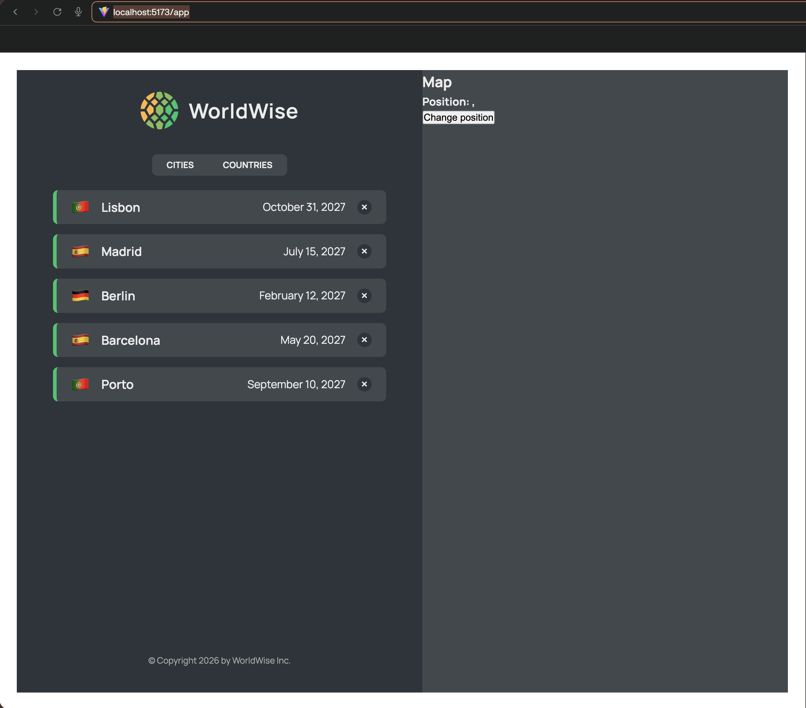

#### 219.2.2 Index route redirect with `<Navigate to="cities" />`

**Subsection Summary:**

- Imports **`Navigate`** from **`react-router-dom`** and registers an **index** child under **`path="app"`** with **`element={<Navigate to="cities" />}`** so **`/app`** immediately targets the **`cities`** child route.
- Keeps **`CityList`**, **`City`**, **`CountryList`**, and **`Form`** as sibling nested routes; only the **default** entry when the path is exactly **`/app`** changes.
- **`section17-lecture219-002.png`** shows the app after the redirect: URL aligned with **Cities** and the list view visible under **`AppLayout`**.

```jsx
/* src/App.jsx */
import { BrowserRouter, Routes, Route, Navigate } from "react-router-dom";    // 👈🏽 ✅
import { useState, useEffect } from "react";
import Product from "./pages/Product";
import Pricing from "./pages/Pricing";
import Homepage from "./pages/Homepage";
import PageNotFound from "./pages/PageNotFound";
import AppLayout from "./pages/AppLayout";
import Login from './pages/Login'
import CityList from "./components/CityList";
import CountryList from './components/CountryList';
import City from './components/City';
import Form from './components/Form';

const BASE_URL = "http://localhost:8000"

function App() {
  const [cities, setCities] = useState([]);
  const [isLoading, setIsLoading] = useState(false);

  useEffect(() => {
    async function fetchCities() {
      try{
        setIsLoading(true);
        const res = await fetch(`${BASE_URL}/cities`);
        const data = await res.json();
        setCities(data);
      } catch(error) {
        console.error(error);
        alert("There was an error loading data");
      }
      finally {
        setIsLoading(false);
      }
    }
    fetchCities();
  }, []);

  return (
    <BrowserRouter>
      <Routes>
        <Route path="/" element={<Homepage />} />
        <Route path="product" element={<Product />} />
        <Route path="pricing" element={<Pricing />} />
        <Route path="login" element={<Login />} />
        <Route path="app" element={<AppLayout />}>
          <Route index element={<Navigate to="cities" />}/>             {/* 👈🏽 ✅ */}
          <Route path="cities" element={<CityList cities={cities} isLoading={isLoading} />}/>
          <Route path="cities/:id" element={<City />}/>
          <Route path="countries" element={ <CountryList cities={cities} isLoading={isLoading} /> }/>
          <Route path="form" element={<Form />}/>
        </Route>
        <Route path="*" element={<PageNotFound />} />
      </Routes>
    </BrowserRouter>
  );
}

export default App;
```

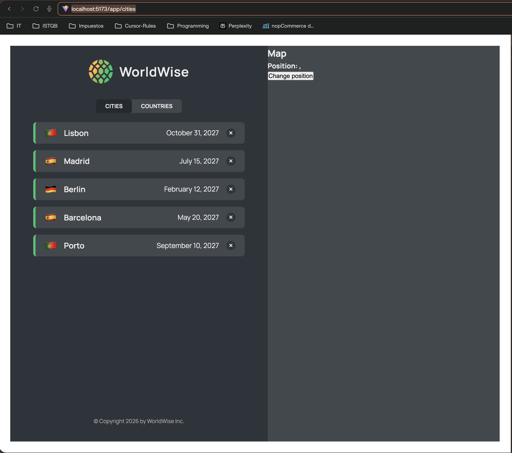

#### 219.2.3 Adding `replace` for sensible browser Back behavior

**Subsection Summary:**

- Notes a **follow-up issue**: after the first **`Navigate`**, the URL may still not behave well with **browser Back** (user cannot “escape” to the prior page as expected) when the redirect **pushes** history.
- Presents the **one-line fix**: **`replace`** on **`<Navigate replace to="cities" />`** so the redirect **replaces** the **`/app`** entry instead of stacking **`/app`** then **`/app/cities`**.
- Ties directly to the **implementation** in **`src/App.jsx`** (same index route, augmented prop).

Steps:
* Open terminal run: `npm run dev`
* Open a browser then go to [localhost](http://localhost:5173)
* Click on `Start Tracking Now` button
* Result: 
  * User is not in this URL: [/app/cities](http://localhost:5173/app/cities)

Issue:
* User can not go back to the previous page.

Fix:
* Adding `replace`
```jsx
/* src/App.jsx */
<Route index element={<Navigate replace to="cities" />}/>             {/* 👈🏽 ✅ */}
```

#### 219.2.4 History stack: with vs without `replace`

**Subsection Summary:**

- Explains **why** **`replace`** matters in terms of the **browser history stack**, not only the visible URL.
- Contrasts **without** **`replace`**: **Back** from **`/app/cities`** can return to **`/app`**, which **re-redirects** to **`/app/cities`**, producing a poor **Back** experience (“trap” or loop).
- Contrasts **with** **`replace`**: **`/app`** is **replaced** by **`/app/cities`**, so **Back** leaves the app to the **previous external** page (e.g. search engine), which matches typical UX expectations.

* the `replace` prop controls how navigation affects the browser history stack.

*(The paths below use a minimal `/` → `/cities` example; for Worldwise, read **`/`** as **`/app`** and **`/cities`** as **`/app/cities`**—the history behavior is the same.)*

1. Without replace:
    * Browser goes to `/`.
    * App redirects to /cities.
    * History stack: [`/`] -> [`/cities`].
    * Problem: 
      * If the user clicks the Back button, they go back to `/`, which instantly redirects them to `/cities` again. The user is trapped in a "redirect loop" and cannot leave your site using the back button.

2. With replace:
    * Browser goes to `/`.
    * App replaces `/` with `/cities`.
    * History stack: [`/cities`] (The `/` is gone).
    * Result: 
      * If the user clicks Back, they go to whatever website they were on before they visited your site (e.g., Google). This provides a much better user experience.


### 🐞 219.3 Issues:

- **“Cities button not selected”:** Before **`Navigate`**, **`/app`** does not match **`/app/cities`**, so **`NavLink`** active state and URL disagree; after the fix, keep **`replace`** in **`App.jsx`** so browser **Back** stays predictable.
- **Relative `to="cities"` assumption:** Works because **`Navigate`** runs in the **`/app`** route context; if the app base path or nesting changes, **`to`** may need to be adjusted (e.g. leading slash or full path).

| Issue | Status | Log/Error |
|---|---|---|
| **`App.jsx` must use `Navigate` + `replace` for production parity** | ℹ️ Informational | `src/App.jsx:45-46` — confirm `<Route index element={<Navigate replace to="cities" />} />` matches lesson conclusion |
| **Nav highlight / URL mismatch before fix** | ✅ Fixed (by lesson) | Nested index **`Navigate`** sends **`/app` → `/app/cities`**; `AppNav` **`NavLink`** paths align when URL includes `cities` |

### 🧱 219.4 Pending Fixes (TODO)

- [ ] **Verify `Navigate` + `replace` in app:** Ensure `src/App.jsx` keeps `<Route index element={<Navigate replace to="cities" />} />` under the `app` layout route so behavior matches 219.2.3–219.2.4.
- [ ] **Optional:** Add a one-line note in the lecture that `to="cities"` is relative to `/app`, so the resolved path is `/app/cities` (helps if students move routes under a different parent).

[↑ top — 219. Lesson 219 — *Programmatic Navigation with `<Navigate />`*](#-219-lesson-219--programmatic-navigation-with-navigate)

<br>


<br>
<br>
<br>

🔥 🔥 🔥 

<br>

## 🔧 XXX. Lesson XXX — *{{TITLE_NAME}}*

### 🧠 XXX.1 Context:

### ⚙️ XXX.2 Updating code/theory according the context:

#### XXX.2.1
```jsx
/*  */

```

#### XXX.2.2
```jsx
/*  */

```

#### XXX.2.3
```jsx
/*  */

```

#### XXX.2.4
```jsx
/*  */

```

### 🐞 XXX.3 Issues:
- **first issue**: something..

| Issue | Status | Log/Error |
|---|---|---|

### 🧱 XXX.4 Pending Fixes (TODO)

- [ ]